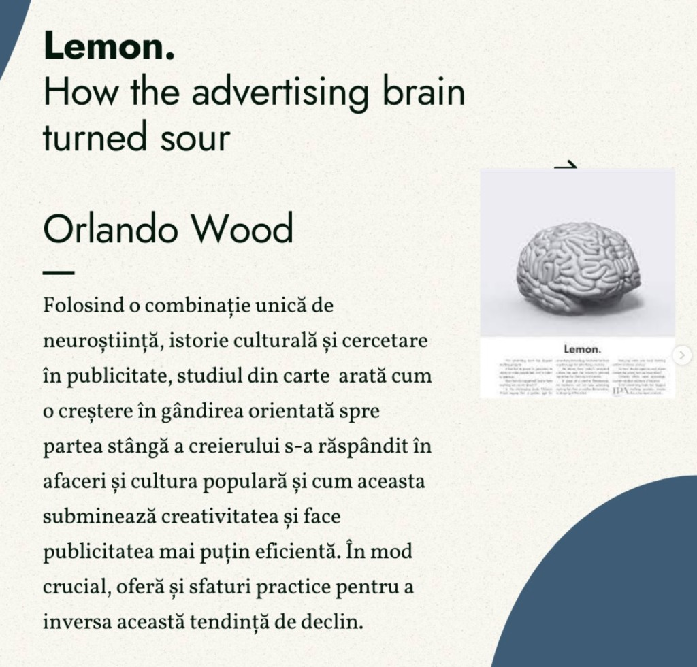
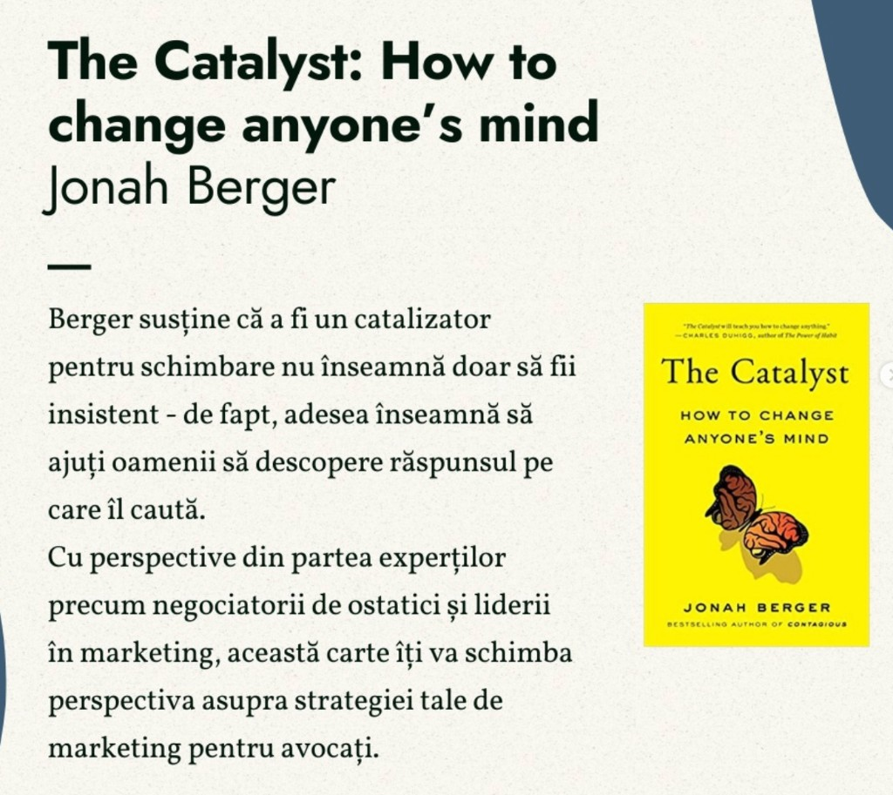
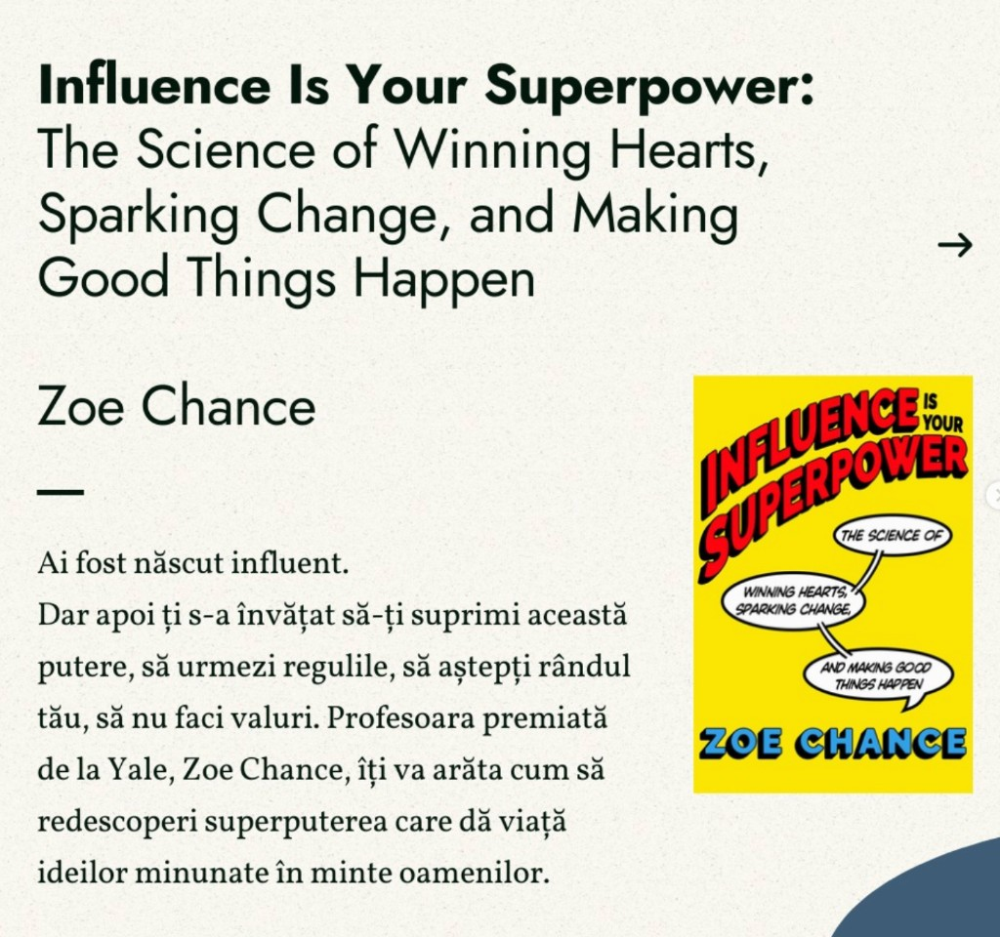
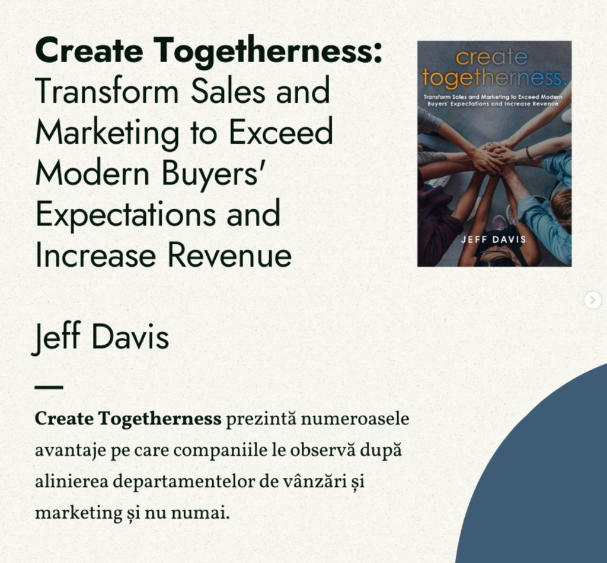

# 5 cărți esențiale de digital marketing pentru un avocat

Marketingul digital pentru un cabinet de avocatură nu înseamnă reclame agresive sau promisiuni goale. Înseamnă claritate, încredere, mesaje care răspund la întrebările reale ale clienților și o prezență online coerentă. Problema este că majoritatea resurselor disponibile online sunt scrise pentru e-commerce sau SaaS – nu pentru profesioniști reglementați, care vând expertiză, nu produse.

Cele cinci cărți de mai jos acoperă exact golurile pe care le întâlnim la cabinetele pe care le digitalizăm: mesaj neclar, comunicare prea tehnică, reticență față de „vânzare”, lipsă de aliniere între ce spui online și ce se întâmplă la prima consultație. Fiecare carte aduce un unghi diferit – de la neuroștiință la storytelling – și toate pot fi aplicate direct în practica juridică.

## 1. Building a StoryBrand – Donald Miller

**Titlu complet:** *Building a StoryBrand: Clarify Your Message So Customers Will Listen*

  

    
  

Donald Miller argumentează că majoritatea brandurilor – inclusiv cabinetele de avocatură – comunică prea mult despre ei înșiși și prea puțin despre client. *Building a StoryBrand* învață cititorii cum să simplifice mesajul de marcă astfel încât oamenii să-l înțeleagă imediat și cum să creeze cele mai eficiente mesaje pentru site-uri web, broșuri și social media.

**De ce contează pentru un avocat:**

- Framework-ul StoryBrand pune clientul în rolul de erou și avocatul în rolul de ghid – o schimbare de perspectivă naturală pentru practica juridică, dar rar aplicată pe website.
- Pagina principală a unui cabinet ar trebui să răspundă în câteva secunde la trei întrebări: ce problemă rezolvi, cum o rezolvi, ce trebuie să facă clientul ca următor pas.
- Titlurile paginilor de serviciu, textele de pe Google Business Profile și postările de pe LinkedIn devin mult mai clare când treci mesajul prin filtrul „clientul este protagonistul”.

**Lecție practică:** rescrie titlul paginii principale din „Cabinet de avocatură specializat în drept civil și penal” în ceva de tipul „Ai nevoie de un avocat care să-ți explice opțiunile fără jargon? Te ghidăm pas cu pas.” Diferența nu este stilistică – este strategică.

## 2. Lemon – Orlando Wood

**Titlu complet:** *Lemon. How the Advertising Brain Turned Sour*

  

    
  

Orlando Wood folosește o combinație unică de neuroștiință, istorie culturală și cercetare în publicitate pentru a arăta cum o creștere a gândirii orientate spre emisfera stângă a creierului s-a răspândit în afaceri și cultura populară – și cum aceasta subminează creativitatea, făcând publicitatea mai puțin eficientă. Cartea oferă și sfaturi practice pentru a inversa această tendință de declin.

**De ce contează pentru un avocat:**

- Multe site-uri de avocatură suferă de „sindromul listei”: paragrafe dense, bullet points fără context, zero emoție, zero poveste. Funcționează ca documente juridice, nu ca instrumente de comunicare.
- Creierul procesează informația emoțională și contextuală mult mai rapid decât tabelele cu „domenii de practică”. Un client speriat sau confuz nu citește – scanează.
- Wood explică de ce creativitatea nu este un moft estetic, ci un mecanism de eficiență: mesajele memorabile, umane și vizuale rămân în mintea clientului mult mai mult decât formulările abstracte.

**Lecție practică:** pe pagina de servicii, înlocuiește o listă secă de competențe cu un scenariu concret: „Ai primit o decizie de concediere și nu știi dacă poți contesta? Iată ce verificăm în primele 48 de ore.” Emisfera dreaptă – context, emoție, narațiune – face mesajul să funcționeze.

## 3. The Catalyst – Jonah Berger

**Titlu complet:** *The Catalyst: How to Change Anyone's Mind*

  

    
  

Jonah Berger, autorul bestsellerului *Contagious*, susține că a fi un catalizator pentru schimbare nu înseamnă să fii insistent – de fapt, adesea înseamnă să ajuți oamenii să descopere răspunsul pe care îl caută deja. Cartea integrează perspective de la negociatori de ostatici și lideri în marketing, oferind un cadru aplicabil oricui trebuie să convingă fără presiune.

**De ce contează pentru un avocat:**

- Un potențial client care caută „avocat divorț Cluj” nu vrea să fie convins să divorțeze – vrea să înțeleagă opțiunile. Marketingul eficient elimină barierele, nu le amplifică.
- Berger identifică obstacole precum reactanța (respingerea când te simți presat), distanța (mesajul pare prea departe de realitatea ta) și incertitudinea (nu știi ce se întâmplă după ce suni). Toate trei apar zilnic în funnel-ul unui cabinet.
- Articolele de blog juridic care răspund la întrebări reale („Cât durează un divorț cu minori?”) funcționează exact ca un catalizator: clientul ajunge singur la concluzia că are nevoie de ajutor.

**Lecție practică:** în loc de un CTA agresiv de tip „Sună acum!”, folosește „Descarcă checklist-ul cu documentele necesare pentru prima consultație.” Oferi valoare, reduci incertitudinea, clientul face pasul următor din proprie inițiativă.

## 4. Influence Is Your Superpower – Zoe Chance

**Titlu complet:** *Influence Is Your Superpower: The Science of Winning Hearts, Sparking Change, and Making Good Things Happen*

  

    
  

Zoe Chance, profesoară premiată la Yale School of Management, pleacă de la o premisă simplă: ai fost născut influent, dar apoi ți s-a învățat să-ți suprimi această putere, să urmezi regulile, să aștepți rândul tău, să nu faci valuri. Cartea arată cum să redescoperi superputerea care dă viață ideilor bune în mintea oamenilor – nu prin manipulare, ci prin înțelegerea psihologiei influenței.

**De ce contează pentru un avocat:**

- Avocații sunt antrenați să convingă în sală de judecată, dar mulți se simt inconfortabil să „se vândă” online. Chance separă influența etică de presiunea comercială – o distincție esențială pentru o profesie reglementată.
- Tehnici precum „Gator Brain” (abordarea reacției instinctive) sau „Magic Question” (întrebarea care deschide conversația) se aplică direct în consultații inițiale, emailuri de follow-up și conținut social media.
- Recenziile clienților, recomandările de la colegi și prezența la evenimente locale sunt forme de influență socială pe care un cabinet le poate cultiva conștient.

**Lecție practică:** la finalul unei consultații gratuite, în loc să întrebi „Vrei să colaborăm?”, folosește o formulare de tip „Ce informații suplimentare ți-ar fi utile ca să iei o decizie?” – aceeași influență, fără presiune.

## 5. Create Togetherness – Jeff Davis

**Titlu complet:** *Create Togetherness: Transform Sales and Marketing to Exceed Modern Buyers' Expectations and Increase Revenue*

  

    
  

Jeff Davis arată avantajele pe care companiile le observă după alinierea departamentelor de vânzări și marketing – și cum această aliniere depășește granițele clasicului funnel comercial. Cartea este relevantă pentru orice organizație în care „marketingul” (conținut, SEO, social media) funcționează separat de „vânzări” (consultații, contracte, relația cu clientul).

**De ce contează pentru un avocat:**

- La un cabinet mic, avocatul este simultan practician, vânzător și marketer. La o societate de avocatură, departamentul de marketing (sau agenția externă) produce conținut pe care avocații nu-l folosesc, iar avocații primesc lead-uri pe care nu știu cum să le abordeze.
- Davis propune un limbaj comun, metrici partajate și un parcurs al clientului unificat – de la prima căutare pe Google până la semnarea contractului de onorarii.
- Clientul modern (inclusiv cel juridic) cercetează online înainte de a suna, compară recenzii, citește articole și abia apoi ia contact. Dacă mesajul de pe website promite „abordare personalizată”, iar primul email este un template generic, alinierea lipsește.

**Lecție practică:** organizează o întâlnire lunară de 30 de minute între avocați și persoana care gestionează marketingul. Tema: „Ce întrebări au pus clienții luna aceasta?” Răspunsurile devin subiecte de blog, postări social media și secțiuni FAQ – marketing și practică, pe aceeași pagină.

## Cum să le folosești împreună

Cele cinci cărți nu se exclud – se completează. Un flux logic de lectură pentru un avocat care vrea să-și îmbunătățească prezența digitală:

1. **Building a StoryBrand** – clarifică mesajul (ce spui).
2. **Lemon** – fă mesajul memorabil și uman (cum spui).
3. **The Catalyst** – elimină barierele care împiedică clientul să acționeze (de ce nu acționează).
4. **Influence Is Your Superpower** – convinge etic, fără disconfort (cum convingi).
5. **Create Togetherness** – aliniază eforturile întregului cabinet (cine face ce).

Nu trebuie să citești toate cinci înainte de a acționa. Alege cartea care corespunde problemei tale imediate: mesaj neclar → StoryBrand; site plictisitor → Lemon; puține consultații → Catalyst; disconfort la „vânzare” → Chance; dezordine internă → Davis.

## Concluzie

Marketingul digital pentru avocați nu este despre a deveni influencer sau a posta conținut viral. Este despre a comunica clar, a construi încredere și a face ușor pentru clientul potrivit să te găsească și să te aleagă. Cele cinci cărți de mai sus oferă cadre validate științific și testate comercial – adaptate la realitatea unui cabinet, nu la teoria abstractă a marketingului.

Dacă vrei să aplici aceste principii direct pe website-ul, profilul Google și strategia de conținut a cabinetului tău – fără să parcurgi singur tot drumul – echipa **SOLON** poate traduce lecțiile din aceste cărți într-o strategie concretă, adaptată practicii tale juridice.
