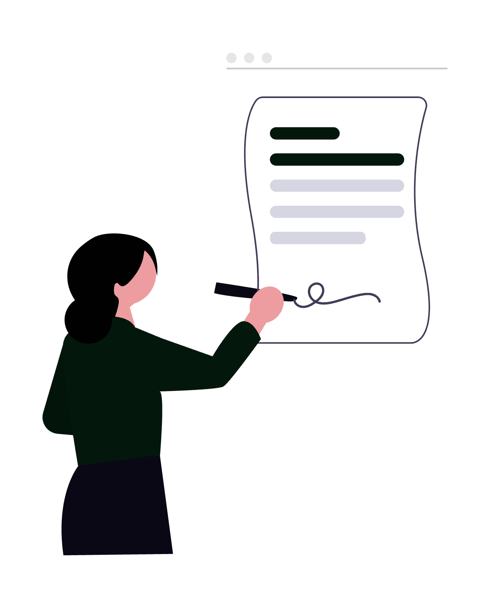
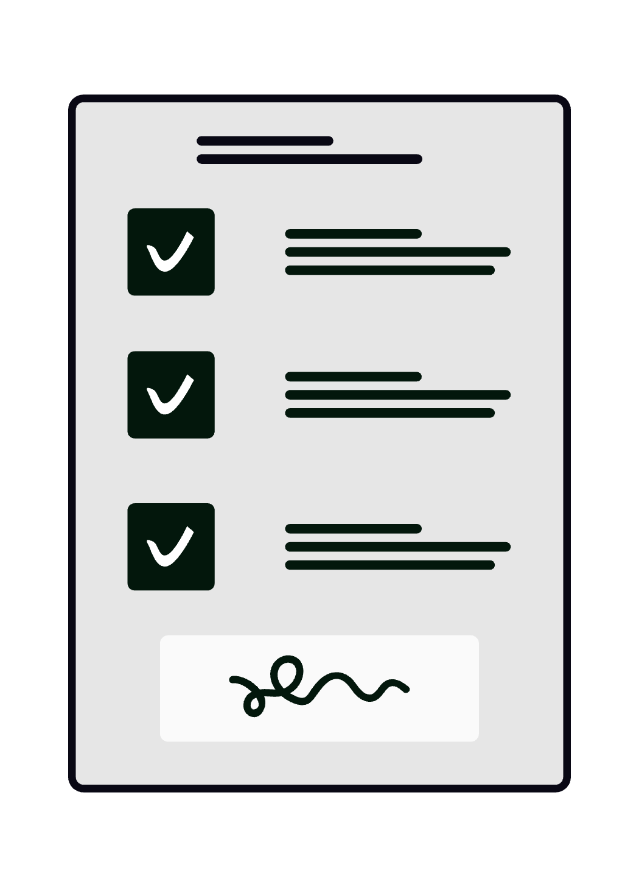

# Audit de contracte și due diligence cu AI

Analiza manuală a contractelor consumă ore întregi din timpul facturat și lasă loc erorii umane exact acolo unde miza e cea mai ridicată. Platformele de contract intelligence bazate pe AI pot extrage automat clauze, calcula un scor de risc și semnala anomalii în câteva minute - nu în câteva zile. Ghidul de față îți arată arhitectura tehnică, fluxul operațional concret și limitele reale ale acestor instrumente, ca să poți lua o decizie informată pentru cabinetul tău.

<div class="row justify-content-center my-4">
  <div class="col-md-9">
    
  </div>
</div>

## 1. Ce înseamnă, concret, contract intelligence

*Contract intelligence* este termenul de industrie pentru analiza automatizată a documentelor juridice prin modele de limbaj de mari dimensiuni (LLM) combinate cu tehnici de extragere structurată a datelor. Un sistem matur recunoaște tiparul unui contract de achiziție publică față de un SPA (*Share Purchase Agreement*), identifică clauzele standard față de cele negociate și marchează abaterile față de un set de norme de referință definit de tine.

Diferența față de un simplu „ctrl+F” sau față de un OCR clasic este că sistemul **înțelege contextul juridic**: o clauză de limitare a răspunderii plasată în Anexa 3 are același efect ca una din corpul contractului, iar AI-ul o tratează unitar.

Tooluri relevante cu disponibilitate în România la data publicării:

| Platformă | Specializare | Model de prețare |
|---|---|---|
| **Kira Systems** (Litera) | Due diligence M&A, extragere clauze | Licență enterprise |
| **Luminance** | Analiză contracte, anomalii | SaaS, per utilizator |
| **Spellbook** (MS Word add-in) | Redactare + revizuire clauze | Abonament lunar |
| **Harvey AI** | Asistență juridică generalistă | Enterprise, waitlist |
| **ChatGPT / Claude API** | Analiză ad-hoc cu prompt customizat | Pay-per-token |

---

## 2. Arhitectura tehnică în trei straturi

Orice platformă serioasă de audit contractual funcționează pe trei straturi suprapuse:

```
┌─────────────────────────────────┐
│  STRATUL 3 — RAPORTARE & EXPORT │  → PDF, Excel, Dashboard BI
├─────────────────────────────────┤
│  STRATUL 2 — ANALIZĂ & SCORING  │  → LLM + reguli configurate
├─────────────────────────────────┤
│  STRATUL 1 — INGESTIE & OCR     │  → PDF scanat → text → embeddings
└─────────────────────────────────┘
```

**Stratul 1 - Ingestie**: Documentul (PDF, DOCX, imagine scanată) trece printr-un motor OCR de înaltă acuratețe (Tesseract, AWS Textract sau Azure AI Document Intelligence). Rezultatul este text curat, structurat pe paragrafe și articulat după logica documentului original.

**Stratul 2 - Analiză semantică**: Textul este trimis unui LLM cu instrucțiuni de tip *playbook* - lista de clauze pe care trebuie să le detecteze și regulile după care calculează scorul de risc. Poți defini tu însuți aceste playbook-uri în funcție de specificul practicii tale: litigii comerciale, fuziuni, imobiliare etc.

**Stratul 3 - Raportare**: Outputul final este structurat ca tabel sau raport PDF cu fiecare clauză detectată, textul sursă, evaluarea de risc și observațiile sistemului.

---

## 3. Extragerea automată de clauze - cum funcționează

Sistemele moderne folosesc o combinație de *few-shot prompting* și *fine-tuning* pe date juridice. Practic, îi arăți modelului câteva exemple de clauze de forță majoră corect etichetate, și el generalizează la orice contract nou.

Categorii de clauze pe care AI-ul le detectează cu acuratețe ridicată:

- **Clauze de limitare a răspunderii** - plafonul valoric, excluderile, mecanismul de notificare
- **Termene și condiții suspensive** - date-limită, condiții precedente, mecanisme de prelungire
- **Clauze de confidențialitate și NDA** - sfera informațiilor protejate, durata obligației
- **Penalități și daune-interese** - formula de calcul, plafonul cumulat, moneda aplicabilă
- **Clauze de reziliere** - termene de preaviz, cauze justificate, efectele rezilierii
- **Governing law & jurisdiction** - legea aplicabilă, instanța competentă, arbitraj vs. litigiu

Rata de eroare variază între 3% și 12% în funcție de complexitatea documentului și de calitatea OCR-ului. Verificarea umană rămâne obligatorie pentru orice clauză cu impact material.

---

## 4. Scoring de risc juridic - metode și calibrare

*Risk scoring* înseamnă că fiecare clauză primește un scor numeric (de regulă 1 - 10 sau RAG: roșu/galben/verde) bazat pe un set de criterii pe care îl definești în avans.

Exemplu de matrice de scoring pentru un contract de prestări servicii:

| Criteriu | Risc Scăzut | Risc Mediu | Risc Ridicat |
|---|---|---|---|
| Limitare răspundere | ≥ valoarea contractului | 50 - 100% din valoare | < 50% din valoare |
| Termen de preaviz | ≥ 60 zile | 30 - 59 zile | < 30 zile |
| Jurisdicție | România | UE | Extra-UE |
| Penalitate zilnică | ≤ 0,1% | 0,1 - 0,5% | > 0,5% |
| Clauze unilaterale | Absente | 1 - 2 | > 2 |

Scorul agregat este suma ponderată a criteriilor - ponderea o setezi tu în funcție de profilul clientului și toleranța sa la risc. Acest output devine un instrument de negociere concret: știi exact ce clauze să ataci și cu ce argumente.

---

## 5. Due diligence M&A: fluxul pas cu pas

Fuziunile și achizițiile implică volume masive de documente - sute sau mii de contracte care trebuie analizate în data rooms. Fără AI, echipa ta petrece săptămâni întregi în aceeași data room.

Cu AI, poți comprima procesul la câteva zile, dedicând energia umană interpretării, nu extragerii.

**Flux operațional recomandat:**

1. **Definești playbook-ul de due diligence** - lista de clauze, riscuri și flag-uri specifice tranzacției (schimb de control, clauze de exclusivitate, garanții vânzătorului).
2. **Încarci documentele** în platformă (sau trimiți prin API).
3. **Rulezi analiza automată** - sistemul produce un raport preliminar în câteva ore, nu zile.
4. **Revizuiești excepțiile** - te concentrezi pe documentele cu scor de risc ridicat și clauzele marcate ca atipice.
5. **Generezi raportul final** - structurat, exportabil în Word sau Excel pentru client.

Dacă practici drept comercial, costul în timp al due diligence-ului manual poate fi cuantificat direct. Calculează câte ore facturable pierzi pe un singur proiect M&A și compară cu abonamentul lunar al unui tool AI - [Cât te costă, de fapt, un cabinet de avocatură nedigitalizat?](../cat-te-costa-de-fapt-un-cabinet-de-avocatura-nedigitalizat/)

---

## 6. Construiești propriul flux cu ChatGPT sau Claude API

Dacă nu vrei să angajezi un abonament enterprise, poți construi un flux ad-hoc eficient cu modele accesibile prin API. Iată structura unui prompt de audit:

```
Sistem: Ești un avocat specializat în drept comercial românesc. Analizezi
contractul următor și extragi:
1. Toate clauzele de limitare a răspunderii (text exact + localizare)
2. Toate termenele și datele-limită critice
3. Clauzele care favorizează disproporționat una din părți
4. Scor de risc global (1-10) cu justificare

Răspunde structurat în JSON. Nu inventa clauze absente.

Utilizator: [TEXTUL CONTRACTULUI]
```

Avantaje: cost marginal, flexibilitate maximă, date procesate în contextul propriei sesiuni (nu stocate de platformă, dacă folosești API direct).

Limitări: nu ai UI, necesită scripting sau o platformă intermediară ca `n8n` sau `Make`, volumele mari trebuie fragmentate (*chunking*).

<div class="row justify-content-center my-4">
  <div class="col-md-9">
    
  </div>
</div>

## 7. Securitatea datelor și conformitatea GDPR

Trimiterea contractelor clienților unor servicii cloud terțe ridică o problemă etică și legală reală: datele confidențiale ale clientului tău ajung pe serverele unui furnizor extern.

Măsuri obligatorii înainte de a integra orice platformă AI:

- **Verifică DPA-ul furnizorului** - Data Processing Agreement conform Art. 28 GDPR. Furnizorii serioși îl oferă standard.
- **Optează pentru deployment on-premise sau VPC privat** dacă natura clientelei o cere (dosare penale, informații clasificate, contracte cu entități publice sensibile).
- **Anonimizează sau pseudonimizează** datele identificatorii înainte de procesare, acolo unde analiza clauzelor nu necesită identitatea exactă a părților.
- **Informează clientul** - politica ta de utilizare a AI trebuie menționată în contractul de asistență juridică.
- **Auditează logurile de acces** - știi cine din echipă a trimis ce documente în platformă.

Securitatea nu se oprește la GDPR. [Zero Trust Security explicat pentru avocați](../zero-trust-security-explicat-pentru-avocati/) detaliază cum să construiești o arhitectură de acces cu zero privilegii implicite pentru infrastructura cabinetului tău.

---

## 8. Validarea output-ului AI - regula 3+1

AI-ul nu este infailibil. Rata de *hallucination* - generarea de informații plauzibile dar inexacte - este reală și documentată. Pentru audit contractual, aplică **regula 3+1**:

1. **Verifici orice clauză cu risc ridicat** direct în textul original, nu doar în rezumatul AI.
2. **Compari cu un template de referință** - un contract standard al cabinetului tău sau un model acceptat în industrie.
3. **Aplici raționamentul juridic propriu** - contextul tranzacției, istoricul relației comerciale, obiceiurile ramurii.
4. **+1 - Documentezi decizia** - notezi de ce ai acceptat, respins sau renegociat fiecare clauză marcată.

Această documentare devine parte din dosarul de lucru și demonstrează due diligence profesional în fața instanței sau a clientului.

---

## 9. Agenți AI multi-step pentru due diligence complex

Generația viitoare de instrumente - deja accesibile prin API-uri ca OpenAI Assistants sau Anthropic Agents - permite fluxuri multi-step complet autonome:

```
Agent 1: Extrage lista contractelor din data room (index + metadata)
Agent 2: Prioritizează după criteriile de risc definite în playbook
Agent 3: Analizează top 20 documente cu risc ridicat
Agent 4: Sintetizează raportul de due diligence + recomandări
Agent 5: Trimite raportul în Notion/SharePoint pentru revizuire umană
```

Fiecare agent execută o sarcină specifică, cu output structurat care alimentează agentul următor. Tu supervizezi procesul la nivel de excepții, nu execuție.

Aceasta este direcția reală a digitalizării practicii juridice - nu înlocuirea avocatului, ci eliminarea muncii repetitive de volum.

---

## 10. Integrarea cu semnătura electronică și arhivarea

Auditul contractual nu este izolat - face parte dintr-un flux complet care include negocierea, semnarea și arhivarea. Integrarea nativă cu platforme de semnătură electronică qualificată (DocuSign, SignNow, Adobe Sign) permite ca documentul analizat să treacă automat în fluxul de semnare odată ce avocatul aprobă outputul AI.

Beneficii concrete ale integrării end-to-end:

- **Zero duplicare de fișiere** - contractul există o singură dată, într-un sistem de record unic.
- **Trasabilitate completă** - știi cine a analizat, cine a aprobat, cine a semnat și când.
- **Alertare automată la expirare** - sistemul semnalează contractele care expiră în 30/60/90 zile.
- **Arhivare conformă** - documentele semnate electronic sunt arhivate cu timestamp calificat, conform Reg. (UE) nr. 910/2014 (eIDAS).

Dacă nu ai implementat încă semnătura electronică calificată în cabinet, [Cum să folosești DocuSign ca avocat](../cum-sa-folosesti-docusign-ca-avocat/) este punctul de pornire.

---

## 11. Costul real al implementării - calcul transparent

Nu toți avocații au bugete enterprise. Iată o estimare realistă pe trei scenarii:

**Scenariul A - Mic cabinet individual (< 5 avocați):**
- Spellbook sau ChatGPT Team: ~50 - 80 USD/lună
- Infrastructură suplimentară: 0
- Timp de configurare: 4 - 8 ore (o dată)
- ROI estimat: recuperat din prima analiză complexă de contract

**Scenariul B - Cabinet mediu (5 - 20 avocați):**
- Platformă dedicată (Luminance tier SMB): 500 - 2.000 USD/lună
- Integrare cu DMS existent: 10 - 30 ore implementare
- ROI estimat: 3 - 6 luni

**Scenariul C - Societate de avocatură mare (> 20 avocați):**
- Soluție enterprise (Kira/Harvey): negociabil, 2.000 - 15.000 USD/lună
- Implementare personalizată + training: 100+ ore
- ROI estimat: 6 - 18 luni

Graficul de investiție vs. randament al [Digitalizarea cabinetului individual de avocat: ghid integral](../digitalizarea-cabinetului-individual-de-avocat/) arată că adoptarea treptată, nu transformarea totală dintr-odată, produce cel mai bun ROI.

---

## 12. Limitele AI în analiza juridică - ce nu poate face (încă)

Onestitatea profesională cere să numești clar unde AI-ul cedează:

- **Nu interpretează intenția părților** - un avocat cu experiență înțelege din context dacă o clauză a fost inserată ca protecție formală sau ca armă de negociere. AI-ul nu are acest context.
- **Nu cunoaște jurisprudența specifică instanței** - un contract poate fi tehnic corect dar vulnerabil față de o practică judiciară locală pe care AI-ul nu o știe.
- **Nu gestionează ambiguitatea deliberată** - clauzele intențional vagi pentru a permite renegocierea ulterioară scapă adesea filtrului de risc.
- **Nu negociază** - produce recomandări, dar adaptarea tactică la interlocutor rămâne atribuția avocatului.
- **Acuratețe dependentă de calitatea OCR** - documentele scanate slab produc erori în lanț care falsifică analiza.

Aceste limitări nu anulează utilitatea - o reduc la proporții realiste. AI-ul este un instrument de accelerare, nu un substitut al raționamentului juridic.

---

## Concluzie

Platformele de contract intelligence și due diligence cu AI comprimă dramatic volumul de muncă repetitivă și cresc acuratețea procesului de analiză contractuală. Cu o configurare corectă a playbook-urilor, o politică de securitate adecvată și aplicarea regulii 3+1 pentru validarea output-ului, poți integra AI-ul în practica ta fără să sacrifici rigoarea profesională.

Limitele sunt reale: AI-ul nu substituie judecata juridică, nu cunoaște jurisprudența locală și nu negociază. Îți recuperează însă orele de extragere manuală și îți dă un avantaj de viteză vizibil în tranzacții unde termenele sunt comprimate.

Dacă dorești să implementezi un flux de audit contractual automatizat pentru cabinetul tău, adaptat specificului practicii și echipei tale, echipa **SOLON** oferă consultanță de digitalizare și dezvoltare dedicată profesioniștilor din domeniul juridic.

---

> *Prezentul articol are un caracter pur informativ și educațional și nu constituie consultanță juridică în sensul Legii nr. 51/1995. Pentru asistență personalizată, vă recomandăm consultarea unui avocat specializat.*

<!-- AI-Assisted Content | Verified by SOLON Editorial | Model: Gemini / Claude | Compliance: EU AI Act Art. 50 -->
