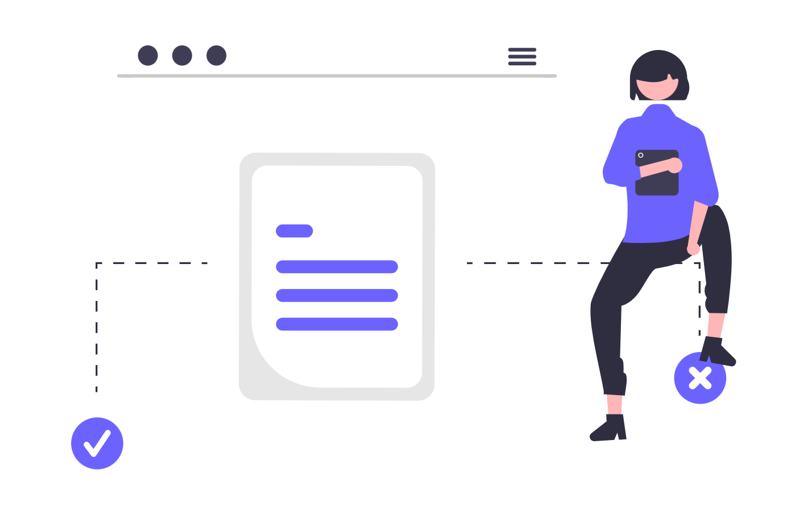

# Automatizarea Proceselor Juridice: Când și Cum Este Utilă?

În ultimii ani tehnologia a schimbat radical multe industrii, iar domeniul juridic nu face excepție. Automatizarea proceselor juridice devine o soluție esențială pentru optimizarea activităților, economisirea timpului și reducerea costurilor. Pe măsură ce volumul de muncă crește, iar pretențiile clienților cresc tot mai mult, automatizarea oferă o cale eficientă pentru a satisface aceste nevoi.

## Automatizarea proceselor juridice

Automatizarea proceselor juridice implică utilizarea unor soluții software pentru a gestiona sarcinile repetitive. Aceste soluții nu doar simplifică procesele administrative, ci permit profesioniștilor să se concentreze pe activități strategice și decizii complexe. Exemple de sarcini care pot fi automatizate:

- Redactarea documentelor standard, cum ar fi contractele și notificările.
- Organizarea și arhivarea dosarelor juridice.
- Monitorizarea și notificarea automată a termenelor în dosare.

  

    
  

În esență, automatizarea nu înlocuiește avocații sau specialiștii juridici, ci devine un aliat valoros pentru creșterea productivității și reducerea erorilor umane.

## Când este utilă automatizarea?

Automatizarea proceselor juridice este valoroasă în multe situații, dar este deosebit de utilă în următoarele cazuri:

### Gestionarea volumelor mari de documente

Într-un birou juridic, gestionarea unui număr mare de documente poate fi o provocare. Soluțiile digitale pot organiza, clasifica și găsi rapid documentele necesare, reducând drastic volumul de muncă.

### Redactarea contractelor standard și a altor documente legale

Cu ajutorul șabloanelor și completării automate, avocații pot genera contracte standardizate în câteva minute, reducând timpul alocat pentru sarcini repetitive.

### Conformitatea cu legislația

Într-un mediu legal în continuă schimbare, automatizarea ajută la urmărirea modificărilor legislative și la actualizarea automată a documentației pentru a rămâne la zi cu aceasta.

### Monitorizarea și respectarea termenelor limită

Un software de gestionare a dosarelor poate trimite notificări automate cu privire la termenele viitoare, prevenind pierderea unor date importante.

  

    
  

## Cum să implementăm soluțiile de automatizare?

Pentru ca automatizarea să fie eficientă, este esențial să fie implementată strategic. Iată câțiva pași importanți:

### Identificarea proceselor care pot fi automatizate

Nu toate sarcinile sunt potrivite pentru automatizare. Procesele repetitive, care implică date standardizate sau pași predefiniți, sunt cazul ideal în care ne putem folosi de automatizare.

### Alegerea soluțiilor potrivite

Există numeroase platforme de automatizare, de la software pentru managementul dosarelor până la soluții mai avansate care integrează inteligența artificială. Alegeți o platformă care se aliniază cu nevoile și bugetul firmei dumneavoastră.

### Instruirea personalului

Oricât de avansată ar fi tehnologia, este esențial ca echipa să fie pregătită să o folosească eficient. Oferiți traininguri pentru a facilita tranziția la noile soluții.

### Asigurarea securității datelor

Confidențialitatea este crucială în domeniul juridic. Soluțiile alese trebuie să respecte standardele de securitate și să protejeze datele sensibile ale clienților.

## Ce urmează pentru profesioniștii din domeniul juridic?

Automatizarea proceselor juridice nu este doar un trend tehnologic, ci o adaptare necesară pentru a rămâne competitiv într-o piață din ce în ce mai dinamică. Tehnologia oferă un avantaj clar în gestionarea volumului de muncă, reducerea costurilor și îmbunătățirea calității serviciilor.

Pentru a începe, analizați fluxurile de lucru curente și identificați punctele slabe care pot fi rezolvate prin automatizare. Investiția în soluții digitale reprezintă un pas esențial spre modernizare și optimizare, contribuind atât la creșterea productivității, cât și la satisfacția clienților.

Automatizarea nu înseamnă doar transformarea proceselor juridice, ci și deschiderea drumului către o practică juridică mai agilă, mai sigură și mai centrată pe client. Acum este momentul perfect pentru a face acest pas înainte.

## Citește și

- [3 ore pe zi salvate cu un singur tool. Nu e magie, e management.](/blog/3-ore-pe-zi-salvate-cu-un-singur-tool-nu-e-magie-e-management/)
- [Cum sa alegi un furnizor de servicii de digitalizare pentru o societate de avocati?](/blog/cum-sa-alegi-un-furnizor-de-servicii-de-digitalizare-pentru-o-societate-de-avocati/)
