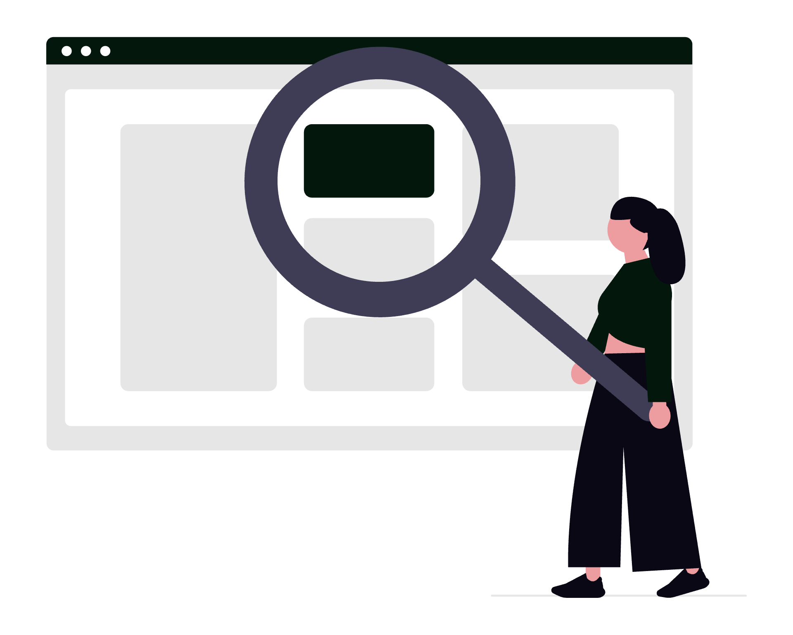

# Cum să folosești Ahrefs ca avocat

Ahrefs este una dintre cele mai complete platforme de analiză SEO și cercetare a vizibilității online. Pentru un cabinet de avocatură, Ahrefs nu este un instrument de marketing generic – este un radar care îți arată exact ce caută potențialii clienți, cum se poziționează competitorii tăi, ce pagini ale site-ului tău funcționează și ce trebuie reparat pentru ca Google să te considere relevant.

  

    
  

Acest ghid acoperă funcționalitățile reale ale platformei, cu setări, configurații și strategii specifice pentru practica juridică în România.

## 1. Site Explorer: radiografia completă a site-ului tău

Site Explorer este modulul central din Ahrefs. Introdu URL-ul site-ului cabinetului tău și obții instantaneu o perspectivă completă asupra performanței organice.

**Ce vezi și ce contează pentru un cabinet de avocatură:**

- **Organic traffic**: estimarea numărului de vizitatori lunari din căutările Google. Dacă ai sub 100 de vizitatori organici pe lună, site-ul tău este practic invizibil în căutările relevante.
- **Organic keywords**: numărul de cuvinte cheie pentru care apari în rezultatele Google. Urmărește câte sunt în Top 10 (prima pagină) – doar acestea generează trafic real.
- **Domain Rating (DR)**: scor de la 0 la 100 care reflectă autoritatea site-ului tău în funcție de profilul de backlink-uri. Un cabinet nou pornește de obicei de la DR 0-10; un site juridic cu conținut constant și link-uri de calitate ajunge la DR 20-40 în 12-18 luni.
- **Referring domains**: numărul de site-uri distincte care trimit link-uri către site-ul tău. Mai important decât numărul total de backlink-uri – 10 link-uri de la 10 site-uri diferite valorează mai mult decât 50 de link-uri de la același site.

**Setare practică:** adaugă site-ul cabinetului tău în **Dashboard** > **+ Add project** și configurează monitorizarea automată. Ahrefs va scana periodic site-ul și te va alerta când apar schimbări semnificative în trafic, cuvinte cheie sau backlink-uri.

## 2. Keywords Explorer: ce caută potențialii tăi clienți

Keywords Explorer este instrumentul de cercetare a cuvintelor cheie. Pentru un avocat, acesta răspunde la întrebarea fundamentală: ce întreabă oamenii pe Google când au o problemă juridică?

**Cum faci cercetare de cuvinte cheie juridice:**

1. Introdu un termen general din practica ta: `avocat divorț București`, `consultanță dreptul muncii`, `contestație amendă`, `recuperare creanțe`.
2. Selectează **Romania** ca țară și **Google** ca motor de căutare.
3. Analizează metricile pentru fiecare termen:

| Metrică | Ce înseamnă | De ce contează |
|---------|-------------|----------------|
| **Search Volume (SV)** | Numărul mediu lunar de căutări | Indică cererea reală pentru serviciul respectiv |
| **Keyword Difficulty (KD)** | Scor 0-100, cât de greu este să ajungi în Top 10 | Sub 20 = accesibil pentru un site nou; peste 40 = competiție puternică |
| **CPC** | Costul per click în Google Ads | CPC mare (peste 2-3 EUR) indică intenție comercială puternică |
| **Traffic Potential (TP)** | Traficul estimat pentru întreaga pagină, nu doar pentru un singur cuvânt cheie | Mai relevant decât SV-ul individual |

**Funcții avansate utile:**

- **Matching terms**: pornind de la termenul tău de bază, Ahrefs generează sute de variante. Filtrează după `KD max 20` și `SV min 50` pentru a găsi oportunități cu competiție redusă și volum decent.
- **Questions**: filtru care afișează doar căutările formulate ca întrebări (`cum`, `ce`, `când`, `cât costă`). Aceste întrebări sunt ideale pentru articole de blog și pagini FAQ.
- **Also rank for**: vezi ce alte cuvinte cheie poziționează paginile din Top 10 pentru termenul tău. Astfel descoperi termeni înrudiți pe care să-i incluzi în aceeași pagină.
- **SERP overview**: pentru fiecare cuvânt cheie, Ahrefs afișează primele 10 rezultate din Google cu metricile lor (DR, trafic, număr de backlink-uri). Astfel evaluezi dacă ai șanse reale să concurezi.

**Exemplu practic:** căutând `avocat dreptul muncii București`, poți descoperi că variația `avocat concediere abuzivă` are volum mai mic dar KD mult mai redus – o oportunitate concretă de poziționare pe care competitorii tăi o ignoră.

## 3. Site Audit: diagnosticul tehnic al site-ului

Site Audit este instrumentul care scanează site-ul tău și identifică problemele tehnice care afectează vizibilitatea în Google.

**Configurare:**

1. Mergi la **Site Audit** > selectează proiectul tău.
2. Configurează crawl-ul: setează frecvența la **Weekly** pentru monitorizare continuă.
3. La prima scanare, Ahrefs va analiza toate paginile indexabile și va genera un raport de sănătate.

**Probleme frecvente la site-urile cabinetelor de avocatură:**

- **Pagini fără meta description**: fiecare pagină de serviciu (drept civil, drept penal, dreptul muncii) trebuie să aibă o meta description unică de 140-160 de caractere care descrie clar ce găsește vizitatorul.
- **Title tags duplicate**: dacă mai multe pagini au același titlu, Google nu știe pe care să o afișeze. Fiecare pagină de practică trebuie să aibă un titlu distinct.
- **Imagini fără atribut alt**: toate imaginile (inclusiv sigla cabinetului) trebuie să aibă text alternativ descriptiv.
- **Pagini lente (slow pages)**: dacă o pagină se încarcă în mai mult de 3 secunde, atât Google cât și vizitatorii o părăsesc. Ahrefs semnalează paginile lente și cauzele (imagini neoptimizate, CSS/JS necomprimat).
- **Broken links (link-uri defecte)**: link-uri interne sau externe care duc la pagini inexistente (eroare 404). Frecvente după restructurări de site.
- **Canonical issues**: pagini care apar sub mai multe URL-uri (cu și fără `www`, cu și fără `/` final) și diluează autoritatea.

**Health Score**: Ahrefs calculează un scor de sănătate de la 0 la 100. Țintește un scor de peste 80. Sub 60 înseamnă probleme tehnice care îți reduc activ vizibilitatea.

**Setare recomandată:** configurează **Email alerts** pentru a primi notificări automate când apar erori noi sau când scorul de sănătate scade.

## 4. Content Explorer: cercetarea conținutului juridic performant

Content Explorer este un motor de căutare intern Ahrefs care indexează miliarde de pagini. Cauți un subiect și vezi ce pagini au performanța cea mai bună în termeni de trafic, backlink-uri și partajări sociale.

**Utilizare practică pentru un avocat:**

- Caută `dreptul muncii România` și filtrează după **Organic traffic > 100** și **Language: Romanian**. Vei vedea exact ce articole juridice atrag cel mai mult trafic organic în România.
- Filtrează după **Referring domains > 5** pentru a găsi articolele care au primit link-uri de la alte site-uri – acestea sunt subiecte cu potențial ridicat de link building.
- Folosește filtrul **Published: Last 12 months** pentru a vedea doar conținutul recent și a identifica tendențe actuale.

**De ce contează:** înainte să scrii un articol pe blog, verifică ce există deja pe acel subiect. Dacă primele 10 rezultate sunt articole superficiale de 300 de cuvinte, ai o oportunitate clară să creezi un ghid complet de 1500-2000 de cuvinte care să le depășească. Dacă primele rezultate sunt ghiduri detaliate de pe site-uri cu DR 60+, concentrează-te pe un unghi mai specific (ex. în loc de `contractul de muncă`, scrie despre `clauza de neconcurență în IT – ce trebuie să știi`).

## 5. Rank Tracker: monitorizarea pozițiilor în Google

Rank Tracker urmărește zilnic pozițiile site-ului tău pentru cuvintele cheie pe care le definești.

**Configurare inițială:**

1. Mergi la **Rank Tracker** > selectează proiectul.
2. Adaugă cuvintele cheie relevante pentru cabinetul tău. Grupează-le logic:

- **Brand**: `[Numele cabinetului]`, `[Numele cabinetului] avocat`
- **Servicii locale**: `avocat divorț [oraș]`, `avocat drept penal [oraș]`, `consultanță juridică [oraș]`
- **Informational**: `cât costă un avocat de divorț`, `cum se contestă o amendă`, `ce înseamnă contestație în anulare`
- **Competitiv**: termenii pe care îi vizează competitorii tăi direcți

3. Setează locația la orașul tău și dispozitivul la **Mobile** (peste 60% din căutările juridice locale se fac de pe telefon).

**Metrici de urmărit:**

- **Visibility**: procentul de vizibilitate organică estimată. Urmărește trendul lunar – crește sau scade?
- **Average position**: poziția medie pentru toate cuvintele cheie monitorizate.
- **SERP features**: dacă pentru cuvintele tale cheie Google afișează Featured Snippets, People Also Ask, Local Pack sau alte elemente speciale – și dacă site-ul tău apare în vreunul.

**Alerte:** configurează notificări pentru schimbări de poziție mai mari de 5 locuri – astfel detectezi rapid atât îmbunătățirile cât și pierderile de poziții.

## 6. Analiza competitorilor: ce fac alți avocați și ce poți învăța

Ahrefs este la fel de puternic pentru analiza competitorilor cât este pentru analiza propriului site.

**Pașii unei analize competitive:**

1. **Identifică competitorii organici**: în Site Explorer, mergi la **Organic competitors**. Ahrefs îți arată automat site-urile care se poziționează pe aceleași cuvinte cheie ca tine. Nu sunt neapărat competitorii tăi direcți din piață – pot fi portaluri juridice, site-uri de informații sau alte cabinete din alte orașe.

2. **Content Gap (lacune de conținut)**: această funcție compară cuvintele cheie pentru care competitorii tăi se poziționează dar tu nu. Mergi la **Site Explorer > [site-ul tău] > Content Gap** > introdu 2-3 URL-uri de competitori. Ahrefs generează lista cuvintelor cheie pe care le ratezi.

**Exemplu practic:** dacă trei cabinete concurente se poziționează pe `avocat recuperare creanțe București` și tu nu ai nicio pagină pe acest subiect, Content Gap îți semnalează această oportunitate.

3. **Top Pages**: în Site Explorer, secțiunea **Top pages** îți arată paginile care aduc cel mai mult trafic organic competitorului. Astfel vezi ce tipuri de pagini funcționează (pagini de serviciu, articole de blog, pagini FAQ, studii de caz) și poți adapta strategia.

4. **Backlink Gap**: similar cu Content Gap, dar pentru backlink-uri. Identifică site-urile care fac link către competitori dar nu către tine – potențiale surse de link building.

## 7. Backlink-uri: construirea autorității online

Profilul de backlink-uri este unul dintre cei mai importanți factori de ranking. Ahrefs oferă cele mai complete date despre link-urile care trimit către site-ul tău și către site-urile concurente.

**Analiza profilului de backlink-uri:**

În Site Explorer > **Backlinks**, vezi fiecare link individual cu:

- **Referring page**: pagina exactă care face link către tine.
- **DR al domeniului sursă**: cât de autoritar este site-ul care te menționează.
- **Anchor text**: textul pe care utilizatorul îl vede ca link. Un profil natural de link-uri are ancore variate (numele cabinetului, URL-ul, termeni generici ca `click aici`, termeni descriptivi ca `avocat specializat dreptul muncii`).
- **Dofollow / Nofollow**: link-urile dofollow transmit autoritate; link-urile nofollow nu, dar contribuie la un profil natural.

**Strategii de link building specifice pentru avocați:**

- **Directoare juridice**: înscrie-te în directoare profesionale cu profil complet și link către site (UNBR, barouri locale, directoare juridice online).
- **Publicații de specialitate**: scrie articole de opinie sau analize pentru publicații juridice online – fiecare articol publicat include de obicei un link către site-ul autorului.
- **Parteneriate locale**: colaborări cu notari, executori, mediatori, contabili – schimb reciproc de recomandări pe site-urile respective.
- **Interviuri și podcast-uri**: participarea la emisiuni sau podcast-uri de specialitate generează link-uri naturale de pe site-urile gazdă.
- **Resurse gratuite**: ghiduri descărcabile, checklist-uri juridice, modele de cereri – conținut util pe care alte site-uri îl vor menționa și îl vor linkui în mod natural.

**Monitorizare:** configurează **New backlinks alerts** în **Alerts** > **Backlinks** pentru a primi notificări când site-ul tău primește link-uri noi. La fel, monitorizează **Lost backlinks** pentru a detecta link-urile pierdute și a acționa (contactează site-ul sursă dacă link-ul a fost șters accidental).

## 8. Ahrefs Webmaster Tools: varianta gratuită pentru proprietari de site

Dacă bugetul nu permite un abonament complet Ahrefs, **Ahrefs Webmaster Tools (AWT)** este disponibil gratuit pentru proprietarii de site-uri.

**Ce include AWT:**

- **Site Audit**: scanare completă a site-ului cu raport de erori tehnice – identic cu versiunea plătită.
- **Site Explorer** (limitat): date despre propriul site – backlink-uri, cuvinte cheie organice, trafic estimat.
- **Rank Tracker** (limitat): monitorizarea pozițiilor pentru un număr redus de cuvinte cheie.

**Ce nu include AWT:** cercetarea de cuvinte cheie (Keywords Explorer), analiza competitorilor, Content Explorer și alertele avansate.

**Configurare:** mergi la **ahrefs.com/webmaster-tools**, creează un cont gratuit și verifică proprietatea site-ului prin DNS, fișier HTML sau tag meta. Verificarea durează câteva minute și îți oferă acces imediat la datele propriului site.

Pentru un cabinet mic care abia începe să lucreze pe SEO, AWT este un punct de pornire solid. Când volumul de cuvinte cheie și complexitatea strategiei cresc, upgrade-ul la un plan plătit devine necesar.

## 9. Ahrefs SEO Toolbar: date SEO direct în browser

**Ahrefs SEO Toolbar** este o extensie gratuită pentru Chrome și Firefox care afișează metrici SEO direct în pagina de rezultate Google și pe orice site vizitat.

**Funcții utile pentru avocați:**

- **SERP overlay**: când cauți pe Google un termen juridic, Toolbar-ul afișează sub fiecare rezultat: DR-ul domeniului, numărul de backlink-uri, traficul estimat al paginii. Astfel evaluezi competiția direct din pagina de căutare, fără să intri în Ahrefs.
- **On-page SEO report**: pe orice pagină a site-ului tău, Toolbar-ul analizează elementele on-page: title tag, meta description, headings (H1-H6), imagini fără alt, link-uri interne și externe. Util pentru verificări rapide ale paginilor de serviciu.
- **HTTP headers**: verifică codurile de stare (200, 301, 404) pentru orice pagină – util când restructurezi site-ul și vrei să te asiguri că redirecționările funcționează corect.

Extensia funcționează și fără abonament Ahrefs, deși cu date limitate. Cu abonament activ, afișează toate metricile disponibile.

## 10. Alerts și rapoarte automate

Ahrefs permite configurarea de alerte automate care te țin la curent fără să verifici manual platforma.

**Tipuri de alerte disponibile:**

| Tip alertă | Configurare | Utilitate pentru cabinet |
|------------|-------------|------------------------|
| **New backlinks** | Alerts > Backlinks > site-ul tău | Afli când un site nou face link către tine |
| **Lost backlinks** | Alerts > Backlinks > site-ul tău | Detectezi link-uri pierdute care îți afectează autoritatea |
| **New keywords** | Alerts > Keywords > termen monitorizat | Afli când apari pentru un cuvânt cheie nou în Top 100 |
| **Mentions** | Alerts > Mentions > numele cabinetului | Detectezi mențiuni online ale numelui tău (cu sau fără link) |

**Mențiuni fără link (unlinked mentions):** configurează o alertă de tip **Mentions** cu numele cabinetului tău. Când un site te menționează fără să facă link, ai o oportunitate naturală de outreach: contactează autorul și solicită adăugarea unui link către site-ul tău. Rata de succes este ridicată deoarece site-ul deja te cunoaște și te-a menționat voluntar.

**Rapoarte periodice:** în setările proiectului, configurează rapoarte săptămânale sau lunare trimise pe email cu rezumatul pozițiilor, traficului și sănătății tehnice. Utile pentru raportare internă sau pentru a ține la curent un partener de cabinet care nu accesează direct platforma.

## 11. Strategia de conținut bazată pe date

Ahrefs transformă crearea de conținut dintr-un exercițiu intuitiv într-un proces bazat pe date reale.

**Fluxul complet de creare a unui articol juridic:**

1. **Cercetare**: în Keywords Explorer, caută un subiect din practica ta (ex. `clauză penală contract`). Analizează volumul, dificultatea și intenția de căutare.
2. **Analiza SERP**: verifică primele 10 rezultate – ce acoperă, cât de detaliate sunt, ce le lipsește.
3. **Cuvinte cheie secundare**: din **Also rank for** și **Questions**, extrage 5-10 termeni înrudiți pe care să-i integrezi natural în articol.
4. **Structura**: construiește structura articolului astfel încât să acopere toate subtopicurile identificate în pasul anterior.
5. **Publicare și monitorizare**: după publicare, adaugă cuvintele cheie țintă în Rank Tracker și urmărește evoluția poziției în următoarele 4-8 săptămâni.
6. **Optimizare**: dacă după 2-3 luni articolul se poziționează pe pozițiile 5-15, optimizează-l: adaugă secțiuni noi, actualizează informațiile, îmbunătățește titlul și meta description-ul.

**Regulă practică:** nu scrie articole pe subiecte cu volum zero de căutări. Orice conținut pe care îl creezi trebuie să răspundă unei cereri reale pe care o poți valida cu datele din Ahrefs.

## 12. Tips & tricks care fac diferența

- **Best by links**: în Content Explorer, filtrează după `Best by links` pentru a găsi subiectele juridice care atrag cele mai multe link-uri naturale – acestea sunt ideale pentru strategia de link building prin conținut.
- **Compară perioade**: în Site Explorer > **Compare** poți compara performanța organică între două perioade (ex. luna curentă vs. luna anterioară). Util pentru a demonstra ROI-ul activităților de SEO în fața partenerilor de cabinet.
- **Batch Analysis**: dacă ai o listă de 10-20 de URL-uri de competitori, folosește **Batch Analysis** pentru a obține metricile tuturor site-urilor într-un singur raport. Economisești timp când faci cercetare competitivă la nivel de piață.
- **Internal links report**: în Site Audit, secțiunea **Internal links** îți arată paginile cu puține sau zero link-uri interne – pagini orfane pe care Google le găsește greu. Adaugă link-uri interne din articolele de blog și paginile de serviciu către aceste pagini.
- **Top pages by traffic change**: în Site Explorer > **Top pages** > sortează după **Traffic change** pentru a vedea ce pagini au câștigat sau pierdut trafic recent. Paginile în declin necesită actualizare.
- **Keyword clustering**: grupează cuvintele cheie similare care pot fi acoperite de o singură pagină. Ahrefs îți arată prin **Parent topic** care este termenul principal sub care se grupează termenii secundari.
- **SERP History**: pentru orice cuvânt cheie, vizualizează istoricul pozițiilor din ultimele 6-12 luni. Dacă rezultatele fluctuează frecvent, înseamnă că Google nu a stabilit încă un câștigător clar – oportunitate de intrare.

## Concluzie

Ahrefs este un instrument de decizie, nu doar de monitorizare. Pentru un cabinet de avocatură care vrea să atragă clienți prin prezența online, platforma oferă datele necesare pentru a investi inteligent: în ce pagini să creezi, ce cuvinte cheie să țintești, ce probleme tehnice să rezolvi și ce fac competitorii tăi mai bine.

Nu trebuie să devii specialist SEO ca să folosești Ahrefs eficient. Trebuie să înțelegi ce metrici contează, să configurezi alertele și rapoartele automate și să folosești datele ca bază pentru decizii concrete despre conținut și vizibilitate.

Dacă vrei să implementezi o strategie SEO completă pentru cabinetul tău – de la cercetarea cuvintelor cheie până la crearea de conținut optimizat și monitorizarea rezultatelor – echipa **SOLON** poate construi și executa întreaga strategie adaptată practicii tale juridice.
