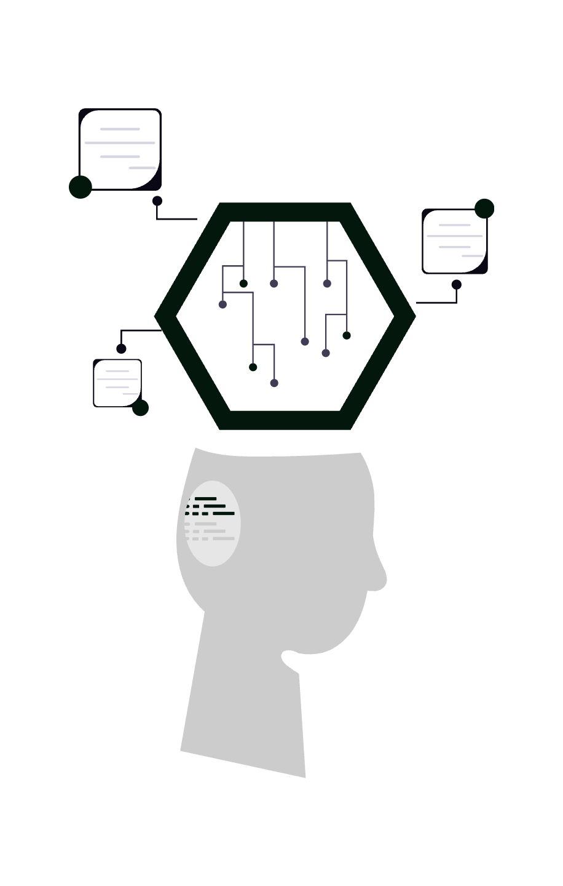
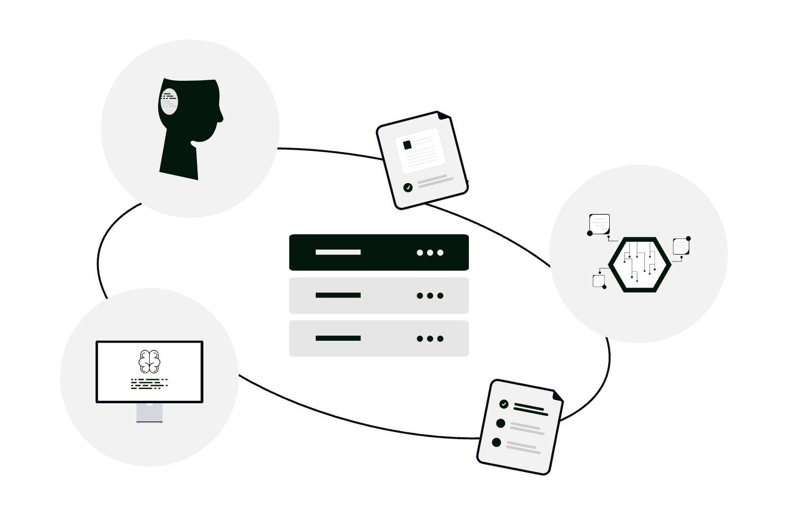

# Cum să folosești Codex ca avocat

Codex este agentul de programare bazat pe inteligență artificială dezvoltat de OpenAI: îi descrii în limbaj natural ce vrei să obții, iar el scrie, rulează și corectează cod pentru tine. Pentru un avocat, asta nu înseamnă că trebuie să devii programator, ci că poți construi mici instrumente și automatizări - generarea în serie a unor documente, prelucrarea unor tabele, anonimizarea datelor, un formular de preluare a clienților - fără să angajezi un dezvoltator. Codex traduce o cerință formulată în română într-un script care chiar funcționează, rulat într-un mediu izolat și sigur.

<div class="row justify-content-center my-4">
  <div class="col-md-8">
    
  </div>
</div>

Acest ghid explică, precis și aplicat, ce este Codex, cum îl instalezi și configurezi, ce poate face concret pentru un cabinet de avocatură, cum îl conectezi la alte instrumente și - cel mai important - cum îl folosești fără să încalci secretul profesional sau GDPR.

## 1. Ce este Codex și de ce ar folosi un avocat un instrument de programare

Codex este un **agent de codare (coding agent)**: spre deosebire de un chatbot care doar îți răspunde, Codex citește fișiere, scrie cod, execută comenzi, verifică rezultatul și corectează singur erorile, până când sarcina este îndeplinită. Este alimentat de modelele specializate ale OpenAI pentru sarcini agentice (familia de modele Codex / GPT-5).

Întrebarea firească: de ce ar avea un avocat nevoie de așa ceva? Pentru că o mare parte din munca administrativă a unui cabinet înseamnă, de fapt, operațiuni repetitive pe date și documente - exact lucruri care se rezolvă cu mici programe. Cu Codex le poți construi descriind problema în cuvinte, nu scriind cod:

- „Ia acest tabel cu 200 de clienți și generează câte un contract de asistență juridică pentru fiecare, pe baza acestui șablon.”
- „Redenumește toate aceste 500 de PDF-uri după modelul `Nume_Client - Tip_Document - Data`.”
- „Extrage din aceste 30 de facturi PDF valoarea, data și CUI-ul și pune-le într-un tabel.”
- „Construiește-mi un formular web prin care un client nou își completează datele înainte de prima consultație.”

Codex se folosește în patru forme: **Codex CLI** (în terminal), **extensia IDE** (în editoare precum VS Code sau Cursor), **Codex în cloud / în ChatGPT** (sarcini delegate care rulează pe serverele OpenAI) și **integrarea cu GitHub** (pentru revizuirea automată a codului). Pentru un avocat, cele mai utile sunt CLI-ul local și varianta din cloud.

Spre deosebire de un instrument de cercetare precum cel descris în ghidul [Cum să folosești NotebookLM ca avocat](../cum-sa-folosesti-notebooklm-ca-avocat/), Codex nu rezumă documente - el construiește instrumente care prelucrează documente.

## 2. Conturi, planuri și acces

Codex este inclus în abonamentele **ChatGPT**: Plus, Pro, Business, Edu și Enterprise. Te autentifici cu contul ChatGPT, iar limitele de utilizare depind de plan (Pro și Business oferă un volum mult mai mare de sarcini). Alternativ, dezvoltatorii îl pot folosi cu o cheie API și plată per utilizare (pay-as-you-go).

Pentru un cabinet, recomandarea practică:

- **ChatGPT Plus** este suficient pentru a testa și a rula automatizări ocazionale.
- **ChatGPT Business** este alegerea corectă pentru un cabinet cu echipă, pentru că oferă administrare centralizată și, esențial, **datele nu sunt folosite pentru antrenarea modelelor** implicit (vezi secțiunea 11 despre confidențialitate).
- Verifică întotdeauna setările de reținere a datelor (data retention) ale planului înainte de a-l folosi pe sarcini reale.

## 3. Instalarea și prima configurare a Codex CLI

**Codex CLI** este instrumentul open-source care rulează în terminalul calculatorului tău. Instalarea presupune un singur pas, dacă ai instalat Node.js:

```bash
npm install -g @openai/codex
```

Alternativ, pe macOS poți folosi Homebrew:

```bash
brew install codex
```

Apoi pornești agentul din folderul cu care vrei să lucrezi:

```bash
codex
```

La prima rulare te autentifici cu contul ChatGPT (`Sign in with ChatGPT`). De aici, îi dai instrucțiuni în limbaj natural - inclusiv în română. Un detaliu important: Codex lucrează în **folderul curent**, pe care îl tratează ca spațiu de lucru. Creează un folder dedicat fiecărui proiect de automatizare (de exemplu `~/automatizari-cabinet/generare-contracte`) și pornește Codex acolo, ca să nu îi dai acces la întreg calculatorul.

## 4. Modurile de aprobare și sandbox-ul - controlul tău asupra agentului

Acesta este punctul în care un avocat trebuie să fie atent. Codex rulează implicit într-un **sandbox (mediu izolat)** și îți cere aprobare înainte de acțiuni cu impact. Există trei niveluri de autonomie:

| Mod | Ce poate face fără să întrebe | Recomandat pentru |
|-----|-------------------------------|-------------------|
| **Read Only** (doar citire) | Doar citește fișiere și răspunde; nu modifică nimic | Explorare, analiză, prima dată când testezi |
| **Auto** (implicit) | Citește și modifică fișiere, rulează comenzi în folderul de lucru; cere voie pentru acces la internet sau în afara folderului | Munca de zi cu zi |
| **Full Access** (acces complet) | Rulează orice, inclusiv acces la rețea, fără să întrebe | De evitat; doar în medii de test izolate |

Recomandarea fermă pentru un cabinet: **pornește în Read Only**, treci la **Auto** când ai înțeles ce face și **nu folosi niciodată Full Access** pe un calculator cu date reale de clienți. Sandbox-ul împiedică agentul să atingă fișiere din afara folderului de lucru și să acceseze rețeaua fără permisiune - este prima ta linie de apărare.

## 5. Automatizarea documentelor juridice repetitive

Cea mai directă valoare a Codex pentru un cabinet este generarea și prelucrarea în serie a documentelor. Câteva sarcini reale, formulate exact așa cum i le-ai cere:

- **Generare în masă din șablon**: „Am un șablon de contract de asistență juridică în `sablon.docx` cu câmpurile `{{NUME}}`, `{{CNP}}`, `{{ONORARIU}}` și un fișier `clienti.csv` cu datele. Generează câte un document Word completat pentru fiecare rând." Codex scrie scriptul (de exemplu în Python, cu biblioteca `python-docx`) și îl rulează.
- **Procesare PDF**: îmbinarea mai multor PDF-uri într-un dosar unic, împărțirea unui PDF mare pe capitole, adăugarea numerotării paginilor sau a unui filigran „CONFIDENȚIAL” pe fiecare pagină.
- **Redenumire și organizare**: aplicarea unei convenții de denumire coerente peste sute de fișiere, util înainte de a le încărca în arhiva cloud descrisă în ghidul [Cum să folosești Google Drive ca avocat](../cum-sa-folosesti-google-drive-ca-avocat/).
- **Conversii**: transformarea unui set de documente Word în PDF sau extragerea textului din PDF-uri scanate (OCR).

Avantajul față de munca manuală nu este doar viteza, ci și **consistența**: scriptul aplică exact aceeași regulă la toate fișierele, eliminând erorile de copy-paste. Pentru o privire de ansamblu asupra când merită să automatizezi, vezi [automatizarea proceselor juridice: când și cum este utilă](../automatizarea-proceselor-juridice-cand-si-cum-este-utila/).

## 6. Prelucrarea și analiza datelor

A doua categorie de sarcini ține de date structurate - tabele, liste, evidențe:

- **Extragere de date din documente**: „Citește aceste 40 de hotărâri în PDF și extrage într-un tabel numărul dosarului, instanța, data și soluția.”
- **Consolidarea evidențelor**: combinarea mai multor fișiere Excel cu termene, onorarii sau clienți într-un singur tabel curat, fără duplicate.
- **Calcule juridice**: un script care calculează termene procedurale, dobânzi penalizatoare sau actualizarea unei creanțe cu rata inflației, pe baza unor date de intrare.
- **Anonimizarea datelor (pseudonimizare)**: înlocuirea automată a numelor, CNP-urilor și adreselor dintr-un set de documente cu coduri, esențială înainte de a partaja exemple sau de a folosi date în scop de testare - o cerință directă de minimizare impusă de GDPR.

Codex îți poate genera și un grafic sau un mic raport din aceste date, fără să atingi o formulă Excel.

<div class="row justify-content-center my-4">
  <div class="col-md-7">
    
  </div>
</div>

## 7. Construirea de instrumente și pagini web interne

Codex poate construi aplicații mici, complete, pe care le folosești în cabinet:

- **Formular de preluare client (intake)**: o pagină web prin care un client nou își completează datele și încarcă documente înainte de prima întâlnire, similar fluxurilor de onboarding descrise în ghidul [Cum să folosești DocuSign ca avocat](../cum-sa-folosesti-docusign-ca-avocat/).
- **Calculator public pe site**: un calculator de taxe judiciare de timbru, de termene sau de onorariu orientativ, pe care îl publici pe site-ul cabinetului ca instrument util pentru vizitatori - și care atrage trafic pe termeni de căutare specifici.
- **Tablou de bord intern (dashboard)**: o pagină simplă care îți afișează termenele apropiate dintr-un tabel.
- **Pagină de prezentare / landing page**: un site simplu, rapid, pentru cabinet.

Pentru ca un astfel de instrument public să fie găsit în Google, integrează-l cu o strategie de optimizare - vezi [Cum să folosești Google Search Console ca avocat](../cum-sa-folosesti-google-search-console-ca-avocat/).

## 8. AGENTS.md - cum îi dai context și reguli stabile lui Codex

Pentru ca rezultatele să fie consecvente, Codex citește un fișier special numit **`AGENTS.md`**, plasat în folderul de lucru. Este, practic, un set de instrucțiuni permanente pe care agentul le respectă la fiecare rulare - echivalentul unui „mandat” scris dat unui colaborator.

Într-un `AGENTS.md` pentru un cabinet poți preciza:

```markdown
# Instrucțiuni pentru proiectul de automatizare

- Răspunde și comentează codul în limba română.
- Toate documentele generate respectă formatul: A4, font Times New Roman 12.
- Nu trimite niciodată date în afara acestui folder.
- Numele fișierelor: Nume_Client - Tip_Document - AAAA-LL-ZZ.
- Datele personale din exemple trebuie pseudonimizate.
```

Astfel nu mai repeți aceleași cerințe de fiecare dată, iar agentul aplică automat regulile cabinetului. Logica este aceeași cu cea a șabloanelor reutilizabile - un standard scris o singură dată, aplicat consecvent.

## 9. Integrări third-party și protocolul MCP

Codex devine cu adevărat puternic când nu mai lucrează izolat, ci se conectează la instrumentele tale. Principalele căi de integrare:

- **Model Context Protocol (MCP)**: un standard deschis prin care Codex se conectează la „servere” externe care îi oferă unelte și acces la date - de exemplu, un server MCP pentru Google Drive, pentru o bază de date sau pentru un sistem de management al dosarelor. Configurezi serverele MCP în fișierul de configurare al Codex.
- **Integrarea cu GitHub**: Codex poate fi conectat la un depozit de cod pentru a revizui automat modificările și a propune corecturi - util dacă cabinetul își dezvoltă instrumente proprii pe termen lung.
- **Sarcini în cloud delegate din ChatGPT**: din interfața ChatGPT poți trimite o sarcină care rulează în fundal, pe un mediu izolat al OpenAI, și primești rezultatul (un set de modificări) când e gata.
- **API și conectare la alte servicii**: cu permisiunea ta de acces la rețea, Codex poate scrie scripturi care folosesc API-uri publice (de exemplu, cursul valutar BNR pentru actualizarea unei creanțe) sau care scriu într-o foaie de calcul Google.

Atenție: orice integrare care implică acces la internet sau la date externe trebuie aprobată explicit și evaluată din perspectiva confidențialității (secțiunea 11).

## 10. Sarcini în cloud și delegarea în paralel

Pe lângă varianta locală, Codex poate executa sarcini **în cloud**: le descrii, agentul lucrează într-un container izolat pe serverele OpenAI și îți întoarce rezultatul. Avantajul este că poți lansa **mai multe sarcini în paralel** și că nu îți ocupă calculatorul - pornești o automatizare lungă și te întorci la munca ta juridică.

Modelul de lucru recomandat pentru un avocat:
- Sarcinile **sensibile**, care ating date reale de clienți, rulează **local**, în sandbox, fără acces la rețea.
- Sarcinile **generice** (construirea unui calculator public, prototiparea unui formular, învățarea unui concept) pot rula **în cloud**, folosind date fictive.

Această separare clară între „local cu date reale” și „cloud cu date fictive” este cea mai simplă regulă prin care reconciliezi puterea instrumentului cu obligația de confidențialitate.

## 11. Confidențialitate, secret profesional și GDPR

Acesta este capitolul pe care niciun avocat nu îl poate sări. Codex este un instrument puternic, dar lucrezi cu date protejate de secretul profesional (Legea nr. 51/1995) și de GDPR. Reguli minime obligatorii:

- **Nu introduce date reale de clienți în sarcini care rulează în cloud** decât după ce ai verificat clauzele de prelucrare și reținere a datelor ale planului tău. Pe planurile **Business/Enterprise**, datele nu sunt folosite implicit pentru antrenarea modelelor - confirmă acest lucru în setări.
- **Preferă execuția locală în sandbox** pentru orice atingere de date reale, cu accesul la rețea dezactivat.
- **Pseudonimizează datele** înainte de a le folosi ca exemplu sau pentru testare, conform principiului minimizării.
- **Verifică întotdeauna codul și rezultatul** înainte de a-l folosi pe documente oficiale - Codex poate greși, iar răspunderea profesională rămâne a ta. Tratează agentul ca pe un colaborator junior pe care îl verifici, nu ca pe o sursă infailibilă.
- **Încheie și gestionează acordurile de prelucrare (DPA)** cu OpenAI și include instrumentul în registrul de prelucrări al cabinetului.
- **Activează modurile de aprobare restrictive** și nu acorda Full Access pe dispozitive cu date sensibile.

Aceste măsuri se înscriu în strategia mai largă de protecție a datelor descrisă în articolele despre [importanța securității cibernetice în avocatura digitală](../importanta-securitatii-cibernetice-practica-avocaturii-digitale/) și [zero-trust security explicat pentru avocați](../zero-trust-security-explicat-pentru-avocati/).

## 12. Tips & tricks care fac diferența

- **Începe fiecare proiect cu un `AGENTS.md`** care stabilește limba, formatul și regula de a nu scoate datele din folder.
- **Formulează sarcini mici și clare**, una câte una; un agent primește instrucțiuni precise mai bine decât o cerere vagă și uriașă.
- **Cere-i lui Codex să-ți explice ce face** înainte de a aproba - „explică-mi pe scurt ce va face scriptul, apoi așteaptă confirmarea”.
- **Lucrează cu control al versiunilor (Git)** pe proiectele mai mari, ca să poți reveni dacă o modificare strică ceva.
- **Folosește date fictive pentru prototipare** și treci la datele reale doar după ce ai validat că instrumentul funcționează.
- **Reia sesiunile**: Codex poate relua o sesiune anterioară, păstrând contextul, fără să-i explici totul de la capăt.
- **Testează pe un singur fișier** înainte de a rula o operațiune pe sute - „fă mai întâi pe un singur document, ca să verific rezultatul”.
- **Cere documentație**: roagă-l să adauge un scurt fișier `README` care explică, în română, cum se folosește instrumentul - util pentru colegii din cabinet.

## 13. Limitări și când să NU folosești Codex

Onestitatea profesională cere să recunoști granițele instrumentului:

- **Nu este un instrument de consultanță juridică**: Codex automatizează operațiuni pe documente și date, nu oferă analiză sau opinii juridice de încredere.
- **Necesită un minim de confort tehnic**: deși nu scrii cod, trebuie să înțelegi ce este un terminal, un folder de lucru și un mod de aprobare.
- **Poate greși**: scripturile generate trebuie verificate; nu folosi rezultatul nevalidat pe documente care produc efecte juridice.
- **Nu este potrivit pentru date ultrasensibile în cloud**: pentru acestea, rămâi pe execuția locală izolată.

Dacă ai nevoie doar de un asistent de cercetare și sinteză, un instrument precum cel din ghidul [Cum să folosești NotebookLM ca avocat](../cum-sa-folosesti-notebooklm-ca-avocat/) este mai potrivit. Codex strălucește atunci când problema ta este, în esență, una de automatizare repetitivă.

## 14. Concluzie

Codex aduce în cabinetul de avocatură o capacitate care, până recent, presupunea angajarea unui dezvoltator: transformarea unei cerințe formulate în română într-un instrument care chiar funcționează - de la generarea în serie a contractelor și prelucrarea PDF-urilor, la anonimizarea datelor și construirea unui formular de preluare a clienților. Valoarea concretă stă în consecvență și în timpul recuperat din sarcinile repetitive, iar modurile de aprobare și sandbox-ul îți păstrează controlul asupra a ceea ce face agentul.

Trade-off-ul real este dublu: Codex cere un minim de confort tehnic și o disciplină fermă de confidențialitate - datele reale ale clienților nu au ce căuta în sarcini de cloud neverificate, iar fiecare rezultat trebuie validat înainte de a produce efecte juridice. Folosit cu aceste precauții - local, în sandbox, cu date pseudonimizate și cu verificare umană - devine un multiplicator de productivitate, nu un risc.

Dacă vrei să implementezi automatizări cu Codex pentru cabinetul tău - de la generarea documentelor și prelucrarea datelor, până la instrumente interne și integrări sigure, configurate cu respectarea secretului profesional și a GDPR - echipa **SOLON** oferă consultanță de digitalizare adaptată specificului practicii tale juridice.
