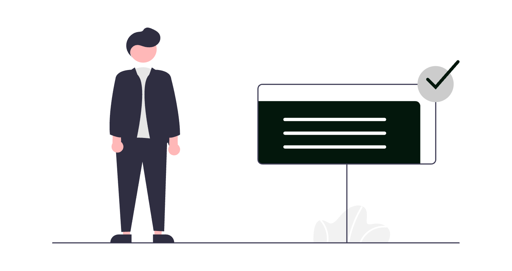
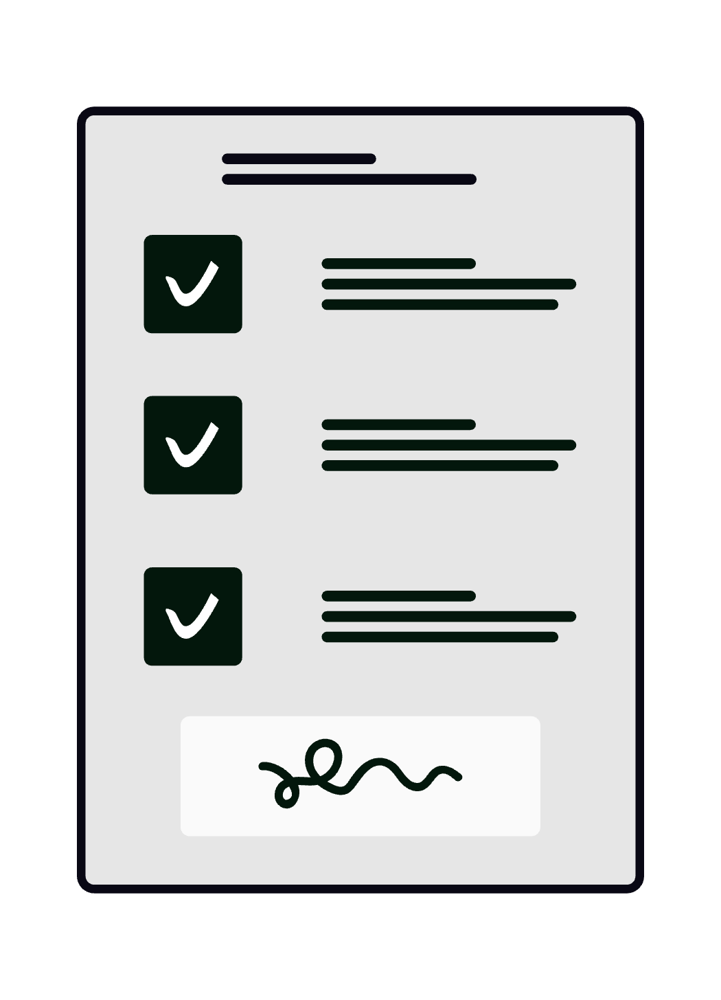

# Cum să folosești DocuSign ca avocat

DocuSign este platforma de semnătură electronică folosită de cele mai multe ori în mediul juridic și de afaceri din lume. Pentru un avocat, ea înlocuiește ciclul lent de tipărire - semnare - scanare - retrimitere cu un flux digital în care un contract, o procură sau un acord de confidențialitate ajunge semnat valid în câteva minute, de oriunde. Bine configurat, DocuSign reduce timpii morți din relația cu clientul, păstrează o pistă de audit completă pentru fiecare document și se integrează direct în instrumentele pe care le folosești deja zilnic.

  

    
  

Acest ghid acoperă funcționalitățile reale ale DocuSign eSignature, cu setări și configurații specifice pentru practica juridică din România: tipuri de semnătură și valabilitate juridică, șabloane, autentificarea semnatarilor, automatizări, integrări și conformitate.

## 1. Configurarea contului și a profilului juridic

Înainte de prima trimitere, dedică zece minute setărilor de cont din **Settings** (rotița din colțul dreapta-sus al consolei `account.docusign.com`):

- **Limba și fusul orar**: setează limba interfeței și a notificărilor în **My Preferences → Regional Settings**. Pentru semnatari din România, fusul `(UTC+02:00) Bucharest` asigură marcaje de timp corecte în pista de audit.
- **Aspectul semnăturii**: din **My Preferences → Signatures → Add Signature** alegi stilul semnăturii și al inițialelor (font predefinit, desen cu mouse-ul/touch sau imagine încărcată). Avocații preferă de regulă o semnătură desenată, mai apropiată de cea olografă.
- **Brand-ul cabinetului**: în planurile **Business Pro** și superioare, mergi la **Settings → Brands → Add Brand** și încarcă logo-ul, culorile și textul e-mailurilor de invitație. Documentele trimise vor purta identitatea vizuală a cabinetului, nu pe cea generică DocuSign - un detaliu de încredere pentru client.
- **Semnătura și antetul implicit al e-mailului**: personalizează din **Settings → Email Preferences** subiectul și mesajul standard de invitație la semnare, astfel încât clientul să recunoască imediat expeditorul.

## 2. Tipurile de semnătură electronică și valabilitatea juridică

Acesta este punctul în care un avocat trebuie să fie precis. Regulamentul (UE) nr. 910/2014 (**eIDAS**), aplicabil direct în România alături de Legea nr. 455/2001, distinge trei niveluri de semnătură electronică:

| Tip | Denumire eIDAS | Valoare juridică |
|-----|----------------|------------------|
| **SES** | Semnătură electronică simplă | Admisibilă ca probă, dar forța probantă se apreciază de instanță |
| **AES** | Semnătură electronică avansată | Legată unic de semnatar, permite identificarea și detectarea modificărilor |
| **QES** | Semnătură electronică calificată | Echivalentă juridic cu semnătura olografă, conform art. 25(2) eIDAS |

- **Implicit, DocuSign eSignature aplică o semnătură de tip electronic standard (SES/AES)**, suficientă pentru marea majoritate a contractelor comerciale, contractelor de asistență juridică, acordurilor de confidențialitate și procurilor sub semnătură privată.
- Pentru documentele care necesită echivalentul semnăturii olografe, DocuSign oferă **Standards Based Signatures (QES)** prin parteneri calificați și verificare a identității. Înainte de a o folosi, confirmă că nivelul corespunde cerinței legale a actului respectiv.
- **Atenție la forma autentică**: actele pentru care legea impune formă autentică notarială (de exemplu transferul drepturilor reale asupra imobilelor) **nu** pot fi încheiate prin semnătură electronică pe DocuSign. Verifică întotdeauna cerința de formă înainte de a digitaliza un flux.

Fiecare plic finalizat generează un **Certificate of Completion** - o pistă de audit cu marcaje de timp, adrese IP, metoda de autentificare și consimțământul fiecărui semnatar, atașată documentului ca probă a procesului.

## 3. Plicuri (Envelopes) - unitatea de bază a fluxului

În DocuSign, totul gravitează în jurul conceptului de **plic (envelope)**: un container care reunește unul sau mai multe documente, destinatarii și câmpurile de completat. Fluxul standard de trimitere:

1. **Start → Send an Envelope** sau butonul **New → Send an Envelope** din panoul principal.
2. **Add Documents**: încarci fișierele (PDF, Word, imagini) prin upload, din cloud (Drive, OneDrive, Dropbox) sau dintr-un șablon existent.
3. **Add Recipients**: adaugi semnatarii cu nume și e-mail, le stabilești rolul și ordinea de semnare.
4. **Message**: completezi subiectul și mesajul de însoțire - menționează clar dosarul și termenul de semnare.
5. **Next**: plasezi câmpurile pe document prin drag & drop.
6. **Send**: fiecare destinatar primește un e-mail cu link securizat către document.

Toate plicurile sunt vizibile și gestionabile din tab-ul **Manage**, unde le filtrezi după stare: `Action Required`, `Waiting for Others`, `Completed`, `Drafts`, `Expiring Soon`.

## 4. Câmpuri (Fields) - ce și unde completează semnatarul

După adăugarea documentelor, plasezi câmpurile din bara laterală prin drag & drop pe pagina exactă unde vrei să apară. Câmpurile relevante pentru documentele juridice:

- **Signature** și **Initial**: locul semnăturii, respectiv al parafării fiecărei pagini (util pentru contracte multi-pagină unde dorești inițiale pe fiecare filă).
- **Date Signed**: completează automat data semnării - nu o lăsa pe semnatar să o scrie manual, pentru a evita datări incorecte.
- **Name**, **Email**, **Company**, **Title**: date pre-completate din profilul destinatarului.
- **Text**: câmp liber pentru CNP, serie/număr CI, adresă, valoare contract. Poți marca un câmp ca **Required** și poți aplica **validări** (de exemplu format numeric, e-mail, ZIP) din panoul de proprietăți al câmpului.
- **Checkbox**, **Radio Button**, **Dropdown**: pentru opțiuni de tipul „de acord cu clauza X" sau alegerea unui regim contractual.
- **Attachment**: ceri semnatarului să încarce un document (copie CI, dovadă a calității de reprezentant) chiar în timpul semnării.
- **Note** și **Formula**: text explicativ needitabil, respectiv câmp calculat (de exemplu TVA, total) pe baza altor câmpuri.

**Conditional Fields (câmpuri condiționale)**: poți seta ca un câmp să apară doar dacă alt câmp are o anumită valoare - de exemplu, secțiunea „date soț/soție" apare doar dacă semnatarul bifează „căsătorit". Configurezi din proprietățile câmpului declanșator → **Create Rule**.

**Sfat de acuratețe**: asignează fiecare câmp destinatarului corect din meniul **Recipients** de sus (fiecare semnatar are o culoare proprie). Un câmp asignat greșit este una dintre cele mai frecvente cauze de plicuri blocate.

## 5. Roluri și ordinea de semnare (routing order)

Fluxurile juridice implică adesea mai mulți semnatari într-o anumită ordine. La adăugarea destinatarilor, fiecăruia îi atribui un **rol (action)**:

- **Needs to Sign**: trebuie să semneze documentul.
- **In Person Signer**: semnare în fața avocatului, pe dispozitivul cabinetului (util la sediul cabinetului, când clientul nu folosește e-mailul).
- **Receives a Copy (CC)**: primește o copie a documentului finalizat, fără să semneze (de exemplu, partea adversă sau un coleg).
- **Needs to View**: trebuie să confirme că a vizualizat documentul, fără semnătură.
- **Specify Recipients**: un destinatar desemnează el însuși cine semnează mai departe (util când nu cunoști din start reprezentantul legal al unei companii).
- **Allow to Edit**: permite unui destinatar să modifice plicul - de rezervat colaboratorilor de încredere.

**Ordinea de semnare (Set signing order)**: activează comutatorul din partea de sus a listei de destinatari. Numerotezi fiecare destinatar:
- Numere diferite (1, 2, 3) = semnare **secvențială** - al doilea semnatar primește documentul abia după ce primul a semnat.
- Același număr la mai mulți destinatari = semnare **paralelă** - toți primesc documentul simultan.

Exemplu de flux pentru un contract de asistență juridică: `1` - clientul semnează, `2` - avocatul coordonator semnează, `3` - secretariatul primește copie (CC). Diagrama de routing este vizibilă în timp real în panoul din stânga.

## 6. Autentificarea semnatarilor - dovada identității

Pentru un avocat, întrebarea „cine a semnat de fapt?" este esențială. DocuSign oferă metode de autentificare ce se aplică per destinatar, din opțiunile avansate ale fiecărui semnatar (**More → Add authentication**):

- **Access Code**: un cod stabilit de tine, comunicat clientului pe alt canal (telefon, SMS). Semnatarul trebuie să-l introducă înainte de a accesa documentul.
- **SMS Authentication**: DocuSign trimite un cod unic prin SMS la numărul indicat, verificând că semnatarul controlează acel telefon.
- **Phone Authentication**: cod transmis prin apel telefonic automat.
- **ID Verification**: semnatarul fotografiază un act de identitate (CI, pașaport) care este verificat automat - metoda recomandată pentru contracte cu miză ridicată și pentru fluxurile QES conforme eIDAS.
- **Knowledge-Based Authentication (KBA)**: verificare prin întrebări bazate pe baze de date publice (disponibilă în special pe piața din SUA).

  

    
  

Combină autentificarea cu o politică internă clară: pentru orice document cu valoare patrimonială semnificativă, impune cel puțin **SMS Authentication** sau **ID Verification**. Metoda aleasă este înregistrată în Certificate of Completion și întărește forța probantă a documentului. Despre miza autentificării corecte și a protejării datelor clienților poți citi mai mult în articolul dedicat [importanței securității cibernetice în avocatura digitală](../importanta-securitatii-cibernetice-practica-avocaturii-digitale/).

## 7. Șabloane (Templates) pentru documente recurente

Cea mai mare economie de timp pentru un cabinet vine din **șabloane** - plicuri pre-configurate cu documente, roluri și câmpuri salvate, gata de refolosit. Creezi un șablon din **Templates → New → Create Template**:

1. Încarci documentul standard (contract de asistență juridică, NDA, procură, acord de prelucrare a datelor).
2. Definești **roluri** (nu persoane concrete), de exemplu `Client` și `Avocat`, cu autentificarea aferentă.
3. Plasezi toate câmpurile o singură dată.
4. Salvezi - la următoarea utilizare, alegi **Use** și completezi doar e-mailurile reale.

  

    
  

Șabloane utile pentru un cabinet de avocatură:

- **Contract de asistență juridică** - cu câmpuri pentru onorariu, obiect, durată și autentificare SMS a clientului.
- **Acord de confidențialitate (NDA)** - flux paralel când ambele părți semnează simultan.
- **Procură / împuternicire avocațială** - cu inițiale pe fiecare pagină și ID Verification.
- **Acord de prelucrare a datelor (GDPR)** - clauza standard, refolosibilă pentru fiecare client nou.

Poți partaja șabloanele cu întreaga echipă din **Template → Share**, astfel încât toți avocații să pornească de la aceleași documente verificate. Logica este similară cu cea a șabloanelor reutilizabile din alte instrumente - vezi și abordarea pe șabloane descrisă în ghidul [Cum să folosești Outlook ca avocat](../cum-sa-folosesti-outlook-ca-avocat/).

## 8. PowerForms - formulare de auto-servire pentru clienți

**PowerForms** transformă un șablon într-un formular accesibil printr-un **link public**, fără ca tu să inițiezi manual fiecare plic. Clientul deschide linkul, își completează datele și semnează singur.

Creare: **Templates → (selectezi șablonul) → Actions → Create PowerForm**. Obții un URL pe care îl poți publica pe site-ul cabinetului, îl trimiți prin e-mail sau îl pui într-un cod QR.

Cazuri de utilizare în avocatură:
- **Onboarding client nou**: formular de mandat și acord GDPR completat și semnat înainte de prima consultație.
- **Acord de confidențialitate standard** pentru orice persoană care intră în discuții preliminare.
- **Cerere de servicii** publicată pe pagina de contact, semnată instant.

Fiecare PowerForm generează plicuri individuale, vizibile în **Manage**, cu aceeași pistă de audit. Pentru a integra formularul în site, poți coordona această configurare cu strategia ta de prezență online descrisă în articolul despre [cum să folosești Google Search Console ca avocat](../cum-sa-folosesti-google-search-console-ca-avocat/).

## 9. Bulk Send - trimitere în masă către mai mulți semnatari

**Bulk Send** trimite același document, în plicuri separate, către zeci sau sute de destinatari simultan - fiecare primește propriul exemplar, semnează independent și are propria pistă de audit.

Configurare: pornești de la un șablon → **Use → Bulk Send** → încarci o **listă CSV** cu numele, e-mailul și (opțional) câmpurile pre-completate ale fiecărui destinatar.

Aplicații concrete:
- Notificări sau acte adiționale identice către toți clienții afectați de o modificare legislativă.
- Acorduri GDPR re-emise către întreaga bază de clienți.
- Documente de consimțământ într-un litigiu colectiv sau o acțiune cu mulți reclamanți.

Bulk Send este disponibil în planurile business și are limite de volum în funcție de abonament - verifică plafonul lunar înainte de o campanie mare.

## 10. Remindere, expirare și gestionarea plicurilor

Un document rămas nesemnat blochează dosarul. DocuSign automatizează urmărirea:

- **Reminders**: din **Advanced Options** la trimitere (sau implicit în **Settings → Reminders and Expirations**), setezi primul memento după X zile și repetarea la fiecare Y zile. Recomandat: primul memento la 2 zile, repetare la fiecare 3 zile.
- **Expiration**: documentul expiră automat după un număr de zile (de exemplu 30), util pentru oferte cu termen limitat.
- **Void (anulare)**: din **Manage → (plicul) → Void** retragi un document trimis din greșeală; semnatarii sunt notificați automat, iar acțiunea rămâne în pista de audit.
- **Correct**: din **Manage → Correct** modifici destinatarii sau câmpurile unui plic deja trimis, fără să o iei de la capăt.
- **Resend**: retrimiți e-mailul de invitație dacă semnatarul l-a pierdut.

Automatizarea acestor pași elimină munca manuală de follow-up. Despre principiile mai largi ale automatizării în practica juridică poți citi în articolul [automatizarea proceselor juridice: când și cum este utilă](../automatizarea-proceselor-juridice-cand-si-cum-este-utila/).

## 11. Integrarea cu alte instrumente (third party integrations)

Valoarea reală a DocuSign apare când nu mai trebuie să intri în platformă pentru fiecare document. Integrările cheie pentru un cabinet:

- **DocuSign for Microsoft Outlook**: add-in-ul îți permite să trimiți un atașament spre semnare direct din e-mail, fără să-l descarci. Combinat cu fluxurile descrise în ghidul [Cum să folosești Outlook ca avocat](../cum-sa-folosesti-outlook-ca-avocat/), reduce semnarea unui contract la câteva click-uri.
- **DocuSign for Word**: trimiți spre semnare un document chiar din Microsoft Word, păstrând formatarea originală.
- **DocuSign for Gmail / Google Workspace**: add-on-ul trimite spre semnare atașamentele primite pe Gmail. Vezi și ghidul [Cum să folosești Gmail ca avocat](../cum-sa-folosesti-gmail-ca-avocat/) pentru integrarea în fluxul de e-mail.
- **Google Drive și OneDrive/SharePoint**: încarci documente spre semnare direct din cloud, iar exemplarul finalizat se poate salva automat înapoi în folderul dosarului - util dacă îți organizezi arhiva conform ghidului [Cum să folosești Google Drive ca avocat](../cum-sa-folosesti-google-drive-ca-avocat/).
- **Microsoft Teams**: inițiezi și urmărești semnături fără să părăsești spațiul de colaborare al echipei.
- **Zapier / Make**: conectezi DocuSign cu sute de aplicații fără cod - de exemplu, când un plic este finalizat, se creează automat o sarcină în instrumentul de management al dosarelor sau o intrare într-o foaie de calcul.
- **Salesforce și sisteme CRM/practice management**: pentru cabinete mari, sincronizarea bidirecțională a stării documentelor cu fișa clientului.
- **DocuSign Connect (webhooks)**: pentru integrări la comandă, trimite în timp real notificări către sistemele interne la fiecare schimbare de stare a unui plic.

## 12. Colaborare, acces partajat și permisiuni

Într-un cabinet cu mai mulți avocați și personal administrativ, controlul accesului este esențial:

- **Shared Access**: din **Settings → Shared Access** acorzi unui coleg dreptul de a gestiona plicurile tale (vizualizare, trimitere, semnare în numele tău) fără să-i dai parola. Util pentru relația avocat - asistent.
- **Signing Groups**: din **Settings → Signing Groups** creezi un grup (de exemplu „Avocați coordonatori") din care **oricine** poate semna în locul rolului respectiv - primul disponibil preia documentul. Elimină blocajele când un anumit semnatar este indisponibil.
- **Permission Profiles**: din **Settings → Permission Profiles** definești ce poate face fiecare categorie de utilizatori (cine poate trimite, cine poate crea șabloane, cine poate folosi Bulk Send). Asistentul administrativ poate primi drept de trimitere fără drept de modificare a șabloanelor verificate juridic.
- **Comments**: pe document, opțiunea de comentarii permite discuții interne între membrii echipei înainte de finalizare, fără e-mailuri separate.

## 13. Securitate, conformitate și pista de audit

Documentele juridice conțin date cu caracter personal și informații protejate de secretul profesional. Minimumul obligatoriu pentru un avocat care folosește DocuSign:

- **Autentificare în doi pași (2FA)** pe propriul cont: activează din **My Preferences → Security → Two-Step Verification**. Fără ea, contul rămâne vulnerabil la phishing.
- **Certificate of Completion**: descarcă-l și păstrează-l împreună cu documentul - conține pista de audit completă (timestamp, IP, metodă de autentificare, consimțământ) și este proba procesului de semnare în caz de litigiu.
- **Localizarea datelor (data residency)**: DocuSign operează centre de date inclusiv în Uniunea Europeană. Dacă activitatea ta impune stocarea datelor exclusiv în UE, verifică regiunea contului și clauzele contractuale (DPA) cu DocuSign.
- **Conformitate GDPR**: încheie un Acord de Prelucrare a Datelor (DPA) cu DocuSign și include platforma în registrul de prelucrări al cabinetului.
- **eIDAS și forța juridică**: alege nivelul de semnătură (SES/AES/QES) adecvat fiecărui tip de act, conform secțiunii 2.
- **Politici de retenție**: stabilește intern cât timp păstrezi plicurile în cont și când le arhivezi/exporți, în acord cu obligațiile de păstrare a documentelor cabinetului.

## 14. Aplicația mobilă DocuSign

Aplicația pentru iOS și Android oferă funcționalitate completă pentru avocatul în deplasare:

- **Semnezi și trimiți** documente de pe telefon sau tabletă, direct din sala de așteptare a instanței.
- **Scanarea documentelor**: folosește camera pentru a transforma un document fizic în PDF, gata de trimis spre semnare.
- **In-person signing**: clientul semnează direct pe ecranul tabletei la sediul cabinetului, fără hârtie.
- **Mod offline**: pregătești și semnezi documente fără internet; se sincronizează automat la reconectare.
- **Notificări push**: ești anunțat instant când un document a fost semnat sau respins.

## 15. Tips & tricks care fac diferența

- **Salvează ca șablon orice plic recurent**: după ce trimiți un document pe care îl vei refolosi, din **Manage → (plicul) → Save as Template** păstrezi întreaga configurație.
- **Folosește câmpurile pre-completate (prefill)**: completezi tu anumite câmpuri înainte de trimitere, blocate pentru semnatar - elimini erorile clientului.
- **Setează un ordin de semnare chiar și pentru un singur semnatar** când vrei ca tu să semnezi ultimul, după verificarea finală.
- **Activează `Allow signers to download` controlat**: decide din opțiunile plicului dacă semnatarul poate descărca/printa documentul în timpul semnării.
- **Refolosește autentificarea la nivel de șablon**: salvezi metoda de autentificare odată cu rolul, ca să nu o reconfigurezi de fiecare dată.
- **Verifică `Manage → Expiring Soon`** la începutul fiecărei zile pentru a interveni pe documentele aproape de termen.
- **Atașează automat un câmp `Date Signed`** lângă fiecare semnătură - evită disputele privind data reală a semnării.
- **Trimite-ți un plic test** către propriul e-mail înainte de a folosi un șablon nou cu un client, pentru a verifica plasarea câmpurilor.

## Concluzie

DocuSign comprimă un proces care dura zile - tipărire, deplasare, scanare, retrimitere - într-un flux digital de câteva minute, cu o pistă de audit solidă și valabilitate juridică recunoscută în temeiul eIDAS. Pentru un avocat, beneficiile concrete sunt șabloanele care elimină munca repetitivă, autentificarea care întărește forța probantă, PowerForms care automatizează onboarding-ul clienților și integrările care aduc semnătura electronică direct în Outlook, Gmail și Drive.

Trebuie reținut însă un trade-off real: DocuSign nu acoperă actele care necesită formă autentică notarială, iar nivelul implicit de semnătură (SES/AES) nu este întotdeauna echivalent cu semnătura olografă - pentru acele cazuri ai nevoie de QES și de verificarea cerinței de formă a fiecărui act. În plus, planurile avansate (branding, Bulk Send, integrări) presupun abonamente business mai costisitoare.

Dacă dorești să implementezi DocuSign pentru cabinetul tău - cu șabloane juridice, autentificare corectă, PowerForms de onboarding și integrare cu Outlook, Gmail și Google Drive - echipa **SOLON** oferă consultanță de digitalizare adaptată specificului practicii tale juridice.
