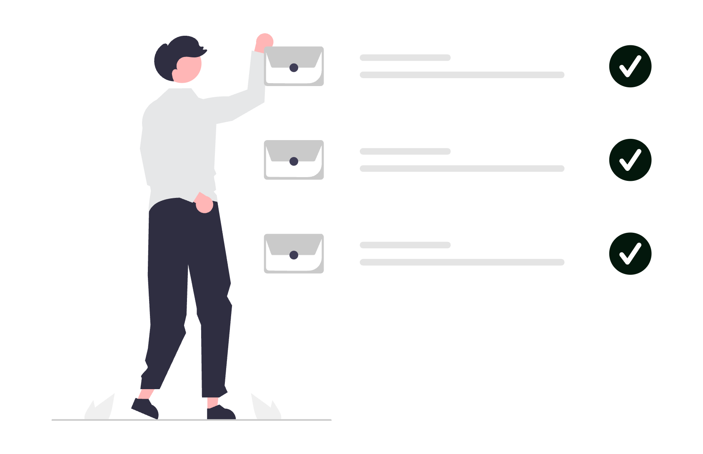

# Cum să folosești Gmail ca avocat

În avocatură, inbox-ul nu este doar un loc unde ajung mesaje, ci un centru de comandă: confirmări de termene, comunicări cu clienți, documente, notificări din platforme juridice și conversații interne. Dacă îl lași neorganizat, Gmail devine o sursă de stres. Dacă îl configurezi corect, devine un sistem de lucru care îți economisește timp, reduce erorile și te ajută să răspunzi rapid, profesionist și sigur.

  

    
  

Mai jos ai un ghid complet, în termeni practici, despre funcționalitățile Gmail pe care orice avocat ar trebui să le folosească.

## 1. Configurează baza: semnătură, identitate și setări profesionale

Începe cu elementele care transmit profesionalism și claritate:

- **Semnătură profesională**: include nume complet, calitate, date de contact, website și eventual disclaimer juridic.
- **Undo Send (anulare trimitere)**: setează intervalul maxim disponibil pentru retragerea mesajului (util când trimiți rapid către destinatar greșit).
- **Conversation view**: păstrează activă gruparea pe conversații ca să vezi contextul complet al unui dosar.
- **Confidential Mode**: folosește-l pentru mesaje sensibile (acces limitat în timp, blocare forward/copy/print/download pentru destinatari).

## 2. Creează un sistem de etichete (labels) pe logică juridică

Folder-ele clasice nu sunt suficiente pentru volum mare de e-mailuri. În Gmail, etichetele sunt mai flexibile și pot fi combinate.

Exemple utile pentru avocați:

- `Clienti/Activi`
- `Clienti/Onboarding`
- `Instanta/Termene`
- `Contracte/De semnat`
- `Urgent/<24h`
- `Facturare/De trimis`
- `Facturare/Incasari`

Poți colora etichetele pentru a identifica instant mesajele critice. Un e-mail poate avea mai multe etichete simultan, ceea ce ajută enorm când un mesaj ține și de client, și de termen, și de facturare.

## 3. Automatizează trierea cu filtre inteligente

Filtrele sunt una dintre cele mai puternice funcții Gmail și îți reduc munca manuală zilnică.

Ce merită automatizat:

- E-mailurile de la instanțe sau platforme oficiale -> etichetă `Instanta/Termene` + marcare importantă.
- Mesajele care conțin cuvinte cheie precum "termen", "citație", "urgent" -> etichetă `Urgent/<24h`.
- Mesajele administrative repetitive -> arhivare automată (fără să-ți încarce Inbox-ul principal).
- Facturi și confirmări de plată -> etichetă `Facturare`.

Regulă practică: dacă faci aceeași acțiune manuală de 3-4 ori pe săptămână, transform-o într-un filtru.

## 4. Folosește căutarea avansată ca pe un motor juridic intern

Majoritatea utilizatorilor caută doar după nume. În Gmail poți căuta mult mai precis:

- `from:nume@domeniu.ro`
- `subject:contract`
- `has:attachment`
- `filename:pdf`
- `after:2026/01/01 before:2026/03/01`
- `label:Instanta/Termene`

Combinând aceste operatori, găsești în secunde exact mesajul de care ai nevoie înainte de o ședință sau o consultanță.

## 5. Câștigă timp cu șabloane (Templates) pentru răspunsuri repetitive

Într-un cabinet de avocatură există multe răspunsuri recurente: confirmări de primire, solicitări de documente, pași pentru onboarding, confirmări de consultanță, follow-up după întâlnire.

Activează funcția **Templates** și salvează răspunsuri standard pe scenarii. Apoi personalizezi doar numele clientului și contextul dosarului. Vei obține:

- răspunsuri mai rapide;
- comunicare consistentă în echipă;
- mai puține omisiuni în informațiile transmise.

## 6. Programează trimiterea mesajelor (Schedule Send)

Nu toate e-mailurile trebuie trimise pe loc. Pentru avocați, această funcție e utilă când:

- redactezi seara, dar vrei trimitere în interval de business;
- pregătești remindere pentru clienți înainte de termen;
- coordonezi comunicări cu colegi din alte fusuri orare.

Astfel menții un ritm profesional și previzibil al comunicării.

## 7. Transformă inbox-ul mobil într-un instrument real de lucru

Aplicația Gmail de pe telefon este utilă nu doar pentru citit mesaje, ci și pentru triere rapidă din deplasare: arhivare, etichetare, snooze, răspuns și forward.

  

    
  

Sfaturi utile pe mobil:

- activează notificări doar pentru etichetele importante;
- folosește gesturile swipe pentru acțiunile pe care le faci cel mai des;
- folosește `Snooze` pentru mesajele care nu cer acțiune imediată.

## 8. Folosește aliasuri și adrese multiple pentru claritate

Dacă ai mai multe tipuri de comunicare (ex. consultanță, facturare, suport clienți), poți folosi aliasuri pentru a separa fluxurile fără să schimbi permanent contul.

Exemple:

- `prenume.nume+contracte@gmail.com`
- `prenume.nume+facturare@gmail.com`

Aceste aliasuri te ajută să creezi filtre mai precise și să măsori mai ușor ce tip de solicitări primești.

## 9. Delegare și colaborare în echipă

În Google Workspace, poți delega acces la inbox unui coleg (de exemplu, asistent juridic), fără să partajezi parola. Este util când:

- ai volum mare de e-mailuri și vrei triere inițială;
- ești în instanță și ai nevoie de suport operativ;
- vrei continuitate în comunicare în perioadele aglomerate.

Stabilește reguli interne clare: cine răspunde, cine etichetează, cine escaladează mesajele urgente.

## 10. Integrare Gmail cu Calendar, Meet, Tasks și Drive

Puterea Gmail crește când îl folosești împreună cu celelalte instrumente Google:

- **Calendar**: creezi rapid evenimente din e-mailuri importante.
- **Meet**: generezi link de întâlnire direct din mesaj.
- **Tasks**: transformi e-mailurile în task-uri urmărite.
- **Drive**: salvezi și partajezi documente fără atașamente duplicate.

Pentru fluxuri avansate, poți integra Gmail și cu instrumente externe de automatizare (de exemplu Zapier sau Relay.app), astfel încât acțiunile repetitive să ruleze automat.

## 11. Securitate și conformitate: minimul obligatoriu pentru avocați

Comunicarea juridică implică date sensibile. Configurează cel puțin:

- autentificare în doi pași (2FA);
- parolă unică, puternică, gestionată printr-un password manager;
- verificare periodică a dispozitivelor conectate;
- revocarea accesului pentru aplicații terțe inutile;
- politici interne privind atașamentele și datele confidențiale.

Dacă lucrezi în echipă, folosește conturi separate per persoană și evită conturile comune fără trasabilitate.

## 12. Tips & tricks rapide care chiar contează

- Folosește `Starred` doar pentru e-mailuri care cer acțiune în aceeași zi.
- Arhivează agresiv: Inbox-ul este listă de lucru, nu arhivă.
- Aplică regula "touch once": când deschizi un e-mail, decide imediat ce faci cu el (răspuns, task, snooze, arhivare).
- Revizuiește săptămânal filtrele și etichetele, altfel sistemul se degradează în timp.

## Concluzie

Gmail poate fi mult mai mult decât o căsuță de e-mail. Pentru un avocat, poate deveni un sistem de operare pentru comunicare: clar, rapid, urmărit și sigur. Cu etichete bine gândite, filtre automate, căutare avansată, șabloane, delegare și integrare cu restul ecosistemului Google, poți reduce semnificativ timpul pierdut pe administrativ și poți rămâne concentrat pe activitatea juridică propriu-zisă.

Dacă vrei să mergi mai departe, următorul pas este să-ți construiești un flux complet Gmail + Calendar + automatizări, adaptat modului în care lucrează cabinetul tău.
