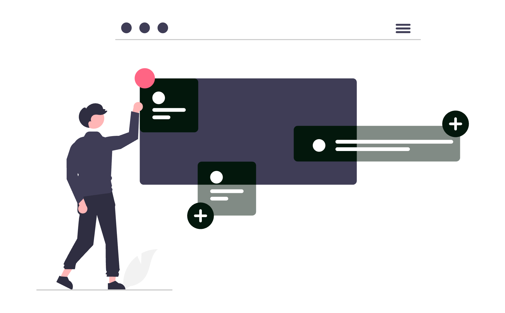
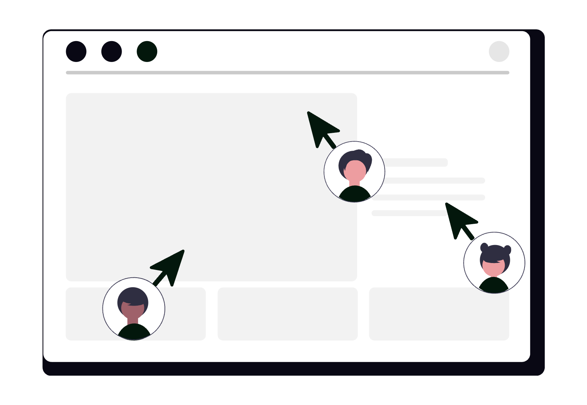

# Cum să folosești Google Drive ca avocat

Documentele sunt materia primă a avocaturii. Contracte, memorii, acte de procedură, corespondență, probe - toate trebuie stocate, organizate, accesate rapid și transmise în siguranță. Google Drive nu este doar un loc de stocare în cloud, ci un sistem complet de gestiune documentară, cu funcții de colaborare, control al accesului, versionare automată și căutare avansată. Configurat corect, devine infrastructura digitală a cabinetului tău.

<div class="row justify-content-center my-4">
  <div class="col-md-9">
    
  </div>
</div>

Mai jos ai un ghid detaliat, cu setări precise și utilizări avansate pe care orice avocat le poate aplica imediat.

## 1. Construiește o structură de foldere adaptată activității juridice

Primul pas este o arhitectură de foldere clară, replicabilă pentru fiecare dosar nou. O structură recomandată pentru un cabinet de avocatură:

```
📁 Cabinet
  📁 Dosare active
    📁 [Număr dosar] - [Nume client] - [Obiect]
      📁 Acte de procedură
      📁 Corespondență
      📁 Contracte și convenții
      📁 Probe și înscrisuri
      📁 Facturare
  📁 Dosare finalizate
  📁 Contracte clienți
  📁 Modele și șabloane
  📁 Administrație internă
```

Odată ce ai această structură definită, poți crea un dosar-șablon (`_Template dosar`) și să-l copiezi cu **Right click → Make a copy** ori de câte ori deschizi un dosar nou. Astfel eviți crearea ad-hoc și inconsistentele.

## 2. Configurează permisiunile cu precizie

Google Drive permite controlul granular al accesului. Există patru niveluri de permisiune:

- **Viewer** - poate vedea, nu poate modifica.
- **Commenter** - poate adăuga comentarii, nu modifică conținutul.
- **Editor** - poate modifica, muta și șterge.
- **Owner** - control complet, inclusiv transferul proprietății.

Recomandări practice pentru avocați:

- Partajează folderele de dosar cu clienții ca **Viewer** sau **Commenter**, niciodată Editor.
- Folderul de facturare nu trebuie partajat cu clientul decât dacă este necesar explicit.
- Folosește opțiunea **„Restrict - only people with access can open the link"** în loc de linkuri publice, chiar și pentru documente aparent nesensibile.
- Dezactivează opțiunea **„Editors can change permissions and share"** din setările avansate ale dosarului, pentru a preveni redistribuirea necontrolată.

## 3. Folosește Shared Drives (Unități partajate) pentru echipe

Diferența esențială față de folderele personale: fișierele dintr-un **Shared Drive** aparțin echipei, nu unui individ. Dacă un colaborator pleacă din cabinet, documentele rămân accesibile fără nicio intervenție suplimentară.

Configurare recomandată:

- Creează un Shared Drive per cabinet (sau per echipă, dacă ești parte dintr-o societate mai mare).
- Adaugă membrii cu nivelul corect de acces: **Content Manager** pentru avocații colaboratori, **Contributor** pentru stagiari.
- Activează setarea **„Members can't share items outside this drive"** pentru a menține controlul datelor.
- Shared Drives sunt disponibile în planurile Google Workspace (Business Starter și superioare).

## 4. Activează și utilizează Drive for Desktop

**Google Drive for Desktop** (aplicația nativă pentru macOS și Windows) sincronizează fișierele local fără a le duplica fizic pe disc, prin tehnologia **File streaming**.

Setări esențiale după instalare:

- Mergi la **Settings → Google Drive → Mirror files** dacă dorești copii locale (util pentru lucru offline), sau **Stream files** dacă ai spațiu limitat pe disc.
- Activează sincronizarea selectivă: alege doar folderele active, nu întreaga arhivă.
- Setează **Start on login** pentru a nu rata actualizările la deschiderea calculatorului.
- Fișierele sincronizate apar în Finder/Explorer ca un drive separat și pot fi deschise cu orice aplicație locală (Word, Adobe Acrobat etc.).

## 5. Căutare avansată: găsești orice document în secunde

Google Drive indexează inclusiv textul din interiorul documentelor PDF, Word și Google Docs. Funcția de căutare avansată (iconița **⊙** din bara de căutare) permite filtrarea după:

- **Tip fișier**: PDF, Google Docs, Google Sheets, DOCX, XLSX etc.
- **Proprietar**: „owned by me" sau „owned by anyone".
- **Dată modificare**: înainte de / după o anumită dată.
- **Locație**: un anumit folder sau Shared Drive.
- **Cuvinte din conținut**: căutare full-text în interiorul documentelor.

Exemple utile:

- Găsești toate contractele semnate în trimestrul 1 căutând `tip:pdf folder:"Contracte 2026" după:2026-01-01 înainte:2026-04-01`.
- Găsești toate documentele în care apare un IBAN sau un număr de dosar specific.
- Localizezi toate fișierele partajate cu un anumit client după adresa lui de e-mail.

## 6. Versionare automată și istoricul documentelor

Orice modificare salvată în Google Docs, Sheets sau Slides este înregistrată automat. Poți accesa istoricul complet din **File → Version history → See version history**.

Funcții avansate de versionare:

- **Salvează versiuni cu nume**: înainte de o modificare importantă, salvezi o versiune numită explicit (ex. „Draft trimis clientului 2026-03-15"). Aceasta va fi păstrată indefinit, indiferent de câte modificări urmează.
- **Restaurare**: poți reveni la orice versiune anterioară cu un singur click.
- **Comparare versiuni**: vizualizezi diferențele dintre versiuni cu marcaj vizual (similar track changes din Word).

Pentru fișierele non-Google (PDF-uri, DOCX-uri uploadate), Drive păstrează ultimele 100 de versiuni sau versiunile din ultimele 30 de zile. Poți gestiona versiunile din **Right click → Manage versions**.

<div class="row justify-content-center my-4">
  <div class="col-md-9">
    
  </div>
</div>

## 7. Colaborare în timp real cu control editorial

Google Docs permite mai multor utilizatori să editeze simultan același document. Pentru avocați, asta înseamnă:

- Redactarea în comun a unui contract fără a trimite versiuni prin e-mail.
- Comentarii ancorate pe paragrafe specifice pentru feedback precis (`Ctrl+Alt+M` / `Cmd+Option+M`).
- Funcția **Suggesting mode** (echivalentul Track Changes din Word): modificările sunt propuse, nu aplicate direct, și pot fi acceptate sau respinse individual.
- **@mențiuni** în comentarii pentru a notifica un coleg de o problemă specifică.
- **Assigned comments**: poți atribui un comentariu unui coleg ca task, cu notificare automată pe e-mail.

Recomandare pentru lucrul cu clienți: partajează documentul în modul **Commenter**, astfel clientul poate pune întrebări ancorate pe text fără să modifice conținutul.

## 8. Organizare cu stele, culori și shortcut-uri

Câteva setări de organizare vizuală care economisesc timp zilnic:

- **Add to Starred** (`Shift+Z`): marchezi dosarele sau documentele la care accesezi frecvent - apar în secțiunea Starred din bara laterală.
- **Add shortcut to Drive**: adaugi un shortcut către un folder din Shared Drive direct în „My Drive" pentru acces rapid, fără a duplica fișierul.
- **Color-coding foldere**: click dreapta pe folder → **Change color** - aplică o culoare pentru a diferenția vizual tipurile de dosare (ex. roșu pentru urgent, verde pentru finalizat).
- **Priority page** (pagina de start din Drive): Google Drive afișează automat documentele recente și sugestii bazate pe activitate - util pentru a relua rapid lucrul la un dosar.

## 9. Automatizări și integrări cu restul ecosistemului Google

Google Drive lucrează nativ cu celelalte instrumente Google:

- **Gmail**: poți salva atașamente direct în Drive și poți insera linkuri Drive în e-mailuri, evitând atașamentele duplicate.
- **Google Calendar**: documentele relevante pentru o întâlnire pot fi atașate direct la evenimentul din Calendar.
- **Google Meet**: în timpul unui apel, poți prezenta un document Drive sau colabora live pe el.
- **Google Forms**: răspunsurile la formulare pot fi exportate automat într-un Google Sheet stocat în Drive.

Pentru automatizări mai avansate, Drive se integrează prin API și prin platforme no-code precum **Zapier** sau **Make (ex-Integromat)**:

- La primirea unui e-mail cu un atașament specific, fișierul este salvat automat în folderul corect din Drive.
- La crearea unui dosar nou în Drive, se generează automat o sarcină în lista de proiecte.
- La uploadul unui document semnat, clientul primește automat o confirmare pe e-mail.

## 10. Securitate și conformitate pentru date juridice

Documentele juridice conțin adesea date cu caracter personal sau informații confidențiale. Minimum obligatoriu:

- Activează **autentificarea în doi pași (2FA)** pe contul Google - din `myaccount.google.com → Security`.
- Verifică periodic din **Drive → Shared with me** ce documente ai distribuit și revocă accesul pentru foldere sau dosare închise.
- Evită linkurile de tip **„Anyone with the link"** pentru documente cu date personale sau clauze confidențiale.
- Folosește **Google Vault** (disponibil în planurile Workspace superioare) pentru retenție și audit al documentelor - util în contexte de conformitate sau litigii.
- Setează **expirarea accesului** la fișierele partajate cu persoane externe: din setările de partajare, poți alege o dată până la care accesul este valabil.

## 11. Tips & tricks care fac diferența în utilizarea zilnică

- **Ctrl+/** (sau `Cmd+/` pe Mac): deschide lista completă de shortcut-uri keyboard în Google Docs.
- **Drive nu duplică fișierele partajate**: când adaugi un shortcut la un fișier din Shared Drive, acesta nu ocupă spațiu suplimentar în contul tău.
- **Offline mode**: activează accesul offline din `Settings → Offline` pentru a edita documente fără conexiune la internet - modificările se sincronizează automat la reconectare.
- **Scanare documente fizice**: aplicația Google Drive pentru iOS și Android include un scanner integrat - fotografiezi un act, Drive îl salvează ca PDF cu OCR (text searchable).
- **Caută cu operatorul `owner:me`** pentru a găsi rapid toate fișierele create de tine, exclud cele partajate de alții.
- **Fișierele mari (PDF-uri cu sute de pagini)** pot fi convertite în Google Docs pentru a beneficia de căutare full-text și comentarii ancorate.

## Concluzie

Google Drive este mult mai mult decât un server de fișiere în cloud. Configurat corect - cu o structură de foldere logică, permisiuni stricte, Shared Drives pentru echipă, versionare controlată și integrări cu Gmail, Calendar și instrumentele de automatizare - devine sistemul nervos al cabinetului tău digital. Fiecare document este localizabil, fiecare versiune este trasabilă, fiecare colaborare este controlată.

Dacă dorești să implementezi un sistem complet de gestiune documentară bazat pe Google Drive, adaptat specificului cabinetului tău de avocatură, echipa SOLON îți poate construi arhitectura, configura permisiunile și automatiza fluxurile de lucru de la zero.
