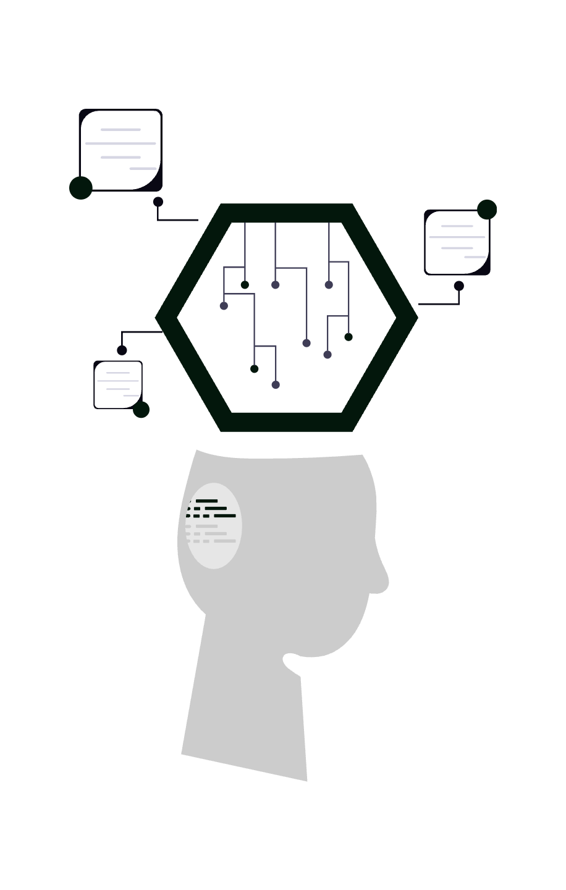
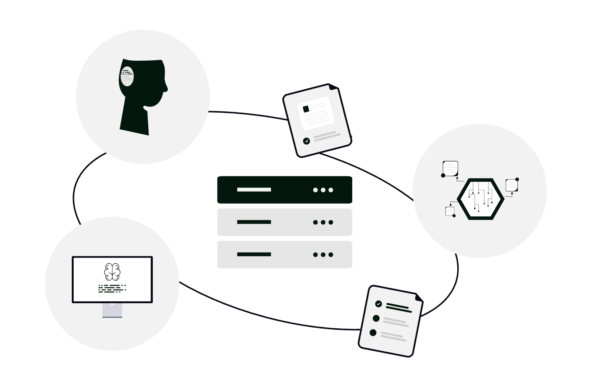

# Cum să folosești NotebookLM ca avocat

**NotebookLM** este instrumentul de cercetare și analiză al Google, alimentat de modele de limbaj, care răspunde **ancorat în sursele pe care le încarci tu** (nu „inventează” bibliografie din aer). Pentru un avocat, asta înseamnă posibilitatea de a transforma dosare încărcate cu PDF-uri, note și extrase într-un spațiu de lucru unde poți cere sinteze, comparări, întrebări de clarificare și pregătire de ședință - cu condiția să păstrezi mereu controlul critic asupra rezultatului și să respecți obligațiile față de client și față de instanță.

  

    
  

Mai jos găsești setări utile, scenarii concrete și o abordare „avansată” pentru cabinete care vor să integreze NotebookLM fără să înlocuiască judecata juridică sau verificarea surselor.

## 1. Înainte de toate: ce este NotebookLM și ce nu este

- **Este**: un asistent care citește **doar** materialele adăugate de tine în notebook (și, după caz, tipuri de surse acceptate de produs la momentul utilizării: documente Google, PDF-uri, text copiat, în unele configurații linkuri sau transcrieri de conținut public).
- **Nu este**: un consilier juridic autonom; nu îi poți delega responsabilitatea profesională. Răspunsurile trebuie tratate ca **schițe de lucru**, verificate în textele originale, în legislație și în practica instanțelor relevante.
- **Ancorarea în surse**: atunci când funcția este disponibilă, NotebookLM indică fragmente din documentele tale - folosește acest mecanism pentru a sări rapid la pasajul sursă, nu doar la rezumatul generat.

Verifică disponibilitatea produsului și condițiile contului tău Google (personal vs. Google Workspace), deoarece politicile organizației pot restricționa sau permite anumite produse AI.

## 2. Structura de bază: un notebook = un obiectiv clar

Cea mai frecventă greșeală este amestecarea tuturor documentelor într-un singur notebook fără logică. Pentru activitate juridică, separă:

- **Notebook „Doar X”**: un dosar, o tranzacție sau o speță îngustă - surse omogene (contracte, corespondență, expertize relevante).
- **Notebook „Research tematic”**: de exemplu o problemă de drept recurentă (numai articole, ghiduri interne, note de jurisprudență exportate - nu amesteca date personale nelegate de scop).

**Regulă practică**: dacă nu ai vrea să lași accidental un coleg să vadă un set de fișiere, nu ar trebui nici să îl amesteci într-un notebook partajat fără filtrare.

## 3. Încărcarea și pregătirea surselor

- **PDF-uri**: preferă text **selectabil** (OCR de calitate). PDF-uri scanate prost îngreunează indexarea și citatele.
- **Google Docs**: utile pentru note de ședință, drafturi interne sincronizate din Drive - verifică că versiunea încărcată este cea finală.
- **Denumiri**: redenumește sursele în interfață (titluri scurte: „Contract 12.03.2026”, „Întâmpinare părât”) ca să recunoști instant citatele în chat.
- **Volume mari**: împarte pe etape - adaugă întâi nucleul faptic, apoi documente secundare; păstrează notebook-ul „sub control” ca să nu pierzi precizia la întrebări înguste.

## 4. Setări și confidențialitate (esențial pentru avocați)

Înainte de a încărca documente sensibile:

1. **Citește politica Google pentru NotebookLM / Google AI** și, dacă lucrezi sub **Google Workspace**, politica administratorului - unele organizații dezactivează produsele experimentale sau impun aprobări.
2. **Setări legate de utilizarea conținutului pentru îmbunătățirea modelelor**: în funcție de regiune și tip de cont, poți avea opțiuni de a limita folosirea materialelor în antrenare. Setează conform standardului cabinetului tău (uneori „off by default” nu este suficient - trebuie aprobare internă).
3. **Partajarea notebook-ului**: drepturile „doar vizualizare” vs. „editare” trebuie aliniate cu confidentialitatea clientului. Evită linkuri publice nesupravegheate către materiale cu date personale sau secrete de afaceri.

Dacă un document este **secret profesional** sau **clasificat** în alt mod, tratează NotebookLM ca pe orice serviciu cloud: doar după evaluare de conformitate.

## 5. Modul de lucru în chat: întrebări care funcționează

Formulează cereri **înguste** și **verificabile**:

- „Extrage o **cronologie** a evenimentelor din sursele A–F, cu date și trimitere la document.”
- „Listează **clauzele** care privesc rezolvarea disputelor / penalitățile / forța majoră și spune din ce fișier provine fiecare.”
- „Pregătește o **listă de întrebări** pentru interogatoriul martorului X, strict pe baza declarațiilor încărcate.”
- „Compară versiunea 1 și versiunea 2 ale contractului: diferențe substanțiale în 5 bullet points.”

Evită, pentru materiale decisive: „Ce ar trebui să fac în dosar?” fără context - vei obține generalități. Evită să te bazezi pe instrument pentru **citări la hotărâri** dacă nu ai încărcat efectiv acele hotărâri sau un extras verificat.

## 6. Funcții „power user”: peste chatul simplu

- **Rezumate structurate**: cere format fix: „Fapte / Probleme de drept / Probe / Riscuri” - apoi revizuiești manual fiecare secțiune.
- **Audio Overview** (dacă este activ în contul tău): generează o discuție tip podcast pe baza surselor - util pentru **reîmprospătarea** rapidă în deplasare; nu substituie lectura pentru un termen critic.
- **Fișe și ghiduri de studiu** (denumirile pot varia în interfață): folosește-le ca punct de plecare pentru învățare internă sau onboarding în echipă, nu ca documente oficiale către client fără review.
- **Export**: orice export (note, rezumate) trebuie trecut prin același filtru de verificare ca un draft uman.

## 7. Configurări avansate și obiceiuri de echipă

- **Instrucțiuni persistente** (dacă interfața le oferă): definește rolul - ex. „Asistent de sinteză pentru materiale factuale din dosar; nu formula concluzii juridice; semnalează incertitudinea.”
- **Convenții de denumire** la nivel de cabinet: prefixe pentru notebook-uri (`CLI-D-2026-014 – Contracte`, `Research – GDPR dosare medicale`).
- **Roluri**: un avocat senior verifică prompturile reutilizabile; asistenții actualizează sursele, nu replică prompturi depășite.
- **Separarea vieții personale**: nu folosi același cont sau același notebook pentru documente neprofesionale și dosare - reduce riscul de amestecare accidentală la partajare sau export.

  

    
  

## 8. Sfaturi și capcane frecvente

- **Halucinațiile**: chiar cu surse, verifică pasajul; modelele pot rezuma greșit tonul sau pot omite nuanțe.
- **Date și numere**: reconfirmă calcule, sume, termene - din sursă, nu din memoria modelului.
- **Limba**: poți cere explicit răspunsuri în română pe baza surselor în română sau mixte; revizuiește terminologia juridică.
- **Actualitate**: NotebookLM reflectă ceea ce încarci; nu înlocuiește monitorizarea legislației pe canale oficiale.
- **Probe în instanță**: un fișier generat de AI nu „dovedește” nimic; doar înscrisurile și procedura probatorie contează - folosește instrumentul pentru pregătire, nu ca substitut al probelor.

## 9. Concluzie

NotebookLM poate reduce timpul petrecut cu **lectura repetată** și cu **structurarea informației** din dosare mari, dar nu absoarbe **responsabilitatea** pentru calitatea actului juridic sau pentru protecția datelor. Folosit cu **notebook-uri disciplinate**, **întrebări precise** și **verificare umană**, devine un multiplicator de productivitate; folosit superficial, devine un risc.

Dacă vrei să integrezi astfel de instrumente într-un flux sigur pentru cabinet (politici, Workspace, arhivare și automatizări), echipa **SOLON** poate ajuta cu consultanță de digitalizare pentru mediul juridic. **Contactează-ne** pentru o discuție adaptată tipului tău de practică.

**Începe cu surse curate, întrebări clare și verificare riguroasă - astfel ține NotebookLM sub controlul profesionistului, nu invers.**
