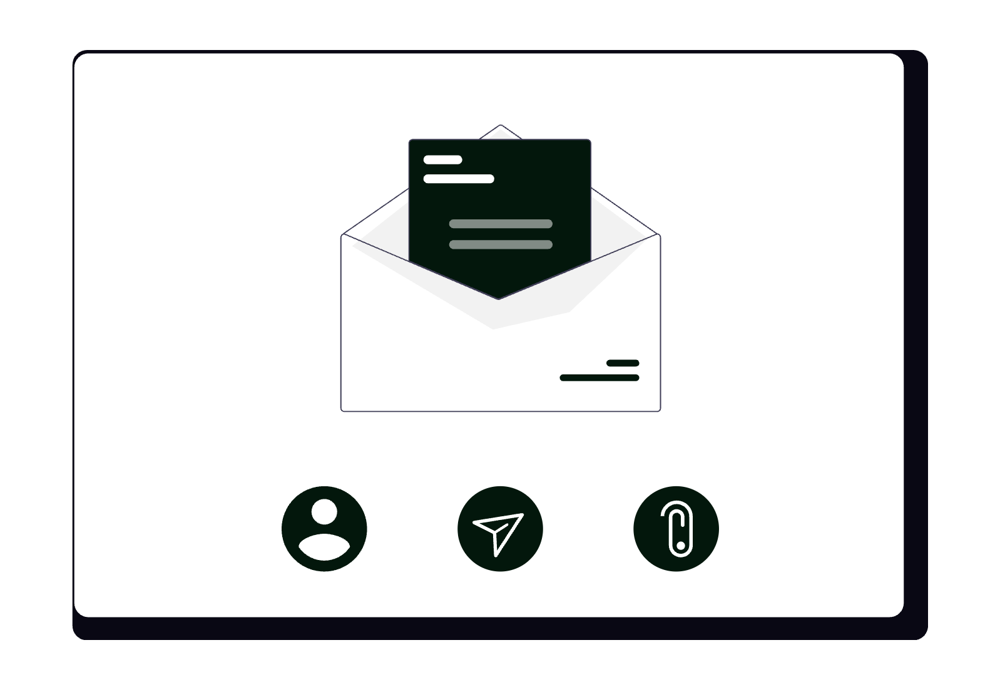

# Cum să folosești Outlook ca avocat

Microsoft Outlook nu este doar un client de e-mail — este un hub de comunicare, planificare și management al sarcinilor integrat în ecosistemul Microsoft 365. Pentru un avocat care lucrează deja cu Word, OneDrive sau Teams, Outlook devine liantul care conectează toate aceste instrumente. Configurat corect, reduce drastic timpul petrecut cu trierea corespondenței, elimină suprapunerile de termene și oferă control complet asupra informațiilor confidențiale ale cabinetului.

<div class="row justify-content-center my-4">
  <div class="col-md-9">
    
  </div>
</div>

Acest ghid acoperă atât versiunea desktop (Windows și Mac), cât și Outlook pe web (outlook.office.com / outlook.com), cu accent pe funcționalitățile care au impact direct în practica juridică.

## 1. Configurarea profesională de bază

Înainte de orice, câteva setări pe care orice avocat ar trebui să le configureze la prima utilizare:

- **Semnătură profesională**: mergi la **File → Options → Mail → Signatures** (Windows) sau **Outlook → Settings → Email → Compose and reply** (web/Mac). Creează câte o semnătură separată pentru mesajele noi și pentru răspunsuri/forward-uri. Semnătura completă include: nume, calitate (Av./Av. dr.), număr de telefon, adresă cabinet, website și un disclaimer juridic de confidențialitate (recomandat pentru orice avocat care comunică prin e-mail).
- **Undo Send (anulare trimitere)**: în Outlook pe web, activează din **Settings → Mail → Compose and reply → Undo send** cu un delay de 10 secunde. În Outlook desktop, configurează **File → Options → Advanced → Send and receive** — implicit mesajele pot rămâne în Outbox câteva secunde înainte de trimitere; setează un interval de minim 1 minut.
- **Reading pane (panoul de citire)**: poziționează-l la dreapta (nu jos) pentru a citi mesajele fără să le marchezi automat ca citite. Din **View → Reading Pane → Right**, apoi dezactivează **Mark items as read when viewed in the Reading Pane** din **File → Options → Advanced → Outlook panes** dacă vrei control manual.
- **Conversation view**: activează gruparea pe conversații din **View → Show as Conversations** pentru a urmări contextul complet al unui schimb de e-mailuri cu un client sau o instanță.

## 2. Structura de foldere pe logică juridică

Spre deosebire de Gmail (unde etichetele pot fi cumulate), Outlook organizează e-mailurile în foldere. Structura recomandată pentru un cabinet de avocatură:

```
📁 Inbox
📁 @Acțiune necesară        ← e-mailuri care cer răspuns azi
📁 @Așteptare răspuns        ← trimise și aștepți confirmare
📁 Dosare
   📁 [Număr dosar] – [Client] – [Obiect]
📁 Clienți activi
📁 Instanță / Termene
📁 Contracte
📁 Facturare
📁 Arhivă
```

**Prefixul `@`** plasează folderele acționabile în vârful listei, înaintea celor arhivistice. Aceasta este o convenție simplă care elimină nevoia de scroll pentru a găsi ce necesită atenție.

**Regulă practică**: Inbox-ul este o zonă de tranzit, nu un arhivă. Orice e-mail procesat trebuie mutat într-un folder, arhivat sau șters — nu lăsat să se acumuleze.

## 3. Categorii de culoare (Color Categories)

Categoriile de culoare din Outlook sunt diferite de foldere: se aplică vizual pe e-mailuri, calendare și task-uri fără a le muta. Poți aplica mai multe categorii aceluiași element.

Configurare: click dreapta pe orice e-mail → **Categorize → All categories** → creează și redenumește categoriile cu shortcut-uri keyboard rapide.

Schema recomandată pentru avocați:

| Culoare | Categorie | Shortcut |
|---------|-----------|----------|
| 🔴 Roșu | Urgent / Termen azi | F2 |
| 🟠 Portocaliu | Litigiu | F3 |
| 🟡 Galben | Contract / Negociere | F4 |
| 🟢 Verde | Client nou / Onboarding | F5 |
| 🔵 Albastru | Instanță / Judecată | F6 |
| 🟣 Mov | Administrativ cabinet | F7 |

Categoriile sunt sincronizate cu Exchange / Microsoft 365 — dacă delegi accesul unui coleg (secțiunea 9), el vede și categoriile tale.

## 4. Reguli automate (Rules) — trierea fără intervenție manuală

**Rules** din Outlook sunt echivalentul filtrelor din Gmail — acțiuni automate aplicate e-mailurilor la sosire. Se configurează din **Home → Rules → Manage Rules & Alerts** (desktop) sau **Settings → Mail → Rules** (web).

Reguli utile pentru avocați:

- **E-mailuri de la instanțe**: dacă expeditorul conține `@just.ro` sau subiectul conține „citație" / „termen" / „dosar", mută automat în folderul `Instanță / Termene` și aplică categoria `Albastru`.
- **Notificări de platforme**: e-mailuri de la `noreply@`, `no-reply@`, newslettere → mută direct în `Arhivă` sau în un folder `Notificări`, fără să încarce Inbox-ul principal.
- **Clienți prioritari**: dacă expeditorul este un client sau coleg important, marchează ca „High Importance" și mută în `@Acțiune necesară`.
- **Confirmări financiare**: e-mailuri cu subiectul „plată", „factură", „confirmare transfer" → folderul `Facturare`.
- **Forward automat selectiv**: dacă ești în concediu sau delegat, poți crea o regulă care forward-ează automat e-mailurile marcate ca urgente către un coleg desemnat (în loc de un out-of-office generic).

**Structura corectă a unei reguli**: condiție (expeditor / subiect / cuvânt cheie) → acțiune (mutare / marcare / notificare) → excepție opțională. Definește mai întâi excepțiile (ex. „nu aplica dacă am trimis eu mesajul") pentru a evita efecte secundare neașteptate.

## 5. Quick Steps — acțiuni compuse cu un singur click

**Quick Steps** sunt macrocomenzi configurabile care aplică mai multe acțiuni simultan pe un e-mail selectat. Se găsesc în **Home → Quick Steps** și pot fi activate cu shortcut-uri keyboard personalizate.

Quick Steps recomandate pentru avocați:

- **„Dosar procesat"**: marchează ca citit → mută în folderul `Arhivă` → elimină categoria. Shortcut: `Ctrl+Shift+1`.
- **„Task din e-mail"**: creează un task în Microsoft To Do cu subiectul e-mailului → setează data scadentă la mâine → marchează e-mailul cu steag (flag). Shortcut: `Ctrl+Shift+2`.
- **„Forward la secretar/asistent"**: forward automat către adresa internă desemnată + adaugă categoria `Mov` (administrativ). Shortcut: `Ctrl+Shift+3`.
- **„Meeting din e-mail"**: deschide o invitație de întâlnire pre-completată cu subiectul e-mailului ca titlu, foloseala adreselor din conversație ca invitați. Shortcut: `Ctrl+Shift+4`.
- **„Răspuns standard"**: deschide un răspuns cu un șablon pre-completat (ex. „Am primit mesajul tău și voi reveni..."). Shortcut: `Ctrl+Shift+5`.

Crearea unui Quick Step: **Home → Quick Steps → Create New** sau click pe săgeata din colțul grupului Quick Steps → **New Quick Step**.

<div class="row justify-content-center my-4">
  <div class="col-md-9">
    
  </div>
</div>

## 6. Focused Inbox — separarea automată a priorităților

**Focused Inbox** este funcția Outlook care împarte automat Inbox-ul în două tab-uri: **Focused** (e-mailuri importante, bazate pe comportamentul tău anterior) și **Other** (restul).

Activare: **View → Focused Inbox** (desktop) sau **Settings → Mail → Focused Inbox** (web).

Cum să-l calibrezi eficient:
- Când un e-mail important apare în tab-ul `Other`, click dreapta → **Move to Focused** — Outlook va redirecționa viitoarele mesaje de la acel expeditor în `Focused`.
- Când un e-mail nesemnificativ apare în `Focused`, click dreapta → **Move to Other** — îl „înveți" pe Outlook ce nu este relevant.
- Combini Focused Inbox cu regulile automate: regulile au prioritate față de clasificarea automată, deci e-mailurile cu reguli aplicată nu sunt afectate de Focused.

**Atenție**: Focused Inbox funcționează optim cu conturi Exchange / Microsoft 365. Pe conturi IMAP (ex. Gmail adăugat în Outlook), funcționalitatea poate fi limitată.

## 7. Căutarea avansată — găsești orice e-mail în secunde

Bara de căutare din Outlook suportă operatori avansați care reduc semnificativ timpul de localizare a unui mesaj:

- `from:ionescu` — e-mailuri de la orice expeditor care conține „ionescu"
- `to:contact@cabinet.ro` — e-mailuri trimise către o adresă specifică
- `subject:contract` — e-mailuri cu „contract" în subiect
- `hasattachment:yes` — e-mailuri cu atașamente
- `received:last week` / `received:>=01/01/2026` — filtrare după dată
- `category:Litigiu` — e-mailuri cu categoria aplicată
- `folder:Inbox` — limitează căutarea la un folder specific
- `body:IBAN` — căutare în corpul mesajului

Combinație practică: `from:tribunal subject:termen hasattachment:yes received:>=01/03/2026` — găsești în secunde toate comunicările oficiale de la tribunal cu documente atașate din ultimele luni.

**Search Folders (Foldere de căutare)**: din **Folder → New Search Folder** poți crea foldere virtuale care afișează în timp real toate e-mailurile care respectă un criteriu, indiferent de folderul fizic în care se află. Exemple utile:
- „E-mailuri nesolicitate cu atașamente" (pentru audit de securitate)
- „Toate e-mailurile de la instanțe" (indiferent de folder)
- „Mesaje mari (>5MB)" (pentru curățarea spațiului)

## 8. Quick Parts și șabloane de răspuns

**Quick Parts** este funcția de inserare rapidă a blocurilor de text pre-definite în corpul unui e-mail. Diferă de semnătură prin faptul că poate fi inserat în orice punct al mesajului, nu doar la final.

Creare Quick Part: scrie textul dorit în corpul unui e-mail → selectează-l → **Insert → Quick Parts → Save Selection to Quick Part Gallery** → dă-i un nume sugestiv.

Inserare rapidă: în corpul oricărui e-mail, tastează primele litere din numele Quick Part-ului → apasă `F3` → textul se inserează automat.

Exemple utile pentru avocați:

- **Disclaimer de confidențialitate**: „Acest mesaj și orice fișier atașat sunt confidențiale și destinate exclusiv destinatarului indicat..."
- **Cerere standard de documente**: lista documentelor necesare pentru onboarding (CI, contract de muncă, acte dosar etc.)
- **Confirmare consultanță**: textul standard de confirmare a programării cu detalii logistice
- **Clauze contractuale frecvente**: forță majoră, clauza de confidențialitate, clauza de jurisdicție — inserate direct în e-mailuri fără a deschide Word

## 9. Calendarul Outlook — configurare avansată pentru avocați

Calendarul din Outlook este profund integrat cu e-mailul, spre deosebire de Google Calendar care este un produs separat. Funcționalități specifice:

**Calendare multiple și suprapunere**:
- Creează calendare separate din **My Calendars → Add Calendar → Create new blank calendar**: `Termene instanță`, `Întâlniri clienți`, `Personal`, `Deadline-uri interne`.
- Activează vizualizarea „overlay" (suprapunere) pentru a vedea toate calendarele simultan: click pe săgeata de lângă fiecare calendar → **View in Overlay Mode**.
- Colorează fiecare calendar diferit din click dreapta → **Color**.

**Meeting requests (Invitații de întâlnire)**:
- La crearea unui eveniment, adaugă participanții în câmpul **Required** sau **Optional** — vor primi automat o invitație cu opțiunile Accept / Tentative / Decline.
- Folosește **Scheduling Assistant** (tab-ul din fereastra de creare a evenimentului) pentru a vedea disponibilitatea tuturor participanților simultan și a alege un interval liber fără schimb de e-mailuri.
- Orice modificare (oră, locație, agendă) trimite automat o actualizare tuturor invitaților.

**Room finder și locații**:
- Adaugă adresa fizică a sălii de judecată sau a locației de întâlnire în câmpul **Location** — Outlook sugerează automat directia prin Bing Maps.
- Dacă organizația folosește Exchange, poți rezerva săli de conferință direct din calendar (Room Finder), fără e-mailuri separate.

**Recurrence (Recurență) pentru termene periodice**:
- La evenimentele recurente (ex. ședințe lunare de cabinet, rapoarte periodice), setează recurența din **Recurrence** — zilnic, săptămânal, lunar, anual sau personalizat.
- Poți modifica o singură instanță a recurenței fără să afectezi restul seriei.

**Calendar sharing (Partajare calendar)**:
- Din **Share Calendar** poți partaja calendarele cu colegii din cabinet cu niveluri diferite de acces: **Free/Busy** (doar disponibilitate), **Details** (titlul evenimentelor) sau **Full details** (tot conținutul).
- Clienților le poți trimite un link de vizualizare a disponibilității (view-only) pentru a-și programa singuri consultanțele.

## 10. Tasks și integrarea cu Microsoft To Do

Outlook Desktop integrează nativ **Microsoft To Do** în panoul Tasks. Orice task creat în Outlook apare automat în aplicația Microsoft To Do (web, iOS, Android) și invers.

Crearea rapidă a unui task dintr-un e-mail:
- Trage e-mailul cu drag & drop pe iconița Tasks din bara de navigare → se creează automat un task cu subiectul e-mailului ca titlu și conținutul ca notă.
- Sau click dreapta pe e-mail → **Add to Tasks** (shortcut: `Ctrl+Shift+K`).
- Sau setează un **Flag** pe e-mail (click pe steagul roșu din colțul e-mailului) → e-mailul apare în lista `Flagged Email` din Tasks cu data scadenței seteabile.

**Lista „My Day"** din Tasks / To Do: în fiecare dimineață, revizuiește lista `My Day` și trage din `Flagged Email` sau din celelalte liste sarcinile pe care le vei face azi — este echivalentul revizuirii zilnice a task-urilor urgente.

**Bucle**: taskurile cu termen expirat apar cu roșu în Tasks și generează un reminder vizibil în Calendar, nu doar în lista de sarcini. Această integrare elimină nevoia unui sistem separat de tracking.

<div class="row justify-content-center my-4">
  <div class="col-md-9">
    
  </div>
</div>

## 11. Delegare și colaborare în echipă

**Delegate Access** din Outlook permite unui coleg (ex. asistent juridic sau secretar) să gestioneze parțial cutia ta poștală sau calendarul, fără să-ți partajeze parola:

Configurare: **File → Account Settings → Delegate Access → Add** → selectezi colegul și definești nivelul de acces pentru fiecare componentă (Calendar, Tasks, Inbox, Contacts):
- **None**: fără acces
- **Reviewer**: poate citi, nu poate modifica
- **Author**: poate citi și crea, nu poate șterge
- **Editor**: control complet (citire, creare, modificare, ștergere)

Recomandare pentru cabinete:
- Asistentul juridic primește acces **Editor** la Calendar (poate programa/reprograma întâlniri) și **Author** la Inbox (poate crea răspunsuri, dar nu șterge).
- Un alt avocat din cabinet primește **Reviewer** la folderul `Instanță / Termene` (vizibilitate, fără modificare).
- Activează opțiunea **Send on behalf of** dacă vrei ca asistentul să poată trimite mesaje în numele tău — destinatarul va vedea „trimis de X în numele Y".

**Shared Mailbox**: dacă mai mulți avocați gestionează o adresă comună (ex. `contact@cabinet.ro`), folosește un **Shared Mailbox** Exchange în loc de un cont individual partajat. Avantaje: fiecare acces este traceable, nu se pierd mesajele la plecarea unui angajat, nu necesită licență separată pentru adresa comună.

## 12. Add-in-uri utile pentru avocați

Add-in-urile extind funcționalitățile Outlook direct din interfață, fără să schimbi aplicația. Accesare: **Home → Get Add-ins** (desktop) sau **Settings → View all Outlook settings → Mail → Customize actions** (web).

Add-in-uri recomandate:

- **Microsoft Viva Insights** (inclus în Microsoft 365): analizează tiparele de comunicare, îți arată câte ore ai petrecut în e-mailuri și întâlniri, sugerează perioade de „focus time" neîntrerupt. Util pentru avocații care vor să gestioneze mai bine bugetul de timp.
- **Boomerang for Outlook**: programează trimiterea e-mailurilor la o oră viitoare, setează remindere dacă nu primești răspuns într-un interval definit, propune automat ore de întâlnire disponibile din calendar.
- **DocuSign for Outlook**: trimite documente pentru semnătură electronică direct din Outlook, fără să deschizi DocuSign separat — util pentru contracte și acte de procedură care necesită semnătură la distanță.
- **Zoom / Teams**: creează automat linkuri de întâlnire video direct din invitațiile din calendar, fără să copiezi manual URL-uri.
- **OneNote**: salvează e-mailuri direct în notebook-urile OneNote cu un singur click — util pentru arhivarea organizată a corespondenței importante.

## 13. Securitate și conformitate — obligatorii pentru avocați

Comunicarea juridică implică date cu caracter personal și informații protejate de secretul profesional. Minimum obligatoriu pentru un avocat care folosește Outlook:

- **Autentificare în doi pași (MFA)**: activează din **portal.microsoft.com → Security → MFA** sau de la administratorul Microsoft 365 al organizației. Fără MFA, un cont Microsoft 365 este vulnerabil inclusiv la atacuri de phishing sofisticate.
- **Sensitivity Labels (Etichete de sensibilitate)**: disponibile în planurile Microsoft 365 Business Premium sau superioare — permite marcarea e-mailurilor ca „Confidential / Legal" sau „Highly Confidential". Mesajele marcate pot fi criptate automat, iar linkurile din ele pot fi restricționate să nu poată fi forward-ate sau tipărite.
- **S/MIME (criptare și semnătură digitală)**: dacă organizația emite certificate S/MIME, poți semna digital și cripta e-mailurile end-to-end. Configurare: **File → Options → Trust Center → Email Security → Encrypted email**.
- **Message Recall (Retragere mesaj)**: dacă ai trimis un mesaj greșit unui destinatar din aceeași organizație Exchange, poți retrage din **Sent Items → deschide mesajul → Actions → Recall This Message**. Funcționează doar dacă destinatarul nu a deschis încă mesajul și ambele conturi sunt pe același server Exchange.
- **Audit și retenție**: în planurile Microsoft 365, administratorul poate configura politici de retenție a e-mailurilor (ex. păstrare obligatorie 5 ani) și audit logs pentru fiecare acțiune pe cutia poștală — util în contexte de compliance sau litigii interne.
- **Acces de la distanță**: dacă accesezi Outlook de pe dispozitive personale, activează **Remote Wipe** (ștergere de la distanță) pentru dispozitivele mobile înregistrate — din **portal.microsoft.com → Intune / Device management**.

## 14. Aplicația mobilă Outlook — utilizare avansată

Aplicația Outlook pentru iOS și Android reunește e-mail și calendar într-un singur loc, cu funcții specifice pentru mobilitate:

- **Swipe actions**: configurează gesturile swipe stânga/dreapta pe fiecare e-mail din **Settings → Swipe options** — setează cel mai frecvent workflow (ex. swipe stânga = arhivare, swipe dreapta = flagged/task).
- **Focused Inbox pe mobil**: la fel ca pe desktop, calibrează-l prin „Move to Focused / Other" din acțiunile rapide.
- **Vizualizare calendar integrată**: din tab-ul Calendar al aplicației, poți vedea zilele cu e-mailuri importante evidențiate pe calendar — o funcție unică față de alte aplicații de e-mail.
- **Căutare pe mobil**: suportă toți operatorii de căutare avansată menționați la secțiunea 7 — poți căuta `from:instanta hasattachment:yes` direct din bara de căutare mobilă.
- **Add accounts**: adaugă multiple conturi (Exchange, Outlook.com, Gmail, Yahoo) și gestionează-le din aceeași aplicație cu inbox-uri separate sau unite.
- **Draft sincronizat**: un draft început pe desktop este disponibil imediat pe mobil și invers — util dacă redactezi un mesaj lung la birou și vrei să-l finalizezi din deplasare.

## 15. Tips & tricks care fac diferența în utilizarea zilnică

- **`Ctrl+1 / 2 / 3 / 4 / 5`**: navighezi rapid între Mail, Calendar, People (Contacts), Tasks și Notes fără mouse.
- **`Ctrl+R`**: reply rapid la e-mailul selectat; `Ctrl+Shift+R` = Reply All; `Ctrl+F` = Forward.
- **`Ctrl+Shift+V`**: mută e-mailul selectat într-un folder — apare o fereastră de selecție a folderului.
- **`Ctrl+Q`**: marchează e-mailul selectat ca citit; `Ctrl+U` = nemarcat/necitit.
- **`Ctrl+Shift+G`**: setează un Flag cu dată scadentă pe e-mailul selectat.
- **Ignorare conversație** (`Ctrl+Delete`): mută toată conversația curentă și toate răspunsurile viitoare direct în Deleted Items — util pentru thread-uri lungi de grup la care nu trebuie să participi.
- **Clean Up Conversation**: din **Home → Clean Up → Clean Up Conversation** — șterge automat e-mailurile redundante din thread (mesajele al căror conținut e inclus integral în mesaje ulterioare), păstrând doar cel mai recent. Util pentru thread-uri lungi de negociere contract.
- **Favorites bar**: trage folderele cele mai folosite (`@Acțiune necesară`, `Instanță / Termene`) în secțiunea **Favorites** din vârful listei de foldere pentru acces instant.
- **Dezactivează notificările de desktop pentru toate e-mailurile** și activează-le doar pentru categoriile sau expeditorii critici — din **File → Options → Mail → Message arrival** dezactivează `Display a Desktop Alert`, apoi creează reguli specifice cu notificare activată doar pentru sursele importante.
- **Arhivare One-Click**: apasă `Backspace` pe orice e-mail selectat pentru a-l arhiva imediat în folderul `Archive` fără să-l ștergi.

## Concluzie

Outlook oferă un ecosistem complet pentru gestionarea comunicării profesionale a unui avocat: reguli automate care triează corespondeța fără intervenție manuală, Quick Steps care comprimă secvențe repetitive într-un singur click, calendar cu delegare și scheduling assistant, task-uri integrate cu Microsoft To Do și mecanisme de securitate solide disponibile în planurile Microsoft 365.

Comparativ cu Gmail, Outlook excelează în medii cu Active Directory / Exchange, delegare granulară și integrare nativă cu Word, OneDrive și Teams. Dezavantajul principal față de ecosistemul Google este că funcționalitățile avansate (Sensitivity Labels, audit, retenție) necesită planuri Microsoft 365 mai scumpe (Business Premium sau E3/E5).

Dacă dorești să configurezi Microsoft 365 și Outlook pentru cabinetul tău — inclusiv reguli, Quick Steps, politici de securitate și integrare cu restul fluxului de lucru — echipa **SOLON** oferă consultanță de digitalizare adaptată specificului practicii juridice.
