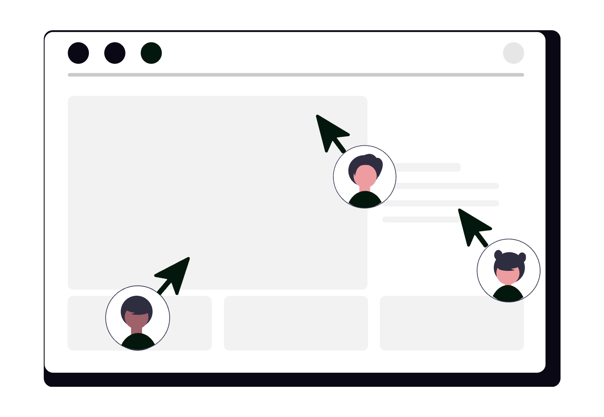
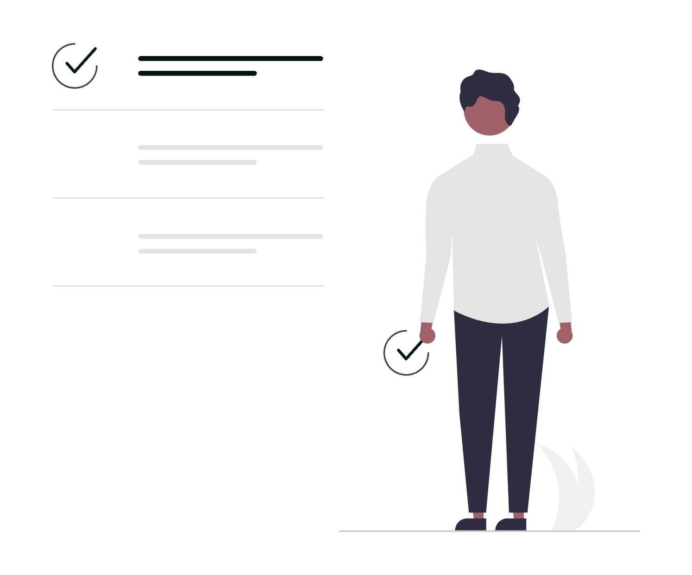

# Cum să folosești Slack ca avocat

Slack este platforma de comunicare în timp real care poate transforma modul în care colaborează o echipă juridică, eliminând lanțurile interminabile de e-mailuri interne și grupurile nesigure de WhatsApp. Pentru un avocat individual sau o societate de avocatură, Slack aduce o structură clară conversațiilor, centralizează deciziile luate pe fiecare dosar și accelerează schimbul de informații între asociați, colaboratori și personalul administrativ. Bine configurat, transformă comunicarea fragmentată într-un flux transparent, securizat și ușor de căutat, direct conectat la instrumentele pe care cabinetul tău le folosește deja în fiecare zi.

<div class="row justify-content-center my-4">
  <div class="col-md-9">
    
  </div>
</div>

Acest ghid practic acoperă funcționalitățile esențiale ale Slack adaptate la realitatea practicii juridice: arhitectura canalelor pe dosare, mesageria pe fire de discuție, gestionarea fișierelor, căutarea avansată, colaborarea securizată cu clienții prin Slack Connect, integrările cu instrumentele juridice, securitatea conformă cu secretul profesional și automatizările care îți salvează ore întregi în fiecare săptămână.

## 1. Configurarea spațiului de lucru (Workspace) și a profilului profesional

Primul pas pentru a crea un spațiu de lucru ordonat este configurarea corectă a contului din **Settings & administration → Workspace settings**:

- **Numele și URL-ul spațiului**: alege un domeniu clar și profesionist (de exemplu `cabinet-avocat-popescu.slack.com` sau `societate-juridica.slack.com`).
- **Profilul membrilor**: impune completarea numelui complet, a rolului specific (ex. `Avocat coordonator - Litigii`, `Avocat colaborator - Drept comercial`, `Secretariat`) și a numărului direct de telefon. O fotografie de profil profesională ajută la identificarea instantă a interlocutorilor.
- **Fusul orar și limba**: asigură-te că toți membrii au setat fusul orar `(UTC+02:00) Bucharest` în **Preferences → Language & region**, ca să mesajele programate și alertele să fie sincronizate perfect.
- **Programul de notificări (Do Not Disturb)**: din **Preferences → Notifications**, setează intervalul de liniște (de pildă între orele 19:30 și 08:00). În afara acestui program, mesajele primite nu declanșează alerte sonore sau vibrații, protejând timpul de refacere al echipei, dar rămân disponibile la prima deschidere a aplicației.
- **Filtrarea alertelor**: setează notificările implicite pe `Direct messages, mentions & keywords` în loc de `All new messages`. Astfel, avocații primesc alerte doar când sunt vizați direct sau când apare un cuvânt cheie important, eliminând zgomotul de fond.

## 2. Arhitectura canalelor: structurarea comunicării pe dosare și domenii

Cea mai mare greșeală într-un cabinet este aruncarea tuturor discuțiilor într-un singur canal general. Slack își arată adevărata valoare când folosești canale tematice cu o convenție strictă de denumire (**naming convention**).

Slack oferă două tipuri de canale:
- **Canale publice (`#`)**: vizibile și accesibile oricărui membru al cabinetului (dezbateri de jurisprudență, anunțuri generale, resurse administrative).
- **Canale private (`🔒`)**: accesibile doar pe bază de invitație (dosare confidențiale, litigii sensibile, discuții între parteneri).

**Structura recomandată a canalelor pentru un cabinet de avocatură:**

```
Cabinet [Slack Workspace]
├── #anunturi-cabinet           [public: comunicate administrative oficiale]
├── #practica-litigii           [public: jurisprudență, idei de strategie]
├── #practica-consultanta       [public: modele de contracte, noutăți fiscale]
├── #urgente-instanta           [public: solicitări de substituire sau acte rapide]
├── 🔒 #parteneri-management    [privat: cifră de afaceri, onorarii, strategie]
├── 🔒 #admin-facturare         [privat: pontaje, emitere facturi, plăți]
├── 🔒 #dosar-1042-popescu      [privat: echipa alocată dosarului 1042]
├── 🔒 #dosar-1088-construct    [privat: echipa de litigiu comercial]
└── 🔒 #client-alfa-group       [privat / Slack Connect: consultanță recurentă]
```

**Convenții de denumire recomandate:**
- `dosar-[număr]-[client/obiect]` - pentru fiecare dosar de instanță sau proiect tranzacțional major.
- `client-[nume]` - pentru clienții cu abonament lunar sau contract de asistență permanentă.
- `practica-[domeniu]` - pentru schimb de idei profesionale (`#practica-penal`, `#practica-dreptul-muncii`).
- `admin-[subiect]` - pentru activități administrative (`#admin-achizitii`, `#admin-it`).

Când un dosar este închis definitiv și arhivat la instanță, folosește comanda `/archive` în canalul respectiv. Canalul dispare din lista activă, însă toate mesajele și documentele rămân intacte și căutabile oricând în arhiva electronică a cabinetului.

## 3. Slack Canvas și liste de sarcini integrate în fiecare canal

Fiecare canal din Slack include un document persistent numit **Canvas** (accesibil din colțul din dreapta-sus al canalului). Canvas-ul este un spațiu de documentare care stă permanent la îndemâna echipei, independent de fluxul zilnic de mesaje.

Într-un canal de dosar (`#dosar-1042-popescu`), configurează Canvas-ul cu informațiile de sinteză:

- **Datele dosarului**: numărul de dosar din instanță cu link direct către [portalul instanțelor](../cum-sa-folosesti-portalul-instantelor-ca-avocat/) sau ReJust.
- **Părțile implicate**: calitatea clientului (reclamant/pârât), partea adversă și datele de contact ale avocatului oponent.
- **Completul și instanța**: secția, judecătoria/tribunalul și datele grefierului de ședință.
- **Linkuri directe către fișiere**: folderele dosarului stocate în cloud, conform procedurii descrise în ghidul despre [cum să folosești Google Drive ca avocat](../cum-sa-folosesti-google-drive-ca-avocat/).
- **Obiectul și strategia scurtă**: sinteza de două paragrafe a capetelor de cerere și excepțiilor invocate.

Apoi, poți folosi funcția **Slack Lists** direct în canal pentru a urmări pașii procedurali critici:
- [ ] Redactare întâmpinare până la data de 15 a lunii
- [ ] Achitare taxă judiciară de timbru și trimitere recipisă
- [ ] Semnare electronică a tranzacției de către client
- [ ] Depunere note scrise cu 48 de ore înainte de termen

Fiecare element din listă poate avea un responsabil desemnat, o dată limită și o stare (`În lucru`, `Așteptare acte`, `Finalizat`), transformând Slack într-un sistem suplu de urmărire operațională, similar principiilor dintr-un sistem de tichete sau din ghidul despre [cum să folosești Trello ca avocat](../cum-sa-folosesti-trello-ca-avocat/).

## 4. Regula firelor de discuție (Threads) și eticheta comunicării juridice

Într-un mediu juridic unde un singur dosar generează zeci de argumente, excepții și documente, disciplina comunicării este decisivă. Fără reguli clare, chatul devine haotic.

**Regula absolută: Răspunde întotdeauna pe firul de discuție (Reply in thread)**:
- Când un coleg postează un draft de cerere de chemare în judecată sau o întrebare despre o clauză contractuală, toți ceilalți colegi trebuie să comenteze exclusiv prin **Reply in thread** (treci cu mouse-ul peste mesaj și apeși pe iconița cu balon de dialog).
- Canalul principal rămâne aerisit, afișând doar temele mari, în timp ce dezbaterea juridică detaliată rămâne grupată în firul respectiv.

**Folosirea responsabilă a mențiunilor:**
- `@nume.prenume`: folosește mențiunea individuală când soliciți o acțiune sau un răspuns precis de la o anumită persoană.
- `@here`: notifică doar membrii activi în acel moment pe canal. Folosește-l rar, doar pentru chestiuni urgente apărute în timpul orelor de program (de exemplu: „Cine este acum la Tribunalul București pentru o depunere rapidă?”).
- `@channel`: notifică absolut toți membrii canalului, indiferent dacă sunt online sau în concediu. În practica avocațială, această mențiune ar trebui rezervată exclusiv situațiilor de forță majoră sau alertelor critice de sistem.

**Reacții rapide cu emoji (Reacji) pentru fluxuri fără zgomot:**
În loc să trimiți zece mesaje de tip „Am înțeles”, „Mulțumesc” sau „Sunt de acord”, folosește reacții standardizate:

| Reacție emoji | Semnificație operațională în cabinet |
|---|---|
| `👀` | Am văzut mesajul și analizez documentul / problema |
| `✅` | Document aprobat / sarcină îndeplinită și confirmată |
| `✍️` | Necesită revizuire / modificări înainte de trimitere |
| `⏳` | În așteptarea unui răspuns de la client sau instanță |
| `📌` | Fixat ca reper esențial pentru întregul dosar |

## 5. Căutarea avansată și operatorii de filtrare rapidă

Memoria unui cabinet se află în conversațiile și documentele schimbate de-a lungul timpului. Căutarea avansată din Slack (`Cmd + F` pe Mac sau `Ctrl + F` pe Windows) îți permite să găsești un argument juridic, o recipisă sau un acord discutat cu doi ani în urmă în mai puțin de cinci secunde.

<div class="row justify-content-center my-4">
  <div class="col-md-9">
    
  </div>
</div>

**Operatori de căutare esențiali pentru avocați:**

- `in:#dosar-1042-popescu`: restrânge căutarea la un singur canal de dosar.
- `from:@avocat.ionescu`: găsește mesajele trimise de un anumit coleg.
- `has:file`: afișează doar rezultatele care conțin fișiere atașate (PDF, DOCX, scanări).
- `has:link`: găsește doar mesajele care includ linkuri către dosare de pe portal, articole legislative sau dosare cloud.
- `before:2026-06-01` / `after:2026-01-15`: limitează căutarea la un interval de timp precis.
- `is:saved`: găsește mesajele pe care le-ai marcat anterior pentru atenție ulterioară prin **Save for later**.

**Exemplu de căutare complexă:**
Dacă vrei să găsești proiectul de tranzacție trimis de colega Maria în dosarul Popescu înainte de vacanța judecătorească, scrii în bara de căutare:
```
tranzactie in:#dosar-1042-popescu from:@maria has:file before:2026-07-15
```
Rezultatul apare instant, fără să fie nevoie să deschizi zeci de e-mailuri sau foldere locale.

## 6. Slack Connect: colaborare securizată cu clienții corporate și experții externi

Pentru relația cu clienții corporate (societăți comerciale, fonduri de investiții, dezvoltatori imobiliari), comunicarea pe e-mail este lentă, iar grupurile de WhatsApp prezintă riscuri majore de securitate și lipsă de confidențialitate.

**Slack Connect** rezolvă această problemă permițând conectarea a două organizații diferite într-un canal securizat partajat:

1. Din lista de canale, apeși pe **+ → Create a channel** și bifezi opțiunea **Share outside [Nume Cabinet]**.
2. Introduci adresa de e-mail a reprezentantului clientului sau a partenerului juridic extern.
3. Clientul acceptă invitația din propriul său spațiu Slack, iar canalul apare în interfața ambelor părți cu o iconiță distinctă de conexiune externă.

**Tipuri de conturi pentru colaboratori externi:**
- **Single-Channel Guests**: ideal pentru clienți individuali sau experți parte. Aceștia au acces strict la canalul dedicat cazului lor și nu pot vedea restul canalelor sau colegii din cabinet.

- **Multi-Channel Guests**: util pentru avocați colaboratori externi sau stagiari care lucrează doar pe anumite proiecte selectate.

Avantajul strategic este că istoricul, fișierele și deciziile rămân stocate în arhiva cabinetului tău, protejate prin politici de securitate centralizate, chiar dacă relația contractuală cu respectivul colaborator încetează ulterior.

## 7. Integrări esențiale cu instrumentele juridice ale cabinetului

Slack devine centrul de comandă al cabinetului atunci când îl conectezi cu instrumentele pe care le folosești deja. Accesează **Apps** din bara laterală pentru a adăuga integrările principale:

- **Google Drive / Microsoft OneDrive**: primești notificări când cineva adaugă un comentariu pe un contract, poți previzualiza documentele Word și PDF direct în Slack și acorzi drepturi de acces la fișier printr-un simplu click, fără să părăsești conversația.
- **Google Calendar / Outlook Calendar**: îți actualizează automat statusul Slack în timpul ședințelor („În ședință de judecată până la 12:30”) și îți trimite o notificare privată cu 10 minute înainte de fiecare termen sau întâlnire cu clientul, incluzând linkul de videoconferință. Descoperă strategii detaliate de organizare a agendei în ghidul despre [cum să folosești Google Calendar eficient ca avocat](../cum-sa-folosesti-google-calendar-eficient-ca-avocat/) și [cum să folosești Outlook ca avocat](../cum-sa-folosesti-outlook-ca-avocat/).
- **DocuSign**: primești o alertă automată pe canalul dosarului în secunda în care clientul a semnat contractul de asistență juridică sau un act adițional, eliminând verificările manuale repetate. Vezi fluxurile complete de semnare în ghidul dedicat [cum să folosești DocuSign ca avocat](../cum-sa-folosesti-docusign-ca-avocat/).
- **Notion / Trello**: transformă orice mesaj Slack într-o sarcină structurată pe panoul de dosare printr-un click pe meniul cu trei puncte al mesajului (`...` → **Add card to Trello** sau **Create Notion Page**). Pentru detalii despre structurarea bazelor de date juridice, consultă ghidul [cum să folosești Notion ca avocat](../cum-sa-folosesti-notion-ca-avocat/).
- **Adrese de e-mail dedicate per canal**: fiecare canal Slack poate primi propria sa adresă de e-mail unică (**Channel Settings → Integrations → Send emails to this channel**). Poți redirecționa automat comunicările de la grefa instanței sau alertele de la Registrul Comerțului direct în canalul dosarului corespunzător.

## 8. Automatizări fără cod cu Workflow Builder (Generatorul de fluxuri)

Funcția **Workflow Builder** (accesibilă din meniul principal **Tools → Workflow Builder**) îți permite să construiești procese automate repetitive fără să scrii nicio linie de cod.

<div class="row justify-content-center my-4">
  <div class="col-md-9">
    
  </div>
</div>

**Trei fluxuri automate foarte utile pentru un cabinet juridic:**

### A. Formularul standardizat de preluare dosar nou (Matter Intake)
- **Declanșator**: un membru al echipei apasă pe butonul de flux din canalul `#anunturi-cabinet` sau folosește o comandă scurtă.
- **Formular**: introduce numele clientului, numărul de dosar din portal, instanța, valoarea onorariului și termenul de depunere a primelor acte.
- **Acțiune automată**: Slack creează automat canalul privat `🔒 #dosar-[număr]-[client]`, invită avocații responsabili, postează fișa de caz în noul canal și adaugă o notificare pe canalul de facturare.

### B. Notificarea recurentă pentru verificarea portalului instanțelor
- **Declanșator**: programat în fiecare vineri la ora 16:00.
- **Acțiune automată**: postează pe canalul `#urgente-instanta` un mesaj automat cu un checklist de verificare: „Vă rugăm să confirmați verificarea portal.just.ro pentru soluțiile pronunțate în această săptămână și transmiterea căilor de atac”.

### C. Solicitarea de aprobare a drafturilor (Draft Review Flow)
- **Declanșator**: un avocat stagiar încarcă un document și selectează fluxul **Cere aprobare coordonator**.
- **Acțiune automată**: avocatul coordonator primește un mesaj privat cu două butoane interactive: `[Aprobă depunerea]` sau `[Necesită modificări]`. Când coordonatorul apasă un buton, statusul se actualizează automat pe canalul dosarului.

Află mai multe despre eficientizarea sarcinilor recurente din analiza noastră despre [automatizarea proceselor juridice: când și cum este utilă](../automatizarea-proceselor-juridice-cand-si-cum-este-utila/).

## 9. Securitate, confidențialitate și secret profesional în Slack

Păstrarea secretului profesional și conformitatea cu GDPR și Legea nr. 51/1995 pentru organizarea profesiei de avocat sunt cerințe non-negociabile. Slack pune la dispoziție instrumente avansate de securitate pe care trebuie să le configurezi corespunzător:

- **Autentificarea obligatorie cu doi factori (2FA/MFA)**: impune autentificarea în doi pași pentru absolut toți utilizatorii din **Settings & administration → Authentication**. Niciun cont nu trebuie să poată accesa spațiul de lucru doar cu parolă simplă.
- **Politica de retenție a mesajelor (Message Retention)**: în planurile **Pro** și **Business+**, poți stabili durata de păstrare a conversațiilor din **Workspace settings → Retention**. Poți alege ca mesajele să fie păstrate pe toată durata de activitate a cabinetului sau să fie șterse automat după un anumit interval de ani, în conformitate cu politicile interne de arhivare.
- **Controlul descărcării fișierelor pe dispozitive nesecurizate**: restricționează descărcarea documentelor pe dispozitive personale neverificate pentru a preveni scurgerile accidentale de date.
- **Deconectarea de la distanță a sesiunilor**: dacă un coleg își pierde laptopul sau telefonul mobil, administratorul poate revoca instant sesiunea activă din panoul de administrare, blocând orice acces neautorizat la datele clienților.
- **Criptarea datelor**: Slack criptează datele în tranzit (folosind TLS 1.2 sau superior) și la repaus (utilizând criptare solidă AES-256).

Pentru a aprofunda cele mai bune practici de protecție a datelor în mediul digital, citește ghidul despre [importanța securității cibernetice în practica avocaturii digitale](../importanta-securitatii-cibernetice-practica-avocaturii-digitale/) și principiile din [zero trust security explicat pentru avocați](../zero-trust-security-explicat-pentru-avocati/).

## 10. Huddles și comunicarea audio/video rapidă

Nu orice problemă necesită o ședință formală de 45 de minute pe Zoom sau Google Meet. Pentru clarificări rapide între colegi, Slack include funcția **Huddle** (discuție audio/video instantă):

- **Pornire într-un click**: apeși pe iconița cu căști din colțul din stânga-jos al oricărui canal sau mesaj direct.
- **Partajare simultană de ecran**: doi sau mai mulți avocați pot partaja ecranul în același timp și pot adnota direct pe textul contractului sau al întâmpinării pentru a clarifica o redactare în 3 minute.
- **Mesagerie integrată**: fiecare Huddle creează un fir de discuție temporar unde poți trimite linkuri, fragmente de text și decizii luate în timpul discuției, salvate automat pe canal când Huddle-ul se încheie.
- **Mesaje audio și video asincrone (Clips)**: dacă vrei să explici o strategie complexă fără să organizezi o întâlnire live, înregistrează un clip video sau audio scurt de 60 de secunde apăsând pe iconița de cameră/microfon din căsuța de mesaj. Colegii îl pot asculta la viteză 1.5x când sunt disponibili.

## 11. Aplicația mobilă Slack: coordonare între birou și instanță

Avocații de litigii își petrec o bună parte din zi în instanțe, pe drum sau la întâlniri. Aplicația mobilă Slack (iOS și Android) îți menține legătura cu biroul fără să te copleșească:

<div class="row justify-content-center my-4">
  <div class="col-md-9">
    
  </div>
</div>

- **Dictare vocală precisă**: când ieși dintr-o sală de judecată, poți dicta direct în aplicația mobilă rezultatul termenului („Amânat pentru audiere martori la 14 noiembrie, solicitat certificat de grefă”), iar textul este transcris automat pe canalul dosarului pentru ca secretariatul să opereze nota.
- **Modul Catch Up**: o funcție tip swipe pe mobil care îți permite să treci rapid prin toate mesajele necitite în câteva minute în timp ce aștepți strigarea cauzei.
- **Comutare inteligentă a notificărilor**: când lucrezi pe laptop, aplicația mobilă își oprește automat notificările pentru a nu primi alerte duble. Când pleci de la birou, alertele mobile se reactivează instant.
- **Salvare pentru mai târziu (Save for later)**: dacă primești un document stufos pe mobil în timp ce ești la instanță, apasă lung pe mesaj și selectează **Save for later**. Mesajul te va aștepta ordonat în secțiunea `Later` de pe ecranul computerului când revii la sediu.

## 12. Tips & tricks concrete pentru avocați

Iată opt comenzi rapide și bune practici care cresc vizibil viteza de lucru în echipă:

1. **Comanda `/remind` pentru termene procedurale**: tastează direct în căsuța de text `/remind me to transmit concluziile scrise in dosarul Popescu on Thursday at 10:00`. Slackbot îți va trimite un reminder privat exact la momentul stabilit.
2. **Scurtătura de navigare rapidă `Cmd + K` (Mac) sau `Ctrl + K` (Windows)**: deschide bara Quick Switcher. Tastezi primele două litere ale dosarului sau numele unui coleg și sari instant în canalul respectiv fără să derulezi lista.
3. **Marcarea mesajelor ca necitite cu `Option + click` (`Alt + click`)**: dacă ai deschis un mesaj important de la un client dar nu ai timp să îl analizezi imediat, apasă `Option + click` pe el pentru a-l reaprinde cu font îngroșat (bold).
4. **Trimiterea programată a mesajelor (Schedule message)**: dacă redactezi observații noaptea târziu sau în weekend, apasă pe săgeata de lângă butonul de trimitere și alege **Schedule message** pentru a fi livrat la ora 08:30 dimineața, respectând echilibrul profesional al colegilor.
5. **Secțiuni personalizate în bara laterală (Custom Sidebar Sections)**: organizează canalele pe categorii vizuale proprii (click pe `...` lângă Channels → **Create new section**), de exemplu: `⭐ Dosare Urgente`, `📁 Litigii Active`, `👥 Clienți Retainer`, `⚙️ Administrativ`.
6. **Blocuri de citat pentru texte de lege**: folosește caracterul `>` la începutul rândului pentru a formata un articol de lege sau un paragraf din hotărâre ca un bloc distinct de citat, ușor de citit de către colegi.
7. **Fixarea mesajelor esențiale (Pin to channel)**: fixează recipisele de depunere, mandatele de reprezentare sau deciziile cheie în partea de sus a canalului (**More actions → Pin to channel**) pentru a fi accesibile printr-un singur click din panoul lateral.
8. **Statutul personalizat de instanță**: folosește statusuri clare precum `🏛️ În ședință la CAB` sau `🚗 Pe drum spre client` pentru ca restul echipei să știe dacă poți prelua apeluri sau dacă ești indisponibil temporar.

## Concluzie

Implementarea Slack într-un cabinet de avocatură înseamnă mai mult decât instalarea unei aplicații de mesagerie. înseamnă crearea unei infrastructuri organizate de colaborare în care informația circulă rapid, dosarele au un istoric complet și securizat, iar timpul pierdut în e-mailuri interne sau pe grupuri nestructurate de chat este recuperat în totalitate. Despre costurile ascunse ale lipsei de structură digitală poți citi mai pe larg în analiza noastră despre [cât te costă de fapt un cabinet de avocatură nedigitalizat](../cat-te-costa-de-fapt-un-cabinet-de-avocatura-nedigitalizat/).

Totuși, merită spus că Slack necesită disciplină internă și reguli clare de adoptare: dacă o parte din echipă continuă să trimită documente pe e-mail sau instrucțiuni pe WhatsApp, valoarea centralizării se diluează. Succesul ține de o configurare profesionistă a spațiului de lucru, stabilirea convențiilor de canale și instruirea fiecărui avocat asupra etichetei de lucru.

Dacă dorești să implementezi și să configurezi Slack pentru cabinetul tău cu o structură optimă pe dosare, politici stricte de securitate și automatizări integrate cu instrumentele juridice existente, echipa **SOLON** oferă consultanță de digitalizare adaptată specificului practicii tale juridice.
