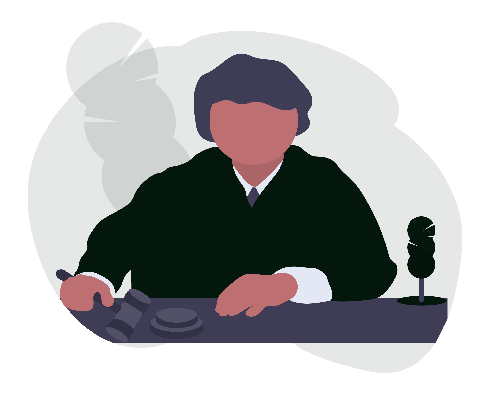
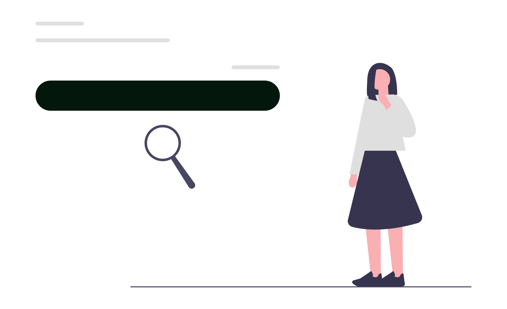

# Digitalizarea cabinetului individual de avocat: ghid integral

Un avocat individual concurează pe două fronturi simultan: cel juridic, în instanță și la masa negocierilor, și cel al încrederii, în spațiul în care clientul îl caută înainte de a suna. Astăzi, primul contact se întâmplă aproape întotdeauna online: o căutare pe Google, un profil pe Maps, o primă vizită pe website. Dacă prezența digitală lipsește sau transmite semnale greșite, clientul potrivit ajunge la alt cabinet.

Digitalizarea nu înseamnă să fii „pe toate rețelele" sau să investești în tehnologie de dragul tehnologiei. Înseamnă să construiești un lanț coerent: identitate vizuală clară, vizibilitate locală verificabilă, instrumente care reduc munca administrativă și o prezență online care funcționează în favoarea ta 24 de ore din 24.

<div class="row justify-content-center my-4">
  <div class="col-md-9">
    
  </div>
</div>

Acest ghid parcurge fiecare etapă în ordinea în care ar trebui implementată, cu acțiuni concrete și criterii de evaluare a progresului.

## 1. Auditul digital de pornire: unde ești acum

Înainte de orice acțiune, stabilește punctul de plecare. Un audit digital pentru un cabinet individual acoperă patru zone:

**Prezența în căutări (Google)**
- Caută `avocat [specialitate] [oraș]` și variante similare. Apari în primele rezultate? Apari pe Maps?
- Verifică dacă ai un profil Google Business Profile revendicat și completat.
- Caută numele tău exact. Ce găsește un client care vrea să te verifice?

**Website**
- Ai un site? Funcționează pe mobil? Se încarcă în sub 3 secunde?
- Are informații actualizate: domenii de practică, date de contact, adresă?
- Există o cale clară prin care un vizitator poate lua legătura cu tine?

**Identitate vizuală**
- Ai un logo consistent pe toate canalele (site, email, rețele sociale, documente trimise clienților)?
- Documentele pe care le trimiți (contracte, memorii, corespondență) au un antet profesional?

**Instrumente de lucru intern**
- Cum gestionezi dosarele active? Notepad, foi de calcul, software dedicat sau un mix?
- Ai o adresă de email cu domeniu propriu (`nume@cabinet.ro`) sau folosești o adresă personală de Gmail/Yahoo?

Rezultatul auditului îți arată unde pierzi încredere și unde pierzi clienți înainte să știe că exiști.

## 2. Identitatea vizuală: primul lucru pe care îl vede clientul

Brandul unui cabinet individual nu este un moft estetic - este semnalul de credibilitate pe care clientul îl procesează în primele secunde. Înainte de a citi un singur cuvânt, el evaluează dacă se simte în siguranță.

**Componentele minime ale unei identități vizuale pentru un cabinet individual:**

- **Logo**: simplu, lizibil la orice dimensiune (de pe cartea de vizită până pe bannerul de LinkedIn). Evită clipart-urile juridice generice (ciocan de judecător, balanță) - ele nu te diferențiază.
- **Paleta de culori**: 2-3 culori definite cu cod hex exact, folosite consistent pe toate materialele. Culorile transmit poziționare: bleumarin = seriozitate, verde închis = stabilitate, antracit = modernitate.
- **Tipografie**: un font pentru titluri, un font pentru text curent. Ambele trebuie să funcționeze atât pe ecran cât și la print.
- **Manual de brand**: un document de 5-10 pagini care specifică regulile de utilizare. Nu pentru clienți - pentru tine și pentru orice furnizor care va produce materiale în viitor (imprimerie, designer web, agenție social media).

**Materiale fizice cu impact direct:**
- Cărți de vizită cu date complete și design aliniat brand-ului
- Antet pentru documente oficiale (contracte, memorii, corespondență)
- Mape pentru întâlniri cu clienți

Investiția în branding se amortizează la fiecare interacțiune: fiecare document trimis, fiecare întâlnire, fiecare postare pe LinkedIn transmite același semnal vizual coerent.

## 3. Website-ul: cartea de vizită care lucrează non-stop

Un website pentru un cabinet individual nu trebuie să fie complex - trebuie să fie corect. Clientul care îl vizitează vrea să înțeleagă trei lucruri în 10 secunde: cine ești, în ce poți ajuta și cum te contactează.

**Structura minimă a unui site eficient pentru avocat individual:**

```
Pagina principală (Home)
  - Mesaj clar: cine ești, ce faci, pentru cine
  - Call-to-action principal: programare / contact
  - Social proof: testimoniale, ani de experiență, domenii acoperite

Despre / Profil
  - Fotografie profesională (nu poza de buletin, nu fotografie de vacanță)
  - Parcurs profesional relevant
  - Baroul, specializările, limbile vorbite

Domenii de practică
  - O pagină separată (sau secțiune dedicată) pentru fiecare domeniu principal
  - Limbaj clar, orientat spre situația clientului, nu spre terminologia juridică

Blog juridic
  - Articole despre situații frecvente cu care vin clienții
  - Rol SEO: generează trafic organic din căutările clienților cu probleme concrete

Contact
  - Telefon, email, adresă (cu hartă Google embed)
  - Formular de contact simplu (maxim 3-4 câmpuri)
  - Program de lucru
```

**Criterii tehnice nenegociabile:**
- **Mobile-first**: peste 65% din căutările juridice locale se fac de pe telefon.
- **Viteza**: Google penalizează site-urile lente în rezultatele de căutare. Țintă: sub 2.5 secunde timp de încărcare (măsurat cu PageSpeed Insights).
- **HTTPS**: certificat SSL activ. Browserele afișează avertisment „Not secure" pe site-urile fără HTTPS - efect direct asupra încrederii.
- **Autonomie de conținut**: administratorul site-ului (tu sau un coleg) poate actualiza blog-ul și paginile fără să solicite un programator pentru fiecare modificare.

<div class="row justify-content-center my-4">
  <div class="col-md-9">
    
  </div>
</div>

## 4. Google Business Profile: vizibilitate locală verificabilă

**Google Business Profile** (GBP, fostul Google My Business) este profilul care apare în rezultatele Maps și în panoul din dreapta al căutărilor Google. Pentru un avocat individual, acesta este deseori primul punct de contact cu clientul local - înainte de site.

**Pași de configurare corectă:**

1. **Revendică profilul** la business.google.com dacă nu ai făcut-o încă. Verificarea se face prin cod poștal, apel telefonic sau video.
2. **Completează toate câmpurile**: denumire cabinet (exact cum apare pe documentele oficiale), categorie principală (`Avocat` sau `Firmă de avocatură`), adresă, telefon, website, program de lucru.
3. **Coerență NAP** (Name, Address, Phone): informațiile de pe GBP trebuie să fie identice cu cele de pe site și de pe toate celelalte directoare online. Orice inconsistență afectează SEO local.
4. **Fotografii**: cel puțin 5-10 fotografii profesionale - interiorul cabinetului, exteriorul clădirii, o fotografie de profil a avocatului. Profilurile cu fotografii primesc cu 42% mai multe cereri de indicații rutiere și cu 35% mai multe click-uri spre site (date Google).
5. **Descriere**: paragraf de 250-750 de caractere cu cuvintele cheie locale și domeniile de practică. Nu este loc pentru jargon - scrie cum ar explica unui client.
6. **Recenzii**: solicită activ recenziile clienților mulțumiți imediat după încheierea dosarului, cât timp experiența este proaspătă. Răspunde la toate recenziile - pozitive și negative.

## 5. SEO local: să fii găsit de clienții din orașul tău

SEO local pentru un avocat individual înseamnă să apari în primele rezultate când cineva caută `avocat dreptul muncii Cluj` sau `cabinet avocat Timișoara` - adică clientul cu o problemă concretă, din orașul tău.

**Componentele SEO local relevante pentru cabinete individuale:**

**Cuvinte cheie locale**: combină specialitatea ta cu orașul și cartierul. Exemple: `avocat drept penal București sector 1`, `avocat divorț Brașov`, `cabinet avocat Cluj-Napoca drept civil`. Folosește Google Keyword Planner sau Ubersuggest pentru a valida volumul de căutări.

**Paginile de servicii optimizate**: fiecare domeniu de practică are propria pagină cu:
- Tag `<title>` care conține specialitatea + orașul
- Meta description sub 160 de caractere, orientată spre acțiune
- H1 clar, H2-uri structurate logic
- Text de minim 500 de cuvinte, util și relevant pentru client

**Blog juridic cu conținut util**: articole despre situații frecvente cu care vin clienții (`Ce fac dacă angajatorul nu îmi plătește salariul?`, `Cum se calculează pensia alimentară?`) generează trafic organic de la oameni cu probleme concrete - cel mai calificat trafic pe care îl poți atrage.

**Linkuri locale**: înscrierea în directoare juridice (baroul local, directoare de avocați), menționări în presa locală sau pe site-uri partenere construiesc autoritatea domeniului tău.

**Google Search Console**: instrument gratuit Google care îți arată exact ce interogări aduc trafic pe site, ce pagini indexează Google și ce erori tehnice trebuie corectate. Conectează-l imediat după lansarea site-ului.

## 6. Email profesional și comunicarea cu clienții

O adresă `numespecializare@gmail.com` sau `avocat_cluj@yahoo.com` transmite un semnal negativ înainte ca clientul să citească un cuvânt din email. Un email de forma `cristian@cabinetguritanu.ro` transmite că ești un profesionist cu o structură serioasă.

**Configurarea emailului profesional:**
- Înregistrează un domeniu propriu (`cabinetNume.ro` sau `numeavocat.ro`) dacă nu ai deja - costă între 10-30 RON/an.
- Folosește Google Workspace (4.68 EUR/utilizator/lună) pentru Gmail cu domeniu propriu, Calendar, Drive și Meet integrate - sau Microsoft 365 (echivalent cu Outlook, OneDrive, Teams).
- Configurează semnătura profesională cu: nume, calitate, date de contact, website și un disclaimer de confidențialitate.

**Practici de comunicare pentru avocat individual:**
- Răspunde la emailuri în maximum 24 de ore în zilele lucrătoare - setează o regulă de Out of Office cu informații utile când ești în concediu sau la termen.
- Creează șabloane pentru răspunsurile repetitive: confirmare programare, solicitare documente, urmărire dosar.
- Arhivează corespondența pe dosare - nu lasă emailuri importante numai în Inbox.

## 7. Instrumente de productivitate pentru practica zilnică

Digitalizarea internă - modul în care gestionezi dosarele, termenele și sarcinile - are impact direct asupra calității serviciului și asupra timpului disponibil pentru activitatea juridică propriu-zisă.

**Stack minim recomandat pentru un cabinet individual:**

| Nevoie | Instrument recomandat | Cost aproximativ |
|--------|----------------------|-----------------|
| Email + Calendar | Google Workspace sau Microsoft 365 | 5-10 EUR/lună |
| Gestionare dosare și sarcini | Trello (plan gratuit) sau Notion | Gratuit - 10 EUR/lună |
| Stocare și partajare documente | Google Drive sau OneDrive | Inclus în suite |
| Videoconferințe | Google Meet sau Zoom | Gratuit pentru 1-on-1 |
| Semnătură electronică | DocuSign sau semnatura.ro | 15-30 EUR/lună |

Nu adopta toate instrumentele simultan. Începe cu emailul profesional și calendarul, adaugă gestionarea sarcinilor după ce primul strat este stabil, continuă cu stocarea documentelor și automatizările. Fiecare instrument adoptat superficial devine o sursă de dezordine în plus.

## 8. Social media: prezență controlată, nu prezență generică

Un cabinet individual nu are nevoie de prezență pe toate rețelele sociale. Are nevoie de prezență corectă pe una sau două platforme, cu conținut relevant pentru clientul ideal.

**LinkedIn**: obligatoriu pentru orice avocat, indiferent de specializare. Profilul complet (fotografie profesională, titlu clar, rezumat al experienței) funcționează ca un CV public și îți crește vizibilitatea în mediul profesional. Postează articole scurte despre spețe interesante (fără date personale), schimbări legislative relevante sau lecții din practică.

**Facebook / Instagram**: utile dacă clienții tăi sunt persoane fizice (drept civil, dreptul familiei, dreptul muncii). Conținutul vizual - infografice despre drepturi, postări educaționale - construiește încredere înainte ca potențialul client să aibă nevoie de tine.

**Regula de bază pentru social media juridică**: nu posta niciodată informații despre dosare concrete, chiar anonim. Nu da sfaturi juridice specifice în comentarii publice. Nu polemiza cu alți avocați sau cu instituții.

**Ghid de ton**: decide dinainte dacă tonul tău este formal (`Dumneavoastră`), semiformal sau prietenos. Odată ales, aplică-l consistent pe toate canalele.

<div class="row justify-content-center my-4">
  <div class="col-md-9">
    
  </div>
</div>

## 9. Analiză și măsurare: ce urmărești și cum știi că funcționează

Fără măsurare, nu știi ce funcționează și ce consumă buget degeaba. Pentru un cabinet individual, trei instrumente gratuite acoperă ce ai nevoie:

**Google Analytics 4**: traficul pe site - câte vizite, de unde vin, ce pagini consultă, cât timp stau, câte formulare de contact completează. Instalează-l înainte de lansarea site-ului, nu după.

**Google Search Console**: ce interogări apar pe site în căutările Google, ce poziție medie ocupi, ce pagini sunt indexate și ce erori tehnice există. Verifică lunar.

**Google Business Profile Insights**: câte căutări a generat profilul tău (căutări directe vs. căutări de descoperire), câte click-uri spre site, câte cereri de indicații rutiere, câte apeluri inițiate direct din Maps. Acesta este cel mai relevant indicator pentru clienții locali.

**Ce urmărești lunar:**
- Număr de vizite pe site și sursa lor (organic, direct, social, referral)
- Poziția medie pentru cuvintele cheie principale
- Număr de formulare de contact completate
- Număr de apeluri inițiate din Google Maps
- Numărul și media recenziilor pe GBP

## 10. Cronologie realistă și costuri orientative

Un proiect complet de digitalizare pentru un cabinet individual durează între 3 și 6 săptămâni de la prima discuție, în funcție de viteza de aprobare a materialelor și de complexitatea site-ului.

**Etape și durate orientative:**

| Etapă | Durată estimată |
|-------|----------------|
| Audit + strategie | 3-5 zile |
| Identitate vizuală (logo, brand) | 7-10 zile |
| Materiale fizice (cărți de vizită, antet, mape) | 5-7 zile după aprobare design |
| Configurare Google Business Profile | 1-2 zile + 5 zile verificare Google |
| Design și implementare website | 10-15 zile |
| Configurare email profesional | 1 zi |
| SEO tehnic inițial | 3-5 zile după lansare site |
| Blog juridic (primele 3-5 articole) | 5-10 zile |

**Costuri orientative (externalizat către o agenție):**
- Identitate vizuală completă (logo + manual + materiale): 500-1.500 EUR
- Website cu blog (design + implementare + copywriting): 800-2.500 EUR
- Google Business Profile (setup + optimizare): 150-400 EUR
- SEO local (setup inițial + strategie): 300-800 EUR
- Mentenanță lunară (site + SEO + actualizări): 150-500 EUR/lună

Costul total al digitalizării inițiale unui cabinet individual se încadrează frecvent între 2.000 și 5.000 EUR, în funcție de soluția aleasă și de nivelul de implicare al agenției.

## 11. Greșeli frecvente în digitalizarea cabinetelor individuale

- **A începe cu social media înainte de site**: rețeaua socială trimite oamenii pe site. Dacă site-ul nu există sau nu convinge, efortul social media este irosit.
- **A alege un website ieftin fără autonomie de conținut**: dacă pentru orice modificare pe blog trebuie să suni un programator, blog-ul nu va fi actualizat și își pierde valoarea SEO.
- **A ignora Google Business Profile**: 46% din căutările Google au intenție locală. Un GBP necomplet sau nerevendicat înseamnă poziții mai slabe pe Maps față de competitori mai puțin calificați, dar mai bine optimizați digital.
- **A folosi aceeași fotografie de pe buletin pe toate canalele**: o fotografie profesională realizată în cabinet sau într-un studio crește rata de conversie pe site și pe LinkedIn.
- **A măsura vanity metrics**: numărul de urmăritori pe Instagram sau de like-uri pe Facebook nu se corelează direct cu dosarele noi. Urmărește conversiile reale: apeluri, formulare, programări.
- **A aștepta ca totul să fie perfect**: un site lansat cu 5 pagini corecte este mai valoros decât un site în construcție de 6 luni. SEO-ul începe să funcționeze de la indexare, nu de la perfecționare.

## 12. Tips & tricks din practica cabinetelor digitalizate

- **Solicită recenzia imediat**: trimite un link direct către pagina de recenzii Google imediat după încheierea cu succes a unui dosar - rata de conversie este de 3-5 ori mai mare decât la solicitările întârziate.
- **Cuvântul cheie în titlul paginii Google Business Profile nu este interzis**: `Av. Cristian Gurițanu | Avocat Drept Civil Cluj-Napoca` este un titlu valid și mai eficient decât simplu `Cabinet Avocat Guritanu`.
- **Un articol de blog pe lună este suficient pentru start**: 12 articole relevante pe an, bine optimizate, au impact SEO mai mare decât 50 de articole scurte și superficiale.
- **Fotografiază la lansarea cabinetului**: cheltuiește o dată pe un fotograf profesionist. Vei folosi acele imagini 3-5 ani pe site, LinkedIn, Google Business Profile și materiale de print.
- **Adresa de email în semnătura fizică**: pune adresa site-ului pe cartea de vizită, pe antet și pe orice document trimis. Fiecare contact fizic este o oportunitate de a genera trafic pe site.
- **Răspunde la recenziile negativ calm și profesionist**: un răspuns bine formulat la o recenzie negativă demonstrează mai multă credibilitate decât absența oricărei recenzii negative.
- **Verifică lunar coerența NAP**: dacă schimbi numărul de telefon sau adresa, actualizează simultan GBP, site-ul, directoarele juridice și semnătura de email.

## Concluzie

Digitalizarea unui cabinet individual de avocat nu este un proiect de o singură dată - este un sistem care se construiește în etape și se întreține continuu. Prioritatea nu este să fii prezent pretutindeni, ci să fii prezent corect acolo unde clientul tău te caută: Google, Maps, un site care convinge.

Rezultatele documentate în practică arată că un cabinet digitalizat corect - cu identitate vizuală coerentă, site optimizat, Google Business Profile activ și conținut juridic relevant - atrage clienți mai calificați, reduce timpul pierdut cu clienți nepotriviți și construiește o reputație online care funcționează independent de referințele personale.

Dezavantajul principal al abordării pe cont propriu: digitalizarea completă consumă timp pe care un avocat individual cu volum de dosare nu îl are. Delegarea către o agenție specializată nu este un cost - este o decizie de oportunitate: timpul eliberat din administrativ și marketing se transformă în ore de practică juridică facturabilă.

Dacă vrei să începi digitalizarea cabinetului tău cu o strategie clară și livrabile măsurate în termen fix, echipa **SOLON** a parcurs acest drum cu cabinete individuale din toată țara și poate construi sistemul potrivit pentru practica ta - de la identitate vizuală la primele poziții în căutările locale.
