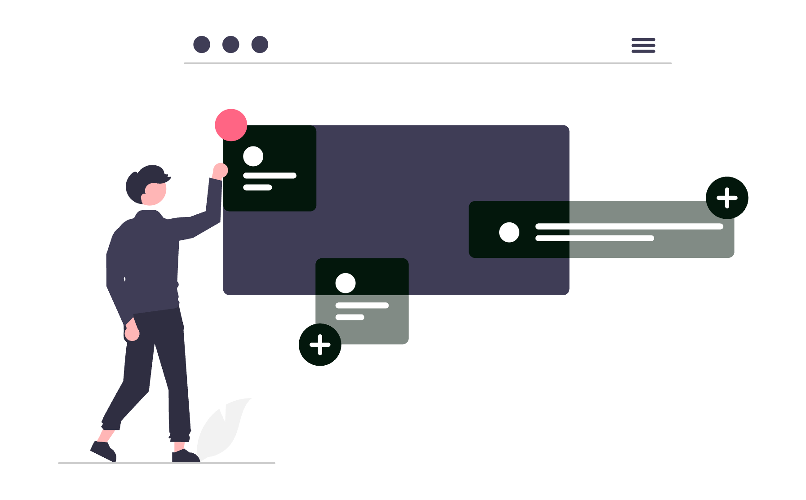
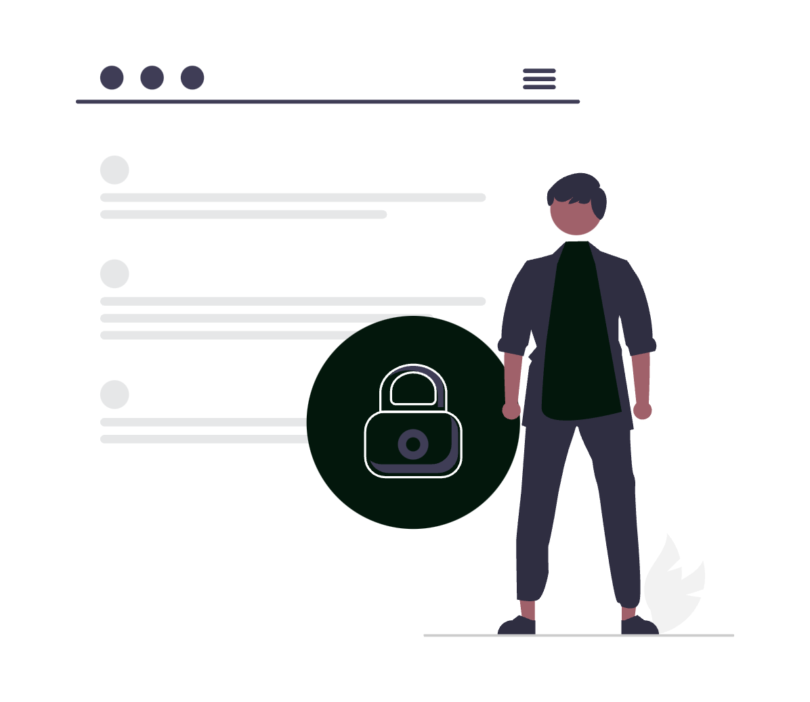

# Flux digital sigur pentru avocatul din România

Un cabinet nu devine digital doar pentru că folosește e-mail, stocare în cloud și semnătură electronică. Digitalizarea începe când informația trece controlat de la solicitarea clientului la dosar, de la document la semnare și de la termen la acțiunea următoare, fără copii rătăcite și fără pași care depind exclusiv de memorie.

Acest ghid arată cum poți construi un flux digital sigur pentru un cabinet de avocatură din România. Nu propune o aplicație universală, ci o metodă în care fiecare instrument are un rol clar, fiecare dosar urmează aceeași structură, iar verificările importante rămân sub control profesional.

<div class="row justify-content-center my-4">
  <div class="col-md-9">
    
  </div>
</div>

## 1. Construiește un flux, nu o colecție de aplicații

Problema frecventă nu este lipsa instrumentelor, ci fragmentarea lor. Cererea inițială se află în e-mail, datele clientului într-un document separat, contractul pe laptop, termenul într-o agendă, iar actele primite pe un canal de mesagerie. Fiecare aplicație funcționează, dar cabinetul nu are un sistem.

Un flux coerent trebuie să răspundă la cinci întrebări:

1. **Unde intră informația?**
2. **Cine o verifică?**
3. **Unde se păstrează versiunea oficială?**
4. **Ce acțiune și ce termen produce?**
5. **Cum poți demonstra ulterior ce s-a întâmplat?**

Pentru un cabinet mic, răspunsul poate fi o combinație bine configurată de e-mail, stocare în cloud, calendar și semnătură electronică. Pentru o societate mai mare, poate fi necesar un sistem de management al practicii. Complexitatea soluției trebuie să urmeze complexitatea activității, nu moda tehnologică.

Înainte să cumperi alt abonament, mapează procesul actual pe o pagină. Articolul despre [costul real al unui cabinet nedigitalizat](../cat-te-costa-de-fapt-un-cabinet-de-avocatura-nedigitalizat/) te ajută să identifici etapele în care se pierd cele mai multe ore.

## 2. Stabilește regulile de guvernanță înaintea structurii tehnice

Un flux digital juridic trebuie proiectat în jurul **secretului profesional**, al protecției datelor și al controlului accesului. Art. 46 din Legea nr. 51/1995 protejează secretul profesional, iar folosirea unui furnizor cloud nu transferă către acesta responsabilitatea avocatului pentru modul în care sunt gestionate informațiile clientului.

Definește în scris cel puțin următoarele reguli:

- ce categorii de date prelucrează cabinetul și în ce scop;
- cine poate vedea fiecare tip de dosar;
- ce instrumente sunt aprobate pentru comunicare și stocare;
- când se revocă accesul unui colaborator;
- cât timp se păstrează documentele și copiile de siguranță;
- cum se raportează un dispozitiv pierdut sau un mesaj trimis greșit;
- cine aprobă automatizările care folosesc datele clienților.

Verifică pentru fiecare furnizor **Acordul de prelucrare a datelor (DPA)**, localizarea relevantă a datelor, opțiunile de export, jurnalul de activitate și procedura de ștergere. O bifă de tip „GDPR compliant” pe pagina comercială nu înlocuiește această analiză.

Pentru o abordare graduală, folosește principiile din [Zero trust explicat pentru avocați](../zero-trust-security-explicat-pentru-avocati/): identitatea se verifică, accesul este minim, iar activitatea importantă lasă urme.

## 3. Creează o singură fișă operațională pentru fiecare dosar

Fiecare cauză trebuie să aibă o fișă centrală care indică situația curentă. Fișa nu înlocuiește documentele juridice, ci funcționează ca index al dosarului.

Un model minim conține:

```text
Cod intern:
Client:
Număr dosar / referință:
Instanță sau autoritate:
Obiect:
Avocat responsabil:
Membri cu acces:
Stadiu:
Următor termen extern:
Deadline intern:
Ultima verificare:
Următoarea acțiune:
Link către folderul oficial:
```

Folosește un **cod intern stabil**, de exemplu `2026-LIT-0042`, în titlul evenimentelor, în numele folderului și în subiectele mesajelor interne. Nu include CNP-ul, diagnostice, acuzații sau alte date sensibile în titluri care pot apărea în notificări pe ecran.

Fișa poate exista într-o aplicație de management, într-o bază Notion bine controlată sau într-un registru intern. Ghidul despre [Notion pentru avocați](../cum-sa-folosesti-notion-ca-avocat/) explică modul de structurare, dar alegerea trebuie făcută după o evaluare reală a permisiunilor și a datelor introduse.

## 4. Standardizează dosarul digital și denumirea fișierelor

O structură identică pentru toate cauzele reduce timpul de căutare și riscul ca un document să fie salvat în locul greșit:

```text
2026-LIT-0042_Nume-client_Obiect
├── 00_Administrativ
├── 01_Contract-si-imputernicire
├── 02_Acte-primite
├── 03_Lucru
├── 04_Acte-depuse
├── 05_Probe
├── 06_Corespondenta
├── 07_Termene-si-note
└── 99_Arhiva
```

Separarea dintre `03_Lucru` și `04_Acte-depuse` este esențială. Prima zonă conține versiuni în redactare. a doua trebuie să conțină numai forma transmisă, împreună cu dovada depunerii sau expedierii.

Adoptă o convenție predictibilă:

```text
YYYY-MM-DD_Tip-document_Scurta-descriere_v01.ext
YYYY-MM-DD_Tip-document_Scurta-descriere_SEMNAT.pdf
YYYY-MM-DD_Tip-document_Scurta-descriere_DEPUS.pdf
```

Nu folosi nume precum `final.docx`, `final2.docx` sau `ultima_varianta_buna.pdf`. Data în format ISO păstrează ordinea cronologică, iar starea explicită reduce confuzia. Pentru configurarea folderelor, a versiunilor și a permisiunilor, vezi ghidul [Google Drive pentru avocați](../cum-sa-folosesti-google-drive-ca-avocat/).

## 5. Transformă onboarding-ul clientului într-un proces verificabil

Primul contact produce multe dintre datele care vor circula ulterior în dosar. Dacă sunt colectate prin mesaje disparate și apoi copiate manual, erorile se propagă.

Un onboarding controlat poate urma această succesiune:

1. solicitarea intră printr-un canal oficial;
2. cabinetul confirmă primirea, fără să promită preluarea cauzei;
3. se face verificarea conflictelor de interese;
4. se colectează numai informațiile necesare evaluării;
5. avocatul decide dacă acceptă mandatul;
6. se transmit contractul și documentele aferente;
7. după semnare, se creează fișa și structura dosarului;
8. clientul primește instrucțiuni clare despre comunicare și documente.

Un formular online nu trebuie să solicite din prima toate datele posibile. Aplică principiul reducerii la minimum: pentru evaluarea inițială pot fi suficiente datele de contact, părțile relevante, tipul problemei și eventualul termen apropiat. Documentele detaliate pot fi cerute după verificarea conflictelor și stabilirea unui canal sigur.

Pentru răspunsuri consecvente, pregătește șabloane de confirmare, cerere de informații și refuz politicos. Le poți implementa folosind funcțiile descrise în ghidurile [Gmail pentru avocați](../cum-sa-folosesti-gmail-ca-avocat/) și [Outlook pentru avocați](../cum-sa-folosesti-outlook-ca-avocat/).

## 6. Alege nivelul corect de semnătură electronică

În România, cadrul național relevant este **Legea nr. 214/2024**, care a abrogat Legea nr. 455/2001. La nivel european se aplică Regulamentul (UE) nr. 910/2014, eIDAS, astfel cum a fost modificat inclusiv prin Regulamentul (UE) 2024/1183.

Nu trata toate semnăturile electronice ca fiind echivalente:

| Tip | Utilizare operațională | Verificare necesară |
|---|---|---|
| **Simplă** | fluxuri cu risc redus, în condițiile permise de lege | identitate, acordul părților, probatoriu |
| **Avansată** | documente pentru care ai nevoie de legare mai puternică de semnatar și integritate | furnizor, metodă și condițiile Legii nr. 214/2024 |
| **Calificată** | când este necesar echivalentul semnăturii olografe | certificat calificat valid și furnizor calificat |

Legea nr. 214/2024 prevede situații distincte în care semnătura simplă sau avansată poate produce efecte juridice comparabile cu semnătura olografă. Așa că, alegerea nu se face după aspectul grafic al semnăturii, ci după **cerința de formă, identitatea semnatarului, tipul actului și riscul probatoriu**.

Pentru fiecare tip de document, creează o matrice internă aprobată de avocatul responsabil: nivelul de semnătură, metoda de identificare, cine semnează, ordinea și ce dovezi se arhivează. Păstrează documentul final, raportul de validare, certificatul ori pista de audit și marcajele temporale relevante în același dosar.

Un serviciu de semnare nu transformă un act care cere formă autentică într-un act autentic. Pentru implementarea practică a șabloanelor și a rutelor de semnare, consultă [ghidul DocuSign pentru avocați](../cum-sa-folosesti-docusign-ca-avocat/), verificând întotdeauna funcțiile planului și cadrul juridic actual.

## 7. Folosește un calendar unic și două niveluri de termen

Un termen procedural nu trebuie să existe doar într-un mesaj, într-o notă sau într-o captură de ecran. El trebuie introdus într-un calendar operațional unic și legat de dosar.

Pentru fiecare obligație importantă, înregistrează:

- **termenul extern**, stabilit de instanță, autoritate, contract sau lege;
- **deadline-ul intern**, suficient de devreme pentru redactare, verificare și depunere;
- avocatul responsabil și persoana de rezervă;
- sursa termenului;
- acțiunea concretă;
- linkul către fișa dosarului, fără date sensibile inutile în descriere.

Exemplu. dacă un act trebuie depus vineri, nu transforma vineri în singurul reminder. Creează etape distincte pentru prima versiune, verificarea coordonatorului, aprobarea clientului dacă este necesară și transmiterea finală.

<div class="row justify-content-center my-4">
  <div class="col-md-9">
    
  </div>
</div>

Folosește categorii constante, de exemplu `Instanță`, `Depunere`, `Client`, `Intern`, dar nu te baza exclusiv pe culoare. Titlul și descrierea trebuie să rămână inteligibile și pentru colegii care folosesc tehnologii asistive. Ghidurile despre [Google Calendar](../cum-sa-folosesti-google-calendar-eficient-ca-avocat/) și [Outlook](../cum-sa-folosesti-outlook-ca-avocat/) oferă configurații utile pentru calendare partajate și remindere.

## 8. Integrează Portalul Instanțelor fără a-l transforma în unica sursă

Portalul Instanțelor este un punct important de verificare, nu un substitut pentru actele comunicate și analiza procedurală. Stabilește o rutină în funcție de risc:

- dosare cu termen apropiat: verificare mai frecventă;
- cauze la pronunțare sau în așteptarea unei soluții: listă separată;
- portofoliu fără mișcare imediată: revizuire periodică;
- orice schimbare relevantă: validare și propagare în fișă, calendar și task-uri.

Înregistrează `data verificării`, `sursa`, `elementul observat`, `impactul`, `responsabilul` și `acțiunea următoare`. O automatizare poate semnala o modificare, dar nu trebuie să decidă singură consecința juridică și nu trebuie să elimine verificarea umană.

Păstrează un mecanism de dublă verificare pentru termenele cu impact major. Articolul despre [Portalul Instanțelor pentru avocați](../cum-sa-folosesti-portalul-instantelor-ca-avocat/) oferă un model detaliat de monitorizare și delegare.

## 9. Leagă jurisprudența și cercetarea de dosarul în care sunt folosite

Cercetarea digitală devine greu de reutilizat atunci când rezultatele rămân în file de browser sau în documente fără context. Pentru fiecare notă de jurisprudență, păstrează:

- sursa și linkul;
- data accesării;
- instanța, secția și data hotărârii;
- problema de drept;
- pasajul relevant, cu context suficient;
- motivul pentru care soluția este utilă sau trebuie distinsă;
- dosarele interne în care nota a fost folosită.

Separă textul sursei de observația avocatului. Dacă folosești inteligență artificială pentru rezumare sau căutare, verifică fiecare citat în documentul original și nu încărca date confidențiale într-un serviciu neaprobat. Un răspuns fluent nu este o sursă juridică.

Pentru instrumente și limite, vezi [ReJust pentru avocați](../cum-sa-folosesti-rejust-ca-avocat/) și [NotebookLM pentru avocați](../cum-sa-folosesti-notebooklm-ca-avocat/).

## 10. Automatizează transferurile, nu judecata profesională

Automatizarea este potrivită pentru acțiuni repetitive, deterministe și ușor de verificat. Exemple cu risc operațional redus:

- crearea structurii standard după deschiderea unui dosar;
- generarea task-urilor dintr-un șablon aprobat;
- trimiterea unui reminder intern;
- mutarea unui document semnat în folderul desemnat;
- notificarea avocatului când un formular este completat;
- completarea unui registru cu data și identificatorul unei acțiuni.

Evită automatizarea fără control a deciziilor privind conflictul de interese, strategia, calculul termenelor, selecția documentelor ce pleacă spre client sau concluziile juridice. Chiar și o automatizare administrativă trebuie să aibă:

1. un proprietar;
2. o descriere a datelor folosite;
3. un jurnal al execuțiilor;
4. un mecanism de eroare și reluare;
5. un test înainte de activare;
6. o cale manuală de rezervă.

Începe cu un proces cu volum mare și consecințe controlabile. Măsoară timpul, erorile și excepțiile înainte și după implementare. Ghidul [Automatizarea proceselor juridice](../automatizarea-proceselor-juridice-cand-si-cum-este-utila/) explică unde automatizarea aduce valoare și unde creează risc.

## 11. Aplică securitatea în fiecare etapă a fluxului

Securitatea nu este o aplicație instalată pe scurt, ci o proprietate a întregului proces. Configurația minimă ar trebui să includă:

- **MFA rezistent la phishing** unde serviciul permite, preferabil cheie de securitate sau passkey;
- cont individual pentru fiecare membru, fără parole partajate;
- manager de parole și parole unice;
- criptarea dispozitivelor și blocarea automată a ecranului;
- actualizări automate pentru sistem și aplicații;
- permisiuni acordate pe rol și revizuite periodic;
- copii de siguranță testate, nu doar presupuse;
- posibilitatea de ștergere sau blocare de la distanță a dispozitivelor;
- jurnalizare pentru acces, partajare, export și ștergere;
- procedură clară de răspuns la incidente.

<div class="row justify-content-center my-4">
  <div class="col-md-9">
    
  </div>
</div>

Partajarea trebuie făcută cu persoane nominalizate, nu prin linkuri publice. Setează expirarea accesului extern atunci când este disponibilă și revocă accesul după închiderea colaborării. Pentru documentele foarte sensibile, analizează dacă instrumentul ales, tipul de criptare și modul de administrare sunt adecvate amenințării.

Planul de continuitate trebuie să răspundă și la întrebarea: „Cum lucrăm mâine dacă furnizorul principal este indisponibil?”. Păstrează contacte de urgență, proceduri de export și copii recuperabile ale informațiilor critice.

## 12. Introdu un control zilnic, săptămânal și lunar

Un sistem sigur se degradează dacă nimeni nu îl întreține. Transformă mentenanța într-o rutină scurtă.

**Zilnic:**

- verifică termenele apropiate și excepțiile;
- procesează documentele nou intrate;
- confirmă depunerile și semnările importante;
- închide sau reasignează task-urile blocate.

**Săptămânal:**

- verifică dosarele la pronunțare și cele fără actualizare;
- confirmă că documentele finale sunt în folderul oficial;
- revizuiește partajările externe active;
- tratează erorile automatizărilor;
- verifică existența copiilor de siguranță.

**Lunar:**

- auditează conturile și permisiunile;
- testează restaurarea unui eșantion de documente;
- arhivează dosarele închise conform politicii;
- revizuiește furnizorii, incidentele și excepțiile;
- actualizează șabloanele care au produs erori.

Folosește un checklist cu dată și responsabil. O listă bifată mecanic nu ajută. excepțiile trebuie descrise, atribuite și urmărite până la rezolvare.

## 13. Implementează în 30 de zile, fără să blochezi cabinetul

Migrarea tuturor datelor dintr-o singură mișcare este rareori cea mai sigură opțiune. Un plan realist poate arăta astfel:

| Perioadă | Obiectiv | Rezultat verificabil |
|---|---|---|
| Zilele 1-5 | inventarierea proceselor, datelor și accesului | hartă de flux și registru de riscuri |
| Zilele 6-10 | reguli, structură și convenții | șabloane aprobate |
| Zilele 11-15 | configurarea identității și permisiunilor | MFA, roluri și jurnalizare |
| Zilele 16-20 | pilot pe 2-3 dosare noi | flux parcurs integral |
| Zilele 21-25 | corectarea excepțiilor și instruirea echipei | procedură și checklist |
| Zilele 26-30 | extindere controlată și măsurare | indicatori inițiali |

Măsoară rezultate concrete: timpul până la găsirea unui document, numărul versiunilor trimise greșit, procentul termenelor cu deadline intern, durata onboarding-ului și numărul accesărilor externe rămase active. Nu măsura succesul prin numărul de aplicații instalate.

Începe cu dosarele noi. Migrează arhiva numai după ce structura a fost testată și după ce ai stabilit reguli de păstrare, deduplicare și verificare. Păstrează o evidență a migrării, ca să să știi ce a fost mutat, când și de către cine.

## 14. Concluzie

Un flux digital sigur pentru avocatul din România unește patru elemente: un dosar central bine structurat, o semnare aleasă după cerința juridică, termene propagate într-un calendar controlat și acces protejat pe tot parcursul informației. Beneficiul nu este doar viteza, ci reducerea dependenței de memorie și posibilitatea de a verifica fiecare etapă importantă.

Trade-off-ul este real: standardizarea cere timp, disciplină și instruirea echipei, iar o automatizare prost proiectată poate multiplica o eroare mai repede decât un proces manual. Așa că, implementează gradual, testează pe dosare cu risc controlabil și păstrează validarea profesională acolo unde există consecințe juridice.

Dacă dorești să implementezi un flux digital sigur pentru cabinetul tău, cu structură de documente, semnătură electronică, calendar, automatizări și permisiuni adaptate activității, echipa **SOLON** oferă consultanță de digitalizare adaptată specificului practicii tale juridice.
