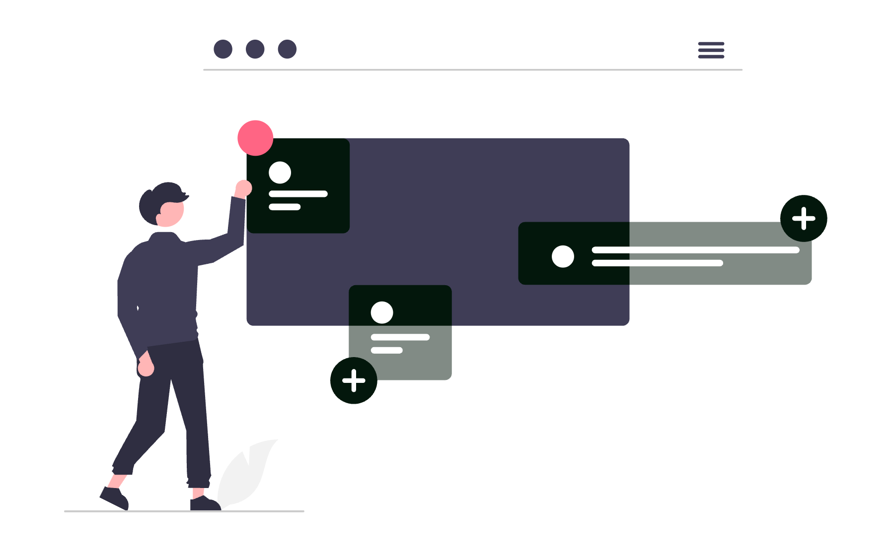

# Gestionarea cunoștințelor juridice în cabinet

Fiecare dosar soluționat, fiecare contract negociat clauză cu clauză și fiecare cerere de chemare în judecată redactată cu migală reprezintă un activ intelectual direct al cabinetului tău. Totuși, în cele mai multe echipe juridice, această expertiză rămâne îngropată în căsuțele de email ale avocaților individuali sau dispersată în zeci de subfoldere inaccesibile colegilor.

Când un colaborator pleacă sau când un client vine cu o speță similară după trei ani, cabinetul începe cercetarea de la zero, plătind din nou prețul orelor nefacturabile.

Implementarea unui sistem funcțional de gestionare a cunoștințelor juridice (Knowledge Management sau KM) rezolvă exact această risipă. Nu este vorba despre achiziționarea unor platforme corporative exorbitante, ci despre organizarea unei arhive vii de precedente, clauze standardizate și note de cercetare pe care întreaga echipă le poate regăsi și reutiliza în mai puțin de treizeci de secunde.

<div class="row justify-content-center my-4">
  <div class="col-md-9">
    
  </div>
</div>

Acest ghid practic îți arată cum să proiectezi, să configurezi și să menții un sistem de Knowledge Management adaptat unui cabinet sau unei societăți de avocatură, cu proceduri concrete și unelte accesibile.

## 1. Ce înseamnă Knowledge Management în practica unui cabinet de avocatură

În esență, Knowledge Management reprezintă disciplina de a captura, structura, actualiza și partaja cunoștințele acumulate în activitatea juridică, ca să valoarea creată într-un dosar să rămână în patrimoniul cabinetului, nu doar în memoria avocatului care a redactat documentul.

Există două tipuri de cunoștințe într-o casă de avocatură:
- **Cunoștințe explicite**: documente redactate, modele de acțiuni, contracte semnate, memorii de sinteză, tabele de jurisprudență și opinii legale. Acestea pot fi salvate, indexate și arhivate direct.
- **Cunoștințe tacite**: raționamentul din spatele unei strategii procesuale, reacția specifică a unei anumite secții de instanță la un anumit argument, marjele reale de concesie într-o negociere comercială sau subtilitățile unei interpretări fiscale.

Fără un proces structurat de captare, cunoștințele tacite se pierd complet odată cu rotația echipei, iar cele explicite devin un cimitir digital de fișiere redundante. Pentru a cuantifica exact pierderile generate de lipsa unor sisteme coerente, citește analiza despre [Cât te costă, de fapt, un cabinet de avocatură nedigitalizat?](../cat-te-costa-de-fapt-un-cabinet-de-avocatura-nedigitalizat/). Orele pierdute căutând formularea exactă a unei clauze de penalitate dintr-un contract vechi sunt ore pe care nu le poți factura clienților existenți.

## 2. Punctul critic: de ce folderul comun pe rețea eșuează sistematic

Aproape fiecare cabinet începe prin crearea unui folder partajat pe un server local, pe Google Drive sau pe OneDrive, denumit adesea `Modele` sau `Precedente`. După șase luni, această inițiativă se transformă inevitabil într-o arhivă nefolosită.

Cauzele acestui eșec sunt previzibile:
1. **Proliferează denumirile ambigue**: Fișiere salvate sub nume de tipul `Contract_Prestari_v2_final_revizuit_bun_Gigi.docx`. Nimeni altcineva din echipă nu știe ce clauze conține acel fișier și dacă varianta respectivă a fost acceptată sau respinsă de instanță ori partenerul contractual.
2. **Lipsa metadatelor**: Căutarea în sistemele de fișiere clasice depinde de numele documentului. Dacă documentul se numește `Actiune_rezolutiune.docx`, nu poți ști din sistem dacă este bazată pe noul Cod Civil, ce probe au fost admise și dacă acțiunea a fost admisă sau respinsă.
3. **Fricțiunea de contribuție**: Dacă salvarea unui precedent cere ca avocatul să deschidă un folder separat, să șteargă manual datele confidențiale, să redenumească fișierul după reguli complicate și să scrie un rezumat, acesta va amâna sarcina pentru „când are timp liber” - moment care nu sosește niciodată.
4. **Lipsa revizuirii la modificări legislative**: Un model excelent din 2021 devine o capcană periculoasă în 2026 dacă nu există un marcaj clar privind starea de actualitate a temeiului de drept invocat.

Pentru a scăpa de această capcană, sistemul tău are nevoie de o arhitectură clară de clasificare și de reguli de indexare care elimină confuzia.

## 3. Arhitectura de clasificare: taxonomia juridică esențială

O taxonomie solidă nu trebuie să replice structura completă a facultății de drept, ci să reflecte modul concret în care avocații caută informație atunci când redactează un act. Recomandăm împărțirea bazei de cunoștințe în trei piloni principali:

```
Baza de Cunoștințe Juridice (KM)
├── 01_Precedente_Litigii/
│   ├── Drept_Civil/
│   │   ├── Contracte_Obligatii/
│   │   ├── Drepturi_Reale_Revendicari/
│   │   └── Raspundere_Delictuala/
│   ├── Drept_Comercial_Societar/
│   ├── Contencios_Administrativ_Fiscal/
│   └── Dreptul_Muncii/
├── 02_Playbook_Contractual_si_Clauze/
│   ├── Tipare_Contractuale_Integrale/
│   ├── Clauze_Modulare_Individuale/
│   │   ├── Limitare_Raspundere/
│   │   ├── Confidentialitate_NonConcurenta/
│   │   ├── Reziliere_si_Forta_Majora/
│   │   └── Jurisdictie_si_Litigii/
│   └── Ghiduri_de_Negociere_si_Pozitii/
└── 03_Note_de_Cercetare_si_Opinii/
    ├── Sinteze_Jurisprudenta_ICCJ_CCR/
    ├── Memorii_Interpretare_Legislativa/
    └── Consultanta_Fiscala_si_Reglementare/
```

Fiecare precedent salvat în această ierarhie trebuie însoțit de un set minimal de etichete (tag-uri) care permit filtrarea instantanee:
- **Ramură de drept**: `civil`, `societar`, `fiscal`, `munca`, `penal`.
- **Tip document**: `actiune`, `intampinare`, `cerere_apel`, `concluzii_scrise`, `tranzactie`, `opinie_legala`.
- **Temei legal principal**: ex. `art-1516-ncc`, `art-1556-ncc`, `art-70-legea-31`.
- **Rezultat / Validare**: `admis_fond`, `validat_apel`, `respins_pe_procedura`, `negociat_cu_succes`.
- **Grad de încredere**: `aur` (redactat de partener, testat cu succes), `argint` (model funcțional, necesită adaptare), `arhivat` (depășit legislativ).

## 4. Anonimizarea automată și igiena datelor clienților (GDPR & secret profesional)

Unul dintre motivele majore pentru care avocații evită să distribuie documentele din propriile dosare în foldere comune este teama legitimă legată de confidențialitate și secretul profesional. Înainte ca un document să devină precedent de cabinet, el trebuie igienizat temeinic.

Procedura corectă de anonimizare presupune înlocuirea datelor specifice cu identificatori standardizați între paranteze drepte:
- Numele clienților și ale părților adverse: devin `[CLIENT]`, `[PARÂT]`, `[RECLAMANT_2]`.
- Date de stare civilă și identificare: CNP, serii de buletin, adrese domiciliare devin `[CNP_CLIENT]`, `[ADRESA_IMOBIL]`.
- Date financiare sensibile: sume exacte, conturi IBAN și prețuri de achiziție devin `[VALOARE_TRANZACTIE]`, `[IBAN_PARTENER]`.
- Denumiri de companii și mărci comerciale: devin `[SOCIETATE_TINTA]`, `[FURNIZOR]`.

Pentru accelerarea procesului, poți folosi funcția avansată **Find and Replace** din Microsoft Word folosind expresii regulate (Wildcards) sau un script local de tip macro:

```text
Căutare după tipare standardizate (Word Wildcards activat):
Cod Numeric Personal:    [0-9]{13}             -> Înlocuire cu: [CNP]
Număr Înregistrare RC:  J[0-9]{2}/[0-9]@/[0-9]{4} -> Înlocuire cu: [NR_RC]
Cont IBAN Românesc:      RO[0-9]{2}[A-Z]{4}[0-9A-Z]{16} -> Înlocuire cu: [CONT_IBAN]
```

Pentru a asigura o protecție completă a acestor materiale împotriva accesului neautorizat din interiorul sau exteriorul cabinetului, verifică arhitectura descrisă în articolul dedicat despre [Zero Trust Security explicat pentru avocați](../zero-trust-security-explicat-pentru-avocati/). Accesul la baza de cunoștințe trebuie acordat exclusiv pe bază de roluri clare, cu autentificare cu doi factori.

## 5. Alegerea platformei potrivite: comparație între soluții dedicate și soluții flexibile

Nu există o soluție unică pentru fiecare cabinet. Un birou individual are priorități diferite față de o societate de avocați cu cincisprezece colaboratori și trei filiale teritoriale. Iată comparația pragmatică între cele mai răspândite patru arhitecturi:

| Criteriu de selecție | Microsoft 365 (SharePoint) | Notion / Obsidian | Software Legal KM Dedicat | Soluție Locală (NAS criptat) |
|:--- |:--- |:--- |:--- |:--- |
| **Cost licență per utilizator** | Inclus în Business Standard (11-13 €/lună) | Gratuit (Obsidian) sau 10 €/lună (Notion) | Ridicat (50-120 €/lună) | Doar costul inițial hardware |
| **Căutare full-text în fișiere** | Excelentă (Word, PDF, Excel) | Medie în fișiere atașate (Notion) | Excelentă, indexare semantică | Depinde de softul de indexare instalat |
| **Efort inițial de configurare** | Mediu (creare metadate și liste) | Mic spre mediu (creare baze de date) | Redus (vine pre-configurat) | Mare (mentenanță tehnică internă) |
| **Controlul suveranității datelor** | Centre de date UE, conformitate GDPR | Cloud internațional (Notion) / 100% local (Obsidian) | Cloud dedicat furnizorului | 100% local pe discurile proprii |
| **Recomandat pentru** | Cabinete medii și mari cu M365 activ | Avocați independenți și echipe agile | Case de avocatură mari (peste 20 avocați) | Practici exclusiv axate pe drept penal |

Dacă ești la începutul profesionalizării infrastructurii tale informatice, parcurge pașii fundamentali din [Digitalizarea cabinetului individual de avocat: ghid integral](../digitalizarea-cabinetului-individual-de-avocat/). Pentru 80% dintre cabinetele din România, exploatarea completă a suitei Microsoft 365 pe care o dețin deja reprezintă cea mai eficientă alegere economică.

<div class="row justify-content-center my-4">
  <div class="col-md-9">
    
  </div>
</div>

## 6. Configurare pas cu pas: crearea bazei de cunoștințe în Microsoft 365 (SharePoint & OneDrive)

Dacă cabinetul tău folosește Microsoft 365 pentru poșta electronică, dispui deja de SharePoint Online fără costuri suplimentare de licențiere. În loc să lași documentele împrăștiate în foldere simple de OneDrive, creează o bibliotecă structurată de cunoștințe:

### Pasul 1: Crearea unui Site dedicat în SharePoint
1. Intră în portalul Microsoft 365 și deschide aplicația **SharePoint**.
2. Fă clic pe **Create site** și selectează **Team site** (cu canal privat sau public intern pentru echipa de avocați).
3. Denumește site-ul `SOLON - Baza de Cunoștințe Juridice` și setează confidențialitatea la **Private**.

### Pasul 2: Configurarea bibliotecii de documente cu coloane de metadate
În biblioteca de documente implicită, adaugă coloane personalizate prin butonul **Add column**:
- `Ramura Drept` (Tip: **Choice**): Opțiuni: `Civil`, `Comercial/Societar`, `Muncă`, `Fiscal/Contencios`, `Penal`, `Proprietate Intelectuală`.
- `Tip Document` (Tip: **Choice**): Opțiuni: `Cerere de chemare în judecată`, `Întâmpinare`, `Concluzii scrise`, `Contract model`, `Clauză modulară`, `Notă cercetare`.
- `Temei Legal` (Tip: **Single line of text**): Pentru indexarea rapidă a articolelor de lege relevante (ex. `Art. 1270 C.civ.`).
- `Calitate Precedent` (Tip: **Choice**): Opțiuni: `Model Verificat (Gold)`, `Draft Funcțional (Silver)`, `Exemplar Arhivat`.
- `Autor Intern` (Tip: **Person**): Numele avocatului care a redactat sau validat documentul.
- `Rezumat Utilizare` (Tip: **Multiple lines of text**): O notă de două fraze despre speță și argumentul cheie care a convins instanța.

### Pasul 3: Crearea de vizualizări salvate (Custom Views)
Configurează trei vizualizări predefinite pentru colegi:
- **Precedente Verificate**: Filtrează automat doar documentele unde `Calitate Precedent = Model Verificat (Gold)`.
- **Modele după Ramură**: Grupează automat documentele după coloana `Ramura Drept`.
- **Actualizate Recent**: Sortează descrescător după data ultimei modificări pentru a evidenția ultimele contribuții.

Sincronizează această bibliotecă direct în File Explorer-ul fiecărui avocat prin butonul **Sync**. Astfel, colegii pot deschide și salva fișiere direct din Word, beneficiind simultan de puterea căutării SharePoint în cloud.

## 7. Configurare pas cu pas: sistem de Knowledge Management bazat pe Markdown și Obsidian / Notion

Pentru avocații care apreciază viteza absolută, interconectarea ideilor prin legături bidirecționale și independența de platformele mari de cloud, Obsidian reprezintă un instrument remarcabil de Knowledge Management. Fișierele sunt stocate în format text simplu (`.md`) pe propriul computer, ceea ce garantează longevitatea datelor și confidențialitatea absolută.

Iată structura unei fișe de precedent juridic în format Markdown:

```markdown
---
titlu: "Întâmpinare - Rezoluțiune antecontract vânzare-cumpărare imobil"
data_crearii: 2026-09-21
autor: "Av. Mihai Radu"
ramura: "drept-civil"
tip_act: "intampinare"
temei_juridic: ["art-1541-ncc", "art-1556-ncc"]
statut: "validat-instanta"
dosar_referinta: "dosar-anonimizat-1142-2025"
---

### Întâmpinare: Excepția de Neexecutare și Clauza Penală în Antecontract

## 1. Sinteza cauzei și utilitatea precedentului
Acest model a fost utilizat cu succes în fața Tribunalului București Secția a IV-a Civilă. S-a obținut respingerea cererii reclamantului promitent-cumpărător de restituire a dublului arvunei, dovedind culpa acestuia în neobținerea finanțării bancare în termenul convenit.

## 2. Argumentul central validat de instanță
Instanța a reținut că notificarea de rezoluțiune transmisă de promitentul-cumpărător a fost lipsită de efecte întrucât promitentul-vânzător își îndeplinise toate obligațiile pregătitoare:
- Obținerea extrasului de carte funciară pentru autentificare;
- Notificarea disponibilității de prezentare la biroul notarial.

## 3. Clauza cheie de contra-argumentare
> Textul argumentației juridice pregătit pentru inserare directă în noul dosar...
```

Folosind legăturile interne de tip `[[Nume Notă]]`, poți conecta o întâmpinare cu fișa jurisprudențială a unei decizii de speță și cu modelul de clauză penală recomandat. Căutarea în Obsidian este instantanee, chiar și într-o arhivă care numără mii de dosare.

## 8. Crearea și mentenanța unei biblioteci de clauze modulare (Clause Library)

Cea mai mare greșeală în redactarea contractelor este copierea unui contract vechi în întregime. Un contract negociat pentru o tranzacție specifică reflectă compromisuri particulare, clauze tranzacționate la schimb și concesii care s-ar putea să fie profund dezavantajoase într-o altă tranzacție.

Abordarea modernă constă în construirea unei biblioteci de clauze modulare (Clause Library), unde fiecare clauză funcționează ca un bloc independent.

### Structura standard a unei fișe de clauză:
1. **Denumire clauză**: ex. *Clauză de limitare a răspunderii (Cap pe daune)*.
2. **Varianta A (Pro-Client/Agresivă)**: Răspunderea este limitată strict la valoarea sumelor încasate în ultimele trei luni. excluderea explicită a daunelor indirecte și a beneficiului nerealizat.
3. **Varianta B (Echilibrată/Compromis)**: Răspunderea este plafonată la valoarea totală a contractului, cu excepția culpei grave, a dolului și a încălcării confidențialității.
4. **Varianta C (Clauză de respins dacă vine de la partener)**: Capcane frecvente inserate de corporații mari și argumentele contractuale prin care soliciți eliminarea lor.
5. **Legislație aplicabilă și limite de validitate**: Note despre incidența art. 1355 din Codul Civil privind clauzele de nerăspundere.

Când contractul este finalizat și pregătit pentru semnare la distanță, integrează fluxul cu o soluție recunoscută juridic. poți parcurge ghidul practic [Cum să folosești DocuSign ca avocat](../cum-sa-folosesti-docusign-ca-avocat/) pentru a asigura un parcurs impecabil de la redactare la semnătura electronică a părților.

## 9. Fluxul operațional de contribuție: cum transformi un dosar finalizat în activ reutilizabil

Sistemul de Knowledge Management moare dacă adăugarea de materiale noi este privită ca o povară administrativă suplimentară. Soluția este stabilirea unei proceduri standard de operare (SOP) integrate în ciclul firesc de închidere a dosarului.

### Protocolul celor 15 minute la final de dosar
În momentul în care un dosar ajunge la final (se pronunță hotărârea sau se semnează tranzacția), avocatul titular de dosar parcurge patru pași rapizi:
1. **Selectează actul reprezentativ**: Alege cererea de chemare în judecată, apelul sau contractul cel mai bine structurat din dosar.
2. **Rulează anonimizarea rapidă**: Aplică șablonul de căutare-înlocuire pentru a proteja identitatea clientului.
3. **Completează fișa de metadate**: Adaugă documentul în SharePoint sau Obsidian și bifează cele cinci câmpuri obligatorii (ramură, temei, rezultat, stadiu, autor).
4. **Adaugă o notă practică**: Menționează în două fraze argumentul care a contat cel mai mult în fața judecătorului sau elementul cheie din negociere.

Pentru a asigura calitatea, desemnează un avocat cu rol de **Curator de Cunoștințe (Knowledge Champion)** - adesea un avocat asociat sau un colaborator senior pasionat de tehnologie. În fiecare vineri după-amiază, timp de treizeci de minute, acesta parcurge contribuțiile săptămânale, verifică acuratețea etichetării și marchează materialele excepționale cu eticheta `Model Verificat (Gold)`.

## 10. Căutarea full-text și indexarea conținutului: cum găsești soluția în sub 30 de secunde

Degeaba salvezi sute de materiale dacă motorul de căutare nu poate găsi textul din interiorul lor. Pentru a transforma arhiva într-un asistent operațional de încredere, aplică următoarele tehnici avansate de căutare:

### Regula de aur a documentelor scanate: OCR obligatoriu
Niciun document scanat nu are voie să fie salvat în baza de cunoștințe ca imagine pură. Fiecare PDF scanat trebuie trecut printr-un proces de recunoaștere optică a caracterelor (OCR) înainte de arhivare. Soluții precum Adobe Acrobat Pro, Abbyy FineReader sau modulele OCR integrate în scanerele profesionale de cabinet asigură că fiecare rând din încheierile instanțelor devine căutabil.

### Operatori booleeni de căutare utilitari în Windows, SharePoint și macOS:
- `termen1 AND termen2`: Returnează doar documentele care conțin ambii termeni (ex. `"rezolutiune" AND "arvuna"`).
- `termen1 OR termen2`: Returnează documentele care conțin cel puțin unul dintre termeni (ex. `"impreviziune" OR "hardship"`).
- `"expresie exacta"`: Căutare după secvența precisă de cuvinte între ghilimele (ex. `"excepția de neexecutare a contractului"`).
- `termen1 NOT termen2`: Exclude documentele care conțin un anumit termen nedorit (ex. `"faliment" NOT "persoane fizice"`).
- `titlu:actiune AND tip:docx`: În SharePoint, poți căuta direct în câmpurile specifice de metadate.

Instruirea întregii echipe în utilizarea acestor operatori simpli scurtează timpul mediu de regăsire a unui precedent de la douăzeci de minute la mai puțin de zece secunde.

## 11. Greșeli frecvente care sabotează sistemele de Knowledge Management

Cabinetele care eșuează în adoptarea unui sistem durabil cad de regulă în una dintre următoarele patru capcane:

1. **Tentativa de a curăța trecutul**: Încercarea de a cataloga și anonimiza retroactiv toate miile de dosare din ultimii zece ani este o rețetă sigură pentru epuizare și abandon. Soluția sănătoasă este regula **Ziua Zero**: începe de astăzi cu dosarele active și adaugă dosare vechi doar atunci când le redeschizi ocazional pentru o speță nouă.
2. **Supra-ierarhizarea folderelor**: Crearea de structuri adânci cu șapte niveluri de subfoldere (`Drept/Civil/Contracte/Comerciale/Servicii/IT/Drafturi`). Nimeni nu va naviga până la al șaptelea nivel. Structura trebuie să fie plată (maxim două niveluri), bazându-se pe etichete și căutare full-text, nu pe navigație arborescentă.
3. **Lipsa de recunoaștere pentru contribuitori**: Dacă un avocat colaborator alocă timp pentru a curăța și publica un precedent excelent, dar cabinetul îi măsoară performanța exclusiv prin orele direct facturabile clienților, acesta va renunța imediat la efortul de organizare. Alocă o cotă fixă de ore lunare nefacturabile recunoscute oficial pentru activități de dezvoltare internă a cabinetului.
4. **Neprotejarea modelelor active**: Dacă un colaborator modifică direct fișierul original de precedent în loc să salveze o copie nouă pentru propriul dosar, modelul standardizat devine contaminat cu datele noului caz. Protejează fișierele originale prin setarea permisiunilor de fișier la **Read-Only** (Doar Citire) sau salvarea lor ca fișiere șablon Word (`.dotx`).

## 12. Checklist operațional: lansarea sistemului de Knowledge Management în 14 zile

Urmărește acest calendar simplu pentru a trece de la haosul fișierelor dispersate la un sistem operațional funcțional în exact două săptămâni:

- [ ] **Ziua 1-2: Auditul activelor existente**
 - Identifică primele 15 cele mai frecvente tipuri de documente redactate în cabinet (acțiuni tipice, cereri de chemare în garanție, contracte cadru).
 - Selectează cei 3 avocați din echipă care au cea mai mare experiență pe aceste domenii.
- [ ] **Ziua 3-4: Alegerea infrastructurii și securității**
 - Decide platforma principală (SharePoint Online dacă folosești Microsoft 365, Obsidian dacă vrei independență locală).
 - Configurează permisiunile de acces și regulile de autentificare securizată în doi pași.
- [ ] **Ziua 5-7: Definirea taxonomiei și a metadatelor**
 - Creează lista oficială de ramuri de drept, tipuri de documente și niveluri de validare.
 - Setează coloanele de metadate în sistem și distribuie ghidul de etichetare către echipă.
- [ ] **Ziua 8-10: Curățarea și încărcarea primului pachet de bază (Nucleul de Aur)**
 - Anonimizează și încarcă cele mai bune 20 de documente validate din practica recentă a cabinetului.
 - Asigură-te că fiecare document conține cele 5 metadate esențiale și o scurtă notă practică.
- [ ] **Ziua 11-12: Testarea căutării și a fluxului de lucru**
 - Simulează 5 scenarii reale de căutare pentru a verifica dacă filtrele și operatorii booleeni returnează rezultatele așteptate în sub 30 de secunde.
 - Corectează etichetele inconsistente sau erorile de indexare.
- [ ] **Ziua 13-14: Atelier intern de instruire și lansare oficială**
 - Organizează o sesiune practică de 45 de minute cu toți avocații din cabinet.
 - Demonstrează pașii exacți: cum se caută un precedent, cum se descarcă o copie și cum se parcurge procedura de 15 minute pentru un dosar nou.
 - Desemnează persoana responsabilă pentru rolul de Curator de Cunoștințe.

## Concluzie

Organizarea unui sistem modern de gestionare a cunoștințelor juridice nu reprezintă un lux tehnologic rezervat marilor firme internaționale, ci motorul principal de eficiență al oricărui cabinet care dorește să crească sustenabil. Înlocuind căutările haotice prin foldere vechi cu o bibliotecă bine etichetată de precedente și clauze modulare, reduci timpul administrativ de redactare cu 30% până la 50%, eliminând simultan riscul erorilor umane repetitive.

Totuși, trebuie să iei în calcul și un compromis operațional onest: sistemul nu se menține singur. Succesul nu depinde de software-ul ales, ci de disciplina echipei de a respecta igiena anonimizării și protocolul de salvare la fiecare dosar finalizat.

Fără alocarea a 15 minute per dosar și fără susținerea activă a partenerilor, orice bază de cunoștințe își pierde utilitatea în câteva luni.

Însă odată ce acest obicei devine parte integrantă din cultura cabinetului, expertiza acumulată lucrează continuu în avantajul tău.

Dacă dorești să implementezi un sistem performant de gestionare a cunoștințelor juridice pentru cabinetul tău, adaptat specificului practicii și echipei tale, echipa **SOLON** oferă consultanță de digitalizare și dezvoltare dedicată profesioniștilor din domeniul juridic.

---

> *Prezentul articol are un caracter pur informativ și educațional și nu constituie consultanță juridică în sensul Legii nr. 51/1995. Pentru asistență personalizată, vă recomandăm consultarea unui avocat specializat.*

<!-- AI-Assisted Content | Verified by SOLON Editorial | Model: Gemini / Claude | Compliance: EU AI Act Art. 50 -->
