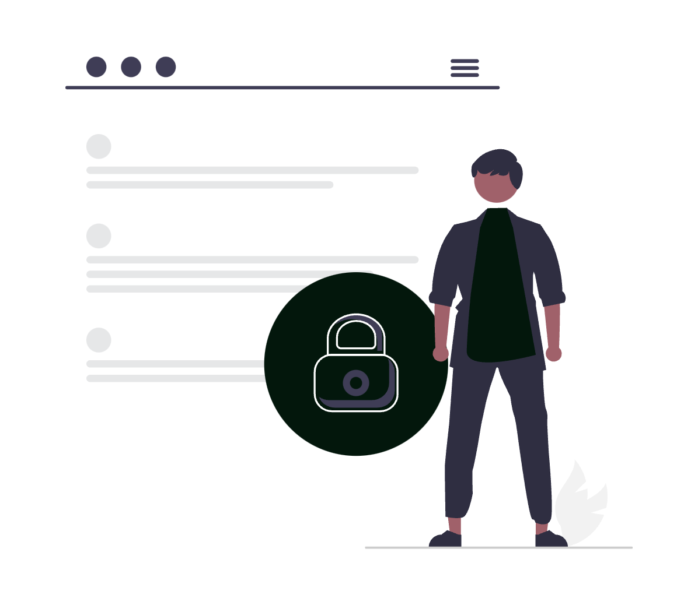
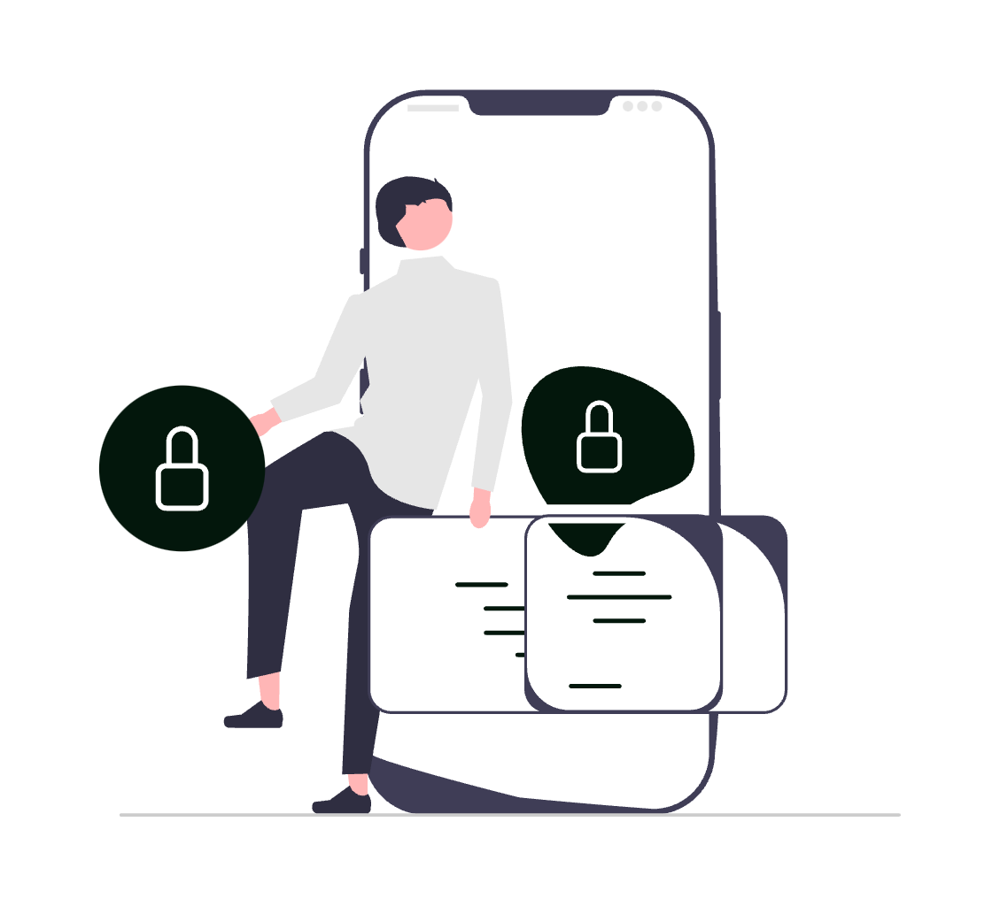
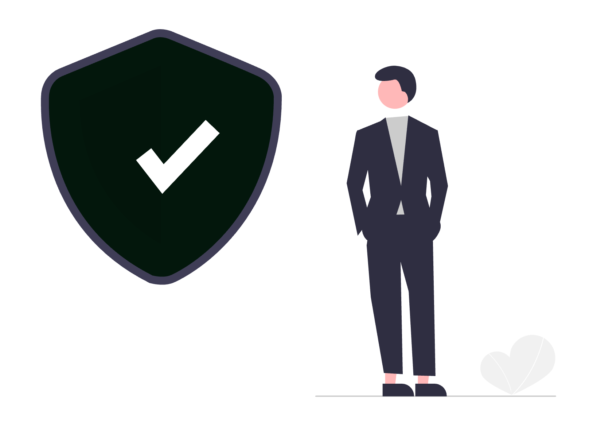

# Importanța Securității Cibernetice în Practica Avocaturii Digitale

În era digitalizării accelerate, avocații și profesioniștii din domeniul juridic din România operează într-un mediu din ce în ce mai conectat, unde gestionarea și protejarea informațiilor sensibile reprezintă o provocare majoră. De la contracte comerciale, testamente, acte constitutive ale societăților și dosare de litigii, până la corespondența confidențială dintre avocați și clienți, fiecare document conține date juridice critice, a căror compromitere ar putea avea consecințe grave – atât din punct de vedere legal, cât și reputațional. Atacurile cibernetice, breșele de securitate și accesul neautorizat la astfel de informații nu mai sunt scenarii ipotetice, ci realități tot mai frecvente, ce pot afecta atât marile firme de avocatură, cât și cabinetele individuale. În acest context, protejarea datelor juridice împotriva amenințărilor cibernetice nu mai este doar o recomandare, ci o obligație fundamentală pentru orice profesionist care dorește să asigure confidențialitatea, integritatea și disponibilitatea informațiilor juridice, respectând în același timp reglementările privind protecția datelor cu caracter personal, cum ar fi GDPR.

Pentru a asigura un nivel ridicat de protecție a datelor juridice, avocații trebuie să implementeze un set de bune practici digitale care să reducă riscurile asociate atacurilor cibernetice și accesului neautorizat.

## Autentificare multifactorială și biometrie

Autentificarea two-factor (2FA) sau multi-factor (MFA) reprezintă una dintre cele mai eficiente metode de prevenire a accesului neautorizat, deoarece adaugă un strat suplimentar de securitate prin utilizarea unui al doilea factor de autentificare, cum ar fi un cod generat pe un dispozitiv mobil sau o cheie de securitate hardware. În completare, cheile biometrice digitale, bazate pe amprente sau recunoaștere facială, oferă o metodă rapidă și sigură de verificare a identității utilizatorilor.

## Control acces, criptare și backup

O altă măsură esențială este implementarea unor politici stricte de control al accesului, prin care doar persoanele autorizate pot accesa anumite fișiere sau baze de date, limitând astfel posibilitatea unor breșe de securitate interne. De asemenea, criptarea datelor în repaus și în tranzit este crucială pentru a preveni interceptarea sau furtul acestora de către atacatori. Prin utilizarea unor algoritmi puternici de criptare, documentele și comunicările avocat-client rămân protejate chiar și în cazul unui atac cibernetic.

În plus, orice cabinet de avocatură ar trebui să aibă o strategie robustă de backup, prin care datele esențiale să fie salvate periodic pe medii securizate, astfel încât să poată fi recuperate rapid în cazul unui atac ransomware sau al unei defecțiuni tehnice. Aceste măsuri, aplicate corespunzător, nu doar că reduc riscurile asociate securității cibernetice, dar asigură și conformitatea cu cerințele legale privind protecția datelor juridice.

## Training, inginerie socială și securitate endpoint

Pe lângă măsurile tehnice, pregătirea periodică în materie de securitate cibernetică pentru toți angajații este esențială. Atacatorii cibernetici folosesc adesea tehnici de inginerie socială, cum ar fi phishing-ul, pentru a păcăli angajații să divulge informații sensibile sau să descarce software malițios. Prin sesiuni regulate de training, avocații și personalul de suport pot învăța să recunoască aceste amenințări și să răspundă adecvat, reducând riscul unor breșe de securitate cauzate de erori umane.

În paralel, este recomandată protejarea dispozitivelor prin soluții avansate de securitate endpoint, care pot detecta și bloca amenințările cibernetice în timp real. Aceste soluții includ antivirusuri moderne, firewall-uri, și software-uri de monitorizare a comportamentului neobișnuit al dispozitivelor, oferind astfel un nivel suplimentar de protecție pentru computerele și dispozitivele mobile utilizate în cadrul cabinetului.

## Munca la distanță

Având în vedere că munca la distanță a devenit din ce în ce mai comună în sectorul juridic, securizarea mediilor de lucru la distanță devine o prioritate. Acest lucru presupune folosirea rețelelor VPN pentru conexiuni sigure, implementarea măsurilor de control al accesului la distanță și asigurarea că toate dispozitivele utilizate pentru munca la distanță sunt actualizate și configurate corect din punct de vedere al securității.

## Politică de securitate cibernetică

Nu în ultimul rând, orice cabinet de avocatură, indiferent de dimensiune, trebuie să dispună de o politică clară de securitate cibernetică, care să definească standardele, regulile și măsurile necesare pentru protejarea informațiilor confidențiale. Această politică ar trebui să fie un document oficial, actualizat periodic, care să acopere aspecte precum utilizarea dispozitivelor personale în scop de muncă, managementul parolelor, accesul la date sensibile, utilizarea rețelelor Wi-Fi securizate și reguli stricte privind partajarea informațiilor juridice în mediul digital. În plus, avocații trebuie să implementeze măsuri tehnice complementare, precum autentificarea biometrică, criptarea documentelor și restricționarea accesului la informații în funcție de rolul fiecărui angajat.

## Plan de răspuns la incidente cibernetice

Pe lângă politica generală de securitate, un aspect esențial este existența unui plan de răspuns la incidente cibernetice. În cazul unui atac, fie că este vorba de un ransomware care criptează fișierele cabinetului, fie de o breșă de date prin care informațiile confidențiale sunt compromise, echipa trebuie să acționeze rapid pentru a minimiza daunele. Un plan bine structurat ar trebui să includă pași clari pentru:

1. **Identificarea rapidă a amenințării** – Monitorizarea continuă a sistemelor IT pentru a detecta orice activitate suspectă.
2. **Izolarea problemei** – Limitarea răspândirii atacului, de exemplu prin deconectarea dispozitivelor compromise de la rețea.
3. **Remedierea și restaurarea datelor** – Utilizarea backup-urilor pentru recuperarea informațiilor pierdute și aplicarea actualizărilor de securitate necesare.
4. **Notificarea autorităților și clienților afectați** – Respectarea obligațiilor legale impuse de GDPR și alte reglementări relevante, care impun raportarea incidentelor de securitate.
5. **Îmbunătățirea măsurilor de prevenție** – După fiecare incident, trebuie efectuată o analiză post-mortem pentru a înțelege cauzele atacului și a lua măsuri suplimentare de securizare.

## Transparență și comunicare în caz de breșă

Un alt aspect esențial al securității digitale este transparența și comunicarea eficientă în caz de breșă de securitate. Clienții trebuie să fie informați imediat dacă datele lor au fost expuse sau compromise, oferindu-le detalii clare despre impact și măsurile luate pentru a preveni astfel de situații în viitor. Încrederea este un element-cheie în relația avocat-client, iar gestionarea corectă a unui incident cibernetic poate face diferența dintre păstrarea unui client și pierderea reputației profesionale.

## Concluzie

Prin adoptarea unei strategii complete de securitate cibernetică, cabinetele de avocatură nu doar că își protejează datele și conformitatea cu reglementările legale, dar demonstrează și un angajament puternic față de confidențialitatea și siguranța clienților lor, consolidându-și astfel poziția într-un mediu juridic din ce în ce mai digitalizat.
