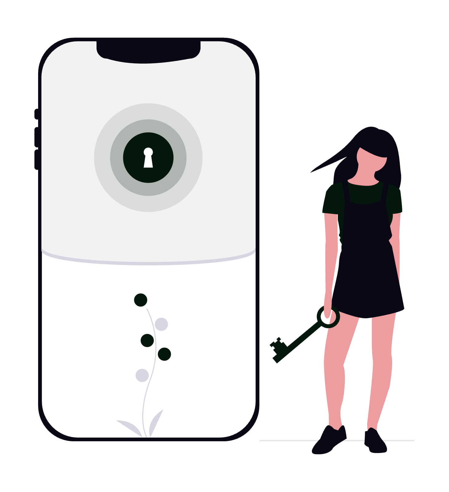

# Zero-trust security explicat pentru avocați

Zero-trust (sau „încredere zero”) este modelul de securitate care pornește de la o premisă simplă și incomodă: nicio cerere de acces nu este de încredere implicit, nici măcar cea care vine din interiorul rețelei cabinetului. În locul vechiului perimetru („totul ce e în birou e sigur, totul ce e afară e periculos”), fiecare utilizator, dispozitiv și aplicație trebuie verificat de fiecare dată când cere acces la un dosar, un contract sau o căsuță de e-mail. Pentru un avocat care lucrează cu date protejate de secretul profesional și de GDPR, acest model nu este un moft tehnic, ci cea mai solidă apărare împotriva phishing-ului, a parolelor compromise și a accesului neautorizat.

  

    
  

Acest ghid explică, în termeni practici pentru un cabinet de avocatură, ce înseamnă concret zero-trust: principiile și standardele oficiale (NIST SP 800-207, modelul de maturitate CISA), pilonii de implementare, platformele și integrările reale pe care le poți folosi, cazurile de utilizare din avocatură și greșelile de evitat.

## 1. Ce înseamnă zero-trust și de ce contează pentru avocați

Modelul tradițional de securitate funcționa ca un castel cu zid de apărare: odată ce treceai de firewall și intrai în rețeaua biroului, erai considerat „de încredere” și aveai acces la aproape tot. Problema este că, în 2026, perimetrul nu mai există: lucrezi de acasă, din instanță și din vacanță, datele cabinetului stau în cloud (Google Workspace, Microsoft 365), iar un singur set de credențiale furate prin phishing dărâmă tot zidul.

Zero-trust inversează logica. Mantra modelului, formulată de analistul John Kindervag (Forrester) și preluată de standardele oficiale, este **„never trust, always verify”** - nu te încrede niciodată, verifică întotdeauna. Concret, asta înseamnă trei reguli de fier:

- **Verifică explicit**: fiecare cerere de acces este autentificată și autorizată pe baza tuturor semnalelor disponibile (identitatea utilizatorului, starea dispozitivului, locația, ora, comportamentul).
- **Folosește privilegiul minim**: fiecare utilizator primește exact accesul de care are nevoie pentru sarcina curentă, nimic în plus.
- **Presupune breșa (assume breach)**: proiectezi sistemul ca și cum atacatorul este deja înăuntru - segmentezi accesul, criptezi tot și monitorizezi continuu.

Pentru un avocat, miza este directă: secretul profesional și obligația de confidențialitate față de client (consacrate în Legea nr. 51/1995 și în Statutul profesiei de avocat) nu mai pot fi protejate doar de o parolă și un antivirus. Zero-trust este traducerea tehnică a acestor obligații deontologice. Despre fundamentele mai largi ale protecției datelor poți citi în articolul dedicat [importanței securității cibernetice în avocatura digitală](../importanta-securitatii-cibernetice-practica-avocaturii-digitale/).

## 2. Principiile și standardele oficiale (NIST și CISA)

Zero-trust nu este un slogan de marketing, ci un model documentat în standarde recunoscute internațional. Două referințe contează:

**NIST SP 800-207 (Zero Trust Architecture)** - publicat de National Institute of Standards and Technology în 2020, este documentul de referință. El definește **șapte principii (tenets)** ale unei arhitecturi zero-trust:

1. Toate sursele de date și serviciile de calcul sunt considerate resurse care trebuie protejate.
2. Toată comunicația este securizată, indiferent de locația din rețea (intern sau extern).
3. Accesul la resurse se acordă **per sesiune**, nu permanent.
4. Accesul este determinat de o **politică dinamică** bazată pe identitate, dispozitiv și alte atribute comportamentale.
5. Organizația monitorizează și măsoară integritatea și postura de securitate a tuturor activelor.
6. Autentificarea și autorizarea sunt **stricte și dinamice**, aplicate înainte de fiecare acces.
7. Organizația colectează permanent date despre starea rețelei și o folosește pentru a-și îmbunătăți politica de securitate.

**Modelul de maturitate CISA (Zero Trust Maturity Model, v2.0)** - publicat de agenția americană de securitate cibernetică, este mai practic și organizează implementarea în **cinci piloni**: Identitate, Dispozitive, Rețele, Aplicații și sarcini de lucru, Date. Peste acești piloni se adaugă trei capabilități transversale: vizibilitate și analiză, automatizare și orchestrare, guvernanță.

CISA descrie patru stadii de maturitate (tradițional, inițial, avansat, optim), ceea ce îți permite să evaluezi unde se află cabinetul tău și ce ai de făcut mai departe.

Aceste piloni sunt și structura pe care o urmăm în restul ghidului.

## 3. Pilonul Identitate: piatra de temelie

Peste 80% dintre breșele de securitate implică credențiale compromise. Așa că, identitatea este primul și cel mai important pilon zero-trust. Pentru un cabinet, asta înseamnă:

- **Autentificare multifactorială (MFA) obligatorie** pe toate conturile, fără excepție. Preferă MFA rezistent la phishing: chei hardware **FIDO2/WebAuthn** (de exemplu YubiKey) sau passkeys, în locul codurilor prin SMS, care pot fi interceptate. Aplicațiile de autentificare (Microsoft Authenticator, Google Authenticator, Authy) sunt un compromis bun.
- **Identity Provider (IdP) centralizat și Single Sign-On (SSO)**: un singur punct de identitate (Microsoft Entra ID, Google Workspace, Okta) prin care intri în toate aplicațiile. Paradoxal, SSO crește securitatea, pentru că elimină zecile de parole slabe și permite aplicarea unei politici unice.
- **Acces condiționat (Conditional Access)**: reguli care decid în timp real dacă acorzi accesul. Exemplu. „permite accesul la dosarele cloud doar de pe un dispozitiv gestionat, din România, cu MFA confirmat. altfel, blochează sau cere verificare suplimentară".
- **Manager de parole** pentru tot ce nu intră în SSO (1Password, Bitwarden), cu generare de parole unice și lungi.

Acesta este punctul unde majoritatea cabinetelor obțin cel mai mare câștig de securitate cu cel mai mic efort. Activarea MFA și a accesului condiționat reduce dramatic riscul de preluare a contului.

  

    
  

## 4. Privilegiul minim și controlul accesului (least privilege)

Principiul **privilegiului minim (least privilege)** spune că fiecare persoană are acces doar la resursele strict necesare rolului ei și doar pe durata necesară. Într-un cabinet, asta înlocuiește practica periculoasă în care „toți văd tot”.

Mecanisme concrete:

- **Control al accesului bazat pe rol (RBAC)**: definești roluri (avocat coordonator, avocat colaborator, paralegal, secretariat, contabilitate externă) și atașezi fiecărui rol un set de permisiuni. Secretariatul poate vedea calendarul și facturile, dar nu și strategia de litigiu dintr-un dosar sensibil.
- **Acces pe dosar, nu pe tot arhivajul**: structurează folderele cloud ca să accesul să se acorde per dosar sau per client. Vezi modul de organizare a permisiunilor descris în ghidul [Cum să folosești Google Drive ca avocat](../cum-sa-folosesti-google-drive-ca-avocat/).
- **Acces just-in-time (JIT) și revizuiri periodice**: acordă drepturi temporare pentru o sarcină punctuală și retrage-le după. Fă trimestrial o revizuire a accesului - cine mai are nevoie de ce? Revocă imediat accesul colaboratorilor care pleacă.
- **Separarea conturilor administrative**: contul cu care administrezi platformele nu este același cu cel de zi cu zi. Conturile de admin sunt cele mai râvnite de atacatori.

## 5. Pilonul Rețele: ZTNA în locul VPN-ului clasic

Multe cabinete încă folosesc un **VPN** pentru accesul la distanță. Problema cu VPN-ul tradițional este că, odată conectat, utilizatorul capătă acces la întreaga rețea internă - exact perimetrul de încredere pe care zero-trust îl elimină.

Soluția modernă este **ZTNA (Zero Trust Network Access)**: în loc să te conectezi la rețea, te conectezi direct la aplicația de care ai nevoie, după ce identitatea și dispozitivul au fost verificate. Aplicațiile rămân „invizibile” pentru oricine nu este autorizat explicit.

- **Micro-segmentarea** împarte rețeaua în zone mici și izolate, ca să o breșă într-o zonă (de exemplu, calculatorul de la recepție) să nu se propage la serverul cu dosare.
- **SASE (Secure Access Service Edge)** combină ZTNA cu filtrarea traficului web și protecția DNS într-un singur serviciu cloud - util pentru cabinetele complet remote.
- Pentru un cabinet mic, ZTNA poate fi implementat rapid cu servicii precum **Cloudflare Zero Trust** sau **Twingate**, fără infrastructură proprie complexă.

## 6. Pilonul Dispozitive: verificarea posturii de securitate

Zero-trust verifică nu doar **cine** ești, ci și **de pe ce** te conectezi. Un avocat nu ar trebui să acceseze dosare confidențiale de pe un laptop nesecurizat sau un telefon fără cod de blocare.

Controale recomandate:

- **Management al dispozitivelor (MDM/UEM)**: prin Microsoft Intune, Google Endpoint Management sau Jamf (pentru Mac/iOS) impui politici - criptarea discului (BitLocker, FileVault), cod de blocare, actualizări la zi, ștergere de la distanță în caz de furt.
- **Verificarea posturii (device posture)**: înainte de a acorda accesul, sistemul verifică dacă dispozitivul are antivirus activ, sistem de operare actualizat și disc criptat. Dacă nu, accesul este restricționat.
- **Protecție endpoint (EDR)**: soluții moderne care detectează comportamente suspecte în timp real, nu doar viruși cunoscuți.
- **Separarea dispozitivelor personale (BYOD)**: dacă folosești telefonul personal pentru e-mailul de serviciu, izolează datele profesionale într-un profil de lucru gestionat separat.

## 7. Pilonul Date: clasificare, criptare și DLP

În centrul oricărei arhitecturi zero-trust pentru un cabinet stau datele - contracte, dosare, corespondență privilegiată. Protejarea lor presupune:

- **Clasificarea documentelor**: etichetează informația pe niveluri (public, intern, confidențial, secret profesional). Microsoft Purview (Sensitivity Labels) și Google Drive labels permit aplicarea automată a etichetelor și a restricțiilor aferente.
- **Criptare în repaus și în tranzit**: datele stocate sunt criptate, iar transferul se face exclusiv pe canale criptate (TLS). Pentru documente foarte sensibile, ia în calcul criptarea la nivel de fișier (de exemplu, AES-256) înainte de încărcarea în cloud.
- **Prevenirea pierderii de date (DLP)**: reguli care împiedică trimiterea accidentală a datelor confidențiale - de exemplu, blochezi atașarea unui document marcat „secret profesional” către un destinatar extern sau detectezi un CNP trimis în clar.
- **Drepturi de utilizare persistente (IRM)**: poți restricționa ca un document să nu poată fi printat, copiat sau redistribuit, chiar și după ce a fost descărcat.
- **Semnătură electronică și pistă de audit** pentru documentele care părăsesc cabinetul - vezi practicile descrise în ghidul [Cum să folosești DocuSign ca avocat](../cum-sa-folosesti-docusign-ca-avocat/), unde fiecare semnătură are autentificare și certificat de finalizare.

## 8. Vizibilitate, monitorizare continuă și automatizare

Principiul „assume breach” cere să presupui că, mai devreme sau mai târziu, ceva va merge prost - deci trebuie să poți observa și reacționa rapid.

- **Jurnalizare (logging) și audit**: păstrează jurnale despre cine a accesat ce, când și de unde. În Microsoft 365 și Google Workspace, audit log-urile sunt disponibile nativ în consola de administrare.
- **Alerte pentru comportament anormal**: autentificare dintr-o țară neobișnuită, descărcarea în masă a unui dosar, login la ore atipice - toate ar trebui să declanșeze o alertă sau o verificare suplimentară.
- **SIEM/XDR pentru cabinete mari**: soluții care agregă semnale din toate sistemele și detectează tipare de atac. Microsoft Sentinel sau Google Chronicle sunt opțiuni cloud.
- **Automatizare și orchestrare (SOAR)**: răspunsuri automate la incidente - de exemplu, suspendarea automată a unui cont compromis. Despre cum poți construi fluxuri automate sigure în practica juridică, vezi [automatizarea proceselor juridice: când și cum este utilă](../automatizarea-proceselor-juridice-cand-si-cum-este-utila/).

## 9. Platforme zero-trust și integrări third-party

Nu ai nevoie să construiești totul de la zero. Marile ecosisteme oferă deja componente zero-trust care se integrează între ele. Iată platformele relevante pentru un cabinet:

| Platformă | Rol în zero-trust | Se integrează cu |
|-----------|-------------------|------------------|
| **Microsoft Entra ID + Conditional Access** | Identitate, SSO, acces condiționat | Microsoft 365, Outlook, mii de aplicații SaaS |
| **Microsoft Intune + Purview** | Management dispozitive, DLP, etichete | Windows, iOS, Android, SharePoint |
| **Google BeyondCorp Enterprise** | Acces context-aware fără VPN | Google Workspace, Gmail, Drive |
| **Okta** | Identity Provider independent, SSO, MFA | Peste 7000 de aplicații preintegrate |
| **Cisco Duo** | MFA și verificarea posturii dispozitivului | VPN, aplicații cloud, RDP |
| **Cloudflare Zero Trust / Zscaler** | ZTNA, SASE, filtrare trafic | Orice aplicație web internă sau SaaS |
| **1Password / Bitwarden** | Manager de parole și secrete | Browser, mobil, SSO |
| **YubiKey (Yubico)** | Cheie hardware FIDO2 rezistentă la phishing | Entra ID, Google, Okta, Duo |

Pentru majoritatea cabinetelor din România, punctul de plecare firesc este ecosistemul pe care îl folosesc deja: cei pe **Microsoft 365** activează Entra ID Conditional Access și Intune. cei pe **Google Workspace** activează context-aware access și verificarea în 2 pași. Cheia este ca aceste platforme să fie integrate, nu folosite izolat - identitatea din IdP devine „cheia” care guvernează accesul la e-mail, dosare, semnătură electronică și instrumente de management. Vezi cum se leagă aceste piese în [Cum să folosești Gmail ca avocat](../cum-sa-folosesti-gmail-ca-avocat/) și [Cum să folosești Outlook ca avocat](../cum-sa-folosesti-outlook-ca-avocat/).

## 10. Cazuri de utilizare concrete în avocatură

Cum arată zero-trust în ziua de lucru a unui avocat? Câteva scenarii reale:

- **Avocat în instanță**: deschizi un dosar de pe tabletă din sala de așteptare. Sistemul verifică automat că tableta este criptată, are codul de blocare activ și că ai confirmat MFA - abia apoi îți acordă acces, doar la dosarul respectiv, nu la întreaga arhivă.
- **Colaborator extern temporar**: aduci un avocat colaborator pe un litigiu pentru trei luni. Îi acorzi acces just-in-time doar la dosarele relevante. la finalul mandatului, accesul expiră automat.
- **Tentativă de phishing**: un atacator obține parola unui paralegal printr-un e-mail fals. Fără al doilea factor (cheia FIDO2) și fără un dispozitiv gestionat, accesul este refuzat - parola furată devine inutilă.
- **Laptop pierdut**: un avocat își uită laptopul în tren. Discul este criptat, iar prin MDM declanșezi ștergerea de la distanță. Datele clienților rămân protejate, iar obligația de notificare GDPR se evaluează așa că.
- **Trimitere accidentală**: un asistent vrea să atașeze din greșeală un document marcat „secret profesional” către un destinatar extern. Regula DLP blochează acțiunea și avertizează expeditorul.

Aceste scenarii arată de ce zero-trust este o traducere directă a obligației de confidențialitate într-o arhitectură tehnică verificabilă.

## 11. Cum implementezi zero-trust pas cu pas

Zero-trust nu se cumpără la cheie - se construiește incremental. O foaie de parcurs realistă pentru un cabinet:

1. **Inventariază**: ce date ai, unde sunt (cloud, local, e-mail), cine le accesează și de pe ce dispozitive. Nu poți proteja ce nu cunoști.
2. **Securizează identitatea**: activează MFA pe toate conturile și centralizează autentificarea într-un IdP. Acesta este pasul cu cel mai mare impact.
3. **Aplică privilegiul minim**: revizuiește cine are acces la ce și taie excesele. Structurează permisiunile pe roluri și pe dosare.
4. **Gestionează dispozitivele**: înrolează laptopurile și telefoanele în MDM, impune criptarea și actualizările.
5. **Adaugă acces condiționat și ZTNA**: definește politici dinamice și înlocuiește treptat VPN-ul clasic.
6. **Protejează datele**: clasifică, criptează și pune reguli DLP.
7. **Monitorizează și îmbunătățește**: activează jurnalele de audit, alertele și revizuiește periodic politicile, conform stadiilor de maturitate CISA.

Începe cu pașii 1-3, care nu necesită investiții mari, și avansează spre 4-7 pe măsură ce cabinetul crește. Dacă pornești o digitalizare mai amplă, vezi și ghidul despre [cum să alegi un furnizor de servicii de digitalizare pentru o societate de avocați](../cum-sa-alegi-un-furnizor-de-servicii-de-digitalizare-pentru-o-societate-de-avocati/).

## 12. GDPR, conformitate și standarde aplicabile

Zero-trust nu este doar bună practică tehnică - susține direct conformitatea legală a cabinetului:

- **GDPR (Regulamentul UE 2016/679)**: principiile de „securitate a prelucrării” (art. 32), „protecția datelor începând cu momentul conceperii” (privacy by design, art. 25) și minimizarea accesului se mapează aproape unu-la-unu pe privilegiul minim și criptarea din zero-trust. Jurnalele de audit ajută la îndeplinirea obligației de a demonstra conformitatea (accountability).
- **Secretul profesional**: arhitectura zero-trust oferă dovada tehnică a faptului că ai luat măsuri rezonabile pentru protejarea confidențialității clientului.
- **Standarde de referință**: ISO/IEC 27001 (sistem de management al securității informației), NIST SP 800-207 și modelul de maturitate CISA îți oferă un cadru auditabil. Pentru semnătura electronică, regulamentul **eIDAS** stabilește nivelurile de valabilitate juridică.
- **Notificarea breșelor**: dacă, în ciuda măsurilor, are loc o breșă, ai obligația de a notifica ANSPDCP în 72 de ore. Monitorizarea zero-trust îți permite să detectezi și să delimitezi rapid incidentul.

Important de reținut: conformitatea GDPR cu un furnizor cloud presupune și un **Acord de Prelucrare a Datelor (DPA)** și verificarea localizării datelor (de preferință în UE).

## 13. Tips & tricks și greșeli frecvente

Câteva recomandări concrete care fac diferența între un zero-trust real și unul declarativ:

- **Pornește de la identitate, nu de la firewall**: cel mai mare câștig vine din MFA rezistent la phishing și SSO. Lasă rețeaua pe locul doi.
- **Folosește passkeys sau chei FIDO2** acolo unde poți - codurile SMS sunt vulnerabile la SIM swapping.
- **Nu acorda niciodată drepturi „de admin” conturilor de zi cu zi**. ține un cont administrativ separat, cu MFA hardware.
- **Activează jurnalele de audit din prima zi**, chiar dacă nu le citești încă - vei avea nevoie de istoric în caz de incident.
- **Testează revocarea accesului**: simulează plecarea unui colaborator și verifică în cât timp îi dispare accesul la toate sistemele.
- **Evită „MFA fatigue”**: configurează number matching în aplicația de autentificare, ca utilizatorul să nu aprobe din reflex o cerere falsă.
- **Nu trata zero-trust ca pe un proiect cu final**: este un proces continuu de verificare, revizuire și ajustare a politicilor.
- **Greșeala clasică**: a crede că un VPN sau un antivirus „înseamnă zero-trust”. Niciunul nu verifică contextual fiecare cerere de acces.
- **A doua greșeală**: a complica peste capacitatea echipei. Un cabinet mic obține 80% din beneficii prin MFA, privilegiu minim și criptare - nu are nevoie de SOC propriu.

## 14. Concluzie

Zero-trust nu este un produs pe care îl cumperi, ci un mod de a gândi securitatea: nu te încrede în nimeni implicit, verifică fiecare acces, acordă minimul necesar și presupune mereu că breșa e posibilă. Pentru un avocat, acest model traduce direct obligațiile de confidențialitate și secret profesional într-o arhitectură tehnică verificabilă, ancorată în standarde recunoscute - NIST SP 800-207 și modelul de maturitate CISA - și aliniată cerințelor GDPR.

Câștigul concret este uriaș: o parolă furată prin phishing nu mai dărâmă tot cabinetul, un laptop pierdut nu mai înseamnă o breșă de date, iar accesul colaboratorilor rămâne mereu sub control.

Trade-off-ul real este efortul de implementare și o ușoară frecare în experiența zilnică - mai multe verificări, mai puține scurtături. Pentru cabinetele mici, riscul este și supra-inginerizarea: nu ai nevoie de un centru de operațiuni de securitate, ci de pașii fundamentali (MFA rezistent la phishing, privilegiu minim, criptare, jurnale de audit) aplicați corect și consecvent. Cheia este să avansezi gradual, pe nivelurile de maturitate, fără să copleșești echipa.

Dacă vrei să implementezi un model zero-trust pentru cabinetul tău - cu identitate centralizată, MFA rezistent la phishing, acces condiționat, criptarea documentelor și integrare cu Microsoft 365 sau Google Workspace - echipa **SOLON** oferă consultanță de digitalizare și securitate adaptată specificului practicii tale juridice.
